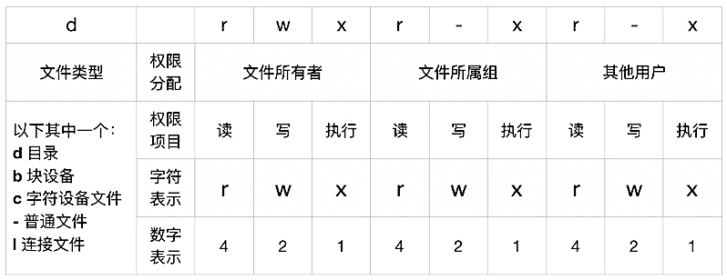

[TOC]

# 一、命令行基本

## 1. 为什么要使用命令行 ？

- 许多功能在图形界面不提供，只有通过命令行来实现
- Finder 会隐藏许多你不太会需要的文件，然而 command line 会允许你访问所有文件
- 通过 command line 可以远程访问你的 Mac（利用 SSH）
- administrators 用户可以通过 `sudo` 命令获得 root 用户权限
- **通过 command-line script 可以使工作更高效**
- 如果你开启手动输入用户名登陆模式
  登陆时在用户名处输入 `> console` 可以直接进入命令行界面，随后你仍然需要登录到一个账户


## 2. 命令行语句构成

许多命令会花费一些时间来执行，然而这中间不会给出任何提示或者进度条

- 一般结束后会出现一个 `用户名$` 的标记
- 如果没有出现，那么说明最后一条命令正在执行
- 想要**强制终止**正在执行的命令用组合键 `control` + `c` 
- 如果你输入了一些错误的命令，系统会返回一些错误信息
  但是**系统却不会阻止你做傻事（例如删除整个用户文件夹）**


**一条命令包括 Command Name、Options、Arguments、Extras 四个部分，后三个部分是可选的**

- **Options** 部分用 `-` 作为前导符：许多命令的 Options 部分只包含单个字母，这时可以合并
  例如，`ls -lA` 和 `ls -l -A` 是等效的
  **Arguments** 部分用来细化这个命令或指定这个命令具体的实施对象
  **Extras** 部分则用来进一步实现其他功能

- 举例：下列命令包含前三个部分，用于删除 Junk 这个程序
  `michelle$ rm -R /Applications/Junk.app`


常用命令

- 清屏命令：clear 
  快捷键 `control` + `l` 清屏后内容上拉可见
  快捷键 `control` + `k` **真的清屏了** 

- 查看之前使用过的命令：history


## 3. manpage — 所有命令的说明书

虽然有上千条命令，每条命令还有许多可选参数和具体的使用方式，但是你却不需要记住这些命令。你只需要记住一个命令：`man`

**大多数命令都会包含一个使用指南，会告诉你任何你需要知道的关于这个命令的所有细节**

- 在命令行中输入 `man command-name` 即可获取
  例如，你想知道 `ls` 这个命令怎么使用，输入`man ls` 即可进入使用指南页面
- 常用操作
  全手册查找关键字 `man -k keyword ` 
  查找命令 `man -f command_line_name`
- 内容查看操作
  关键字查找：向下查找 `/keyword` ，向上查找 `?keyword`
  退出：Q（注意是大写）


# 二、路径和文件


## 1. 代表路径的特殊字符

> 在输入路径时，可按 tab 按键，自动完成 文件、目录名称的补齐

绝对路径：`/` 开头的路径，是**完整**的路径描述，例：`/Users/Sun/Desktop`

相对路径：`.` 开头的路径，描述基于当前目录的部分路径，`.` 代表当前目录，`..` 代表上级目录

`~`：代表当前用户的 home folder，例：`~/Desktop` 和 `/Users/Sun/Desktop` 等价

路径中含有特殊符号（如：空格，`"`，`()`，`[]`，`!`，`$`，`&`，`*`，`;`，`|`，`\`）

1. 在特殊符号前面加入转意符号 `\` 防止路径输入出错，例：
   `~/Destop/Demo\ name/`
2. 直接使用 **双引号** 或 **单引号**，例：
   `'~/Destop/Demo name/'`


## 2. 路径切换

`pwd`：print working directory，显示当前路径

`ls`：list directory contents，列出当前目录内容

`cd`：change directory，切换到指定目录，如果指令后面没有目标目录，则默认切换到当前用户的 home folder，例：用 cd **切换到电脑外接硬盘**的目录下 `cd /Volumes/外接硬盘目录`

`cd -`：切换到上次切换的目录


## 3. 目录栈

目录栈作用：当需要在几个目录之间频繁切换时，可以将需要切换的目录放入目录栈中，实现迅速切换

- `pushd ./path`：将 ./path 路径压入目录栈中，并从当前路径切换到 ./path 路径下，如果目录栈中有压入的目录，将会删除重复的目录，依旧将新的目录压入栈顶
- `popd`：目录栈中的栈顶路径弹出，并从当前路径切换到栈顶路径下
- `dirs`：显示当前目录栈中的所有记录


## 4. 文件查看

隐藏文件或隐藏文件夹一般命名以 `.` 开头

查看当前目录下文件（不包括隐藏文件）：`ls`
查看当前目录下所有文件（包括隐藏文件）：`ls -la`

- 其中 `-l` 代表控制输出格式，表示输出详情，**可用于查看软链接的链接地址**
- `-la` 表示输出所有文件
- `-lA` 表示输出除了当前文件夹  `.` 和父级文件夹 `..` 以外的其他文件


查看命令执行程序的地址：`which 命令A` 会得到 执行命令 A 的程序的存储位置

查看文件类型：`file ./file_path`，会得到 file_path 文件的后缀名称，文件类型等信息

查看文件内容： 

1. `cat ./file_path `（concatenate）
2. `less ./file_path` 查看效果和查看 manpage 一样，可以上下翻页，按大写 Q 退出查看


查找文件：`find ./文件路径 -name '带有通配符的文件'`

- 通配符 `*` ，代表任何长度任何字符，例 `*.tiff` 代表所有格式为 tiff 的文件
- 通配符 `?` ，代表任何单个字符，例 `b?ok` 匹配 book 但不匹配 brook
- 通配符 `[]` ，代表 [] 中的任意单个字符，例 `[Dd]ocument` 匹配 Document 以及 document


## 5. 编辑文件和文件夹

拼接文件：`cat ./file1.txt >> ./file2.txt` ，把 file1.txt 文件 内容添加到 file2.txt 的**结尾**

创建文件：`touch ./file_path` 创建文件 file_path
删除文件：`rm ./file_path` 删除文件 file_path，不会到垃圾桶中，直接删除了，**有可能通过恢复工具找回文件**

创建文件夹：

1. `mkdir ./file_path` 或 `mkdir file_path`，在当前目录下创建 file_path 文件夹
2. `mkdir -p A/B` 在当前文件夹下创建文件夹 A 然后在 A 文件夹里创建 B

删除文件夹：

1. `rmdir ./file_path  `或 `mkdir file_path`，在当前目录下删除 file_path 文件夹，如果文件夹 file_path 不为空，无法删除
2. `rm -R ./file_path` ，在当前目录下删除 file_path 文件夹，及其内部所有内容

**创建文件软连接（快捷方式）**：`ln -s 原始目录 软连接目录`

复制

- 复制文件：`cp ./origin_path ./destination_path`
- 复制文件夹：`cp -R ./origin_path ./destination_path` 
- 如果指定的目标路径不含文件名，则 cp 命令会按原名复制
  如果指定的目标路径包括文件名，则会复制为你指定的文件名
  如果仅指定新文件名，则会在原处以新名称创建文件副本

- **系统会自动替换同名文件而不出现提示**


## 6. 文件权限更改

**Linux 的文件信息结构**

- 权限（访问权限）：读取、写入、可执行、无权限
- 归属（文件所有者）：归属的账户、归属账户所在组


**以 `ls -l` 的长格式显示为例**，[详细格式解释](<https://blog.csdn.net/zhuoya_/article/details/77418413>)

```shell
#              文件被连接次数 		 	          文件大小
#  权限和归属  文件夹内部文件数  用户名    组名  单位字节  月 日 时 分  文件名
-rwxrwxrwx                1 	 sun  staff       24	3 31 21:51  test.sh
drwxr-xr-x@              23    sun  staff      736  3 26 10:46  book
```

其中对于 `drwxr-xr-x@`

- `+` ：增加权限
  `-` ：取消权限
  `=` ：唯一设定权限
- `@` ：表示同步符号连接，多用在软链接或硬链接文件标记
- 


**chmod 设置文件或目录的权限**

- 格式1：chmod [ugoa] [+-=] [rwx] 文件或目录路径
  为指定用户添加部分权限，u 属主、g 属组、o 其他用户、a 所有用户，**默认不填为所有用户**，例
  `chmod u+r, g+w 文件或目录路径`
- 格式2：chmod **nnn** 文件或目录路径
  为设置所有的权限，例：
  文件所有者 权限为 rwx，n = 4 + 2 + 1 = 7
  文件所属组 权限为 r-x，n = 4 + 0 + 1 = 5
  其他用户 权限为 -w-，n = 0 + 2 + 0 = 2
  最终为` chmod 752 文件或目录路径`


## 7. alias 简化命令

alias 可以为命令设置别称

- 格式：alias 别称=命令
- 输入 `alias` 可以查看使用 alias 设置的所有别称
- 例：把 vscode 作为系统内置的命令，可以将以下 shell 代码放到 `~/.bash_profile` 文件中
   `alias vscode='/Applications/Visual\ Studio\ Code.app/Contents/Resources/app/bin/code'`