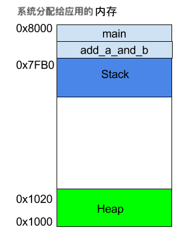

[TOC]

# 一、确定编译的依赖关系

**确定编译的依赖关系：确定了编译时需要哪些头文件，这是个在编译时拼接资源文件的过程**


## 1. 头文件的作用

- 只暴露接口，隐藏实现细节
- 加强类型安全检查
  某个接口被实现或被使用时，其方式与头文件中的声明不一致，编译器就会指出错误
- 防止重复声明，便于修改声明
  编译器在编译代码时对代码的后缀名并不敏感

  > **早期编译器只认识 .c / .cpp 文件，而没有 .h 文件**。多个 .c / .cpp 文件中存在大量的重复声明。其中有一个声明变更时，就需要修改其他重复声明的 .c / .cpp 文件。为了防止某个声明发生了变更到处寻找与修改相关文件，人们将重复的部分提取出来放在一个后缀名叫 .h 的新文件里，并在 .c / .cpp 文件内首行添加引入。


## 2. 明确依赖关系

> .c / .cpp和 .h 文件名称即便相同也没有任何直接关系，很多编译器都可以接受其他扩展名

假定 A 文件依赖于 B 文件，编译器应该保证：

- 先编译依赖的文件 B 在编译 A 文件
- 当依赖文件发生变化时，A 文件也会重新编译

- .h 文件中的所有内容会被写到包含它的 .c / .cpp 文件中
  **在 .c / .cpp 文件中的 `#include` 对应的 .h 文件来防止 .c / .cpp 文件中函数的相互调用时，调用的函数没有声明的现象**
- **先在预处理阶段**找到 main 函数所在的 .c / .cpp 文件，然后**在链接阶段**通过 .c / .cpp 文件引入的头文件找到相应的其他文件编译
  所有的 .c / .cpp 文件以一个共同的 main 函数作为可执行程序的入口


## 3. 预编译头文件

采用**预处理头文件**，能将公共且不常改变的头文件放在公共的 PCH 文件里，减少不必要的代码重新编译工作，**提高编译效率**

预编译头文件的使用方法：

- 创建预编译头文件 .h（如果是 gcc 编译器还要创建 .cpp 文件）
  预编译头文件中应该 include 很多长期不易变动的文件，这样才能只在第一次编译的时候编译预编译头文件，在以后的编译中不断调用已经生成的 .pch 预编译头文件（后缀名可以是任意的）
- 在所有依赖预编译头文件的代码（.h / .hpp / .c / .cpp）中的第一行引入预编译头文件


# 二、编译步骤

> GCC：GNU Compiler Collection，GNU编译器套件
>
> 包括 C、C++、Objective-C、Fortran、Java、Ada 和 Go语言 的前端，也包括了这些语言的库（如 libstdc++、libgcj 等等）

**编译器工作之前需要配置**

- 在编译之前，需要对编译器进行配置：确定编译参数，配置标准函数库和头文件的位置

- 一般编译器的配置工作写在配置文件里，或者由 IDE 通过在 UI 界面里进行配置来代劳

以下，以 hello.c 文件为例介绍 GCC 编译器的工作流程。其中 hello.c 内容如下

```c
#include <stdio.h>

/** 编译器先从 main 函数所在的源文件开始编译 */
int main()
{
    printf("Hello World\n");
    return 0; 	// 不要忘了 main 函数的 return 值
}
```

以 GCC 编译器为例，在编译源代码时都会先后经历：预处理，编译，汇编，链接这 4 个步骤

```shell
$gcc hello.c	# GCC 编译器经过预处理，编译，汇编，链接，得到文件 a.out
$./a.out 		  # 运行 a.out 文件
Hello World		# 得到 a.out 文件的运行结果
```


## 1. 预处理（Prepressing）

```shell
$cpp hello.c > hello.i		  # CPP 预编译器 把 hello.c 文件生成 .i 文件
$gcc -E hello.c -o hello.i	# GCC 编译器通过 -E 进行预编译，由 .c 文件生成 .i 文件
```

| 预编译       | 输入                     | 输出 |
| ------------ | ------------------------ | ---- |
| C 程序代码   | .h、.c                   | .i   |
| C++ 程序代码 | .h、.c、.hpp、.cpp、.cxx | .ii  |

预处理主要处理以 `#` 开始的预编译指令，**检测依赖关系，进行宏替换**，比如：`#include`、`#define` 

处理规则：

- 递归处理所有预编译指令 `#include` 将被包含的文件插入到该预编译指令位置
- 删除所有注释
- 删除所有预编译指令 `#define`，展开宏定义
- 处理所有条件预编译指令，比如 `#if`、`#ifdef`、`#elif`、`#else`、`#endif`

- 添加行号和文件名标识，供编译器调试
- 保留所有 `#pragma` 编译器指令，供编译器使用


## 2. 编译（Compilation）

```shell
$gcc -S hello.i -o hello.s	# GCC 编译器通过 -S 将 预处理文件 .i 文件 编译为 .s 文件
$gcc -S hello.c -o hello.s	# GCC 编译器通过 -S 将 源代码文件 .c 文件 预处理后再编译为 .s 文件
```

> **根据不同的编译器**，可以在编译阶段加入不同的参数控制编译行为

gcc 会根据不同类型的源文件调用相应的编译程序进行 词法分析，语法分析，语义分析及优化后生成相应的汇编代码文件

- C 语言代码调用 ccl 程序编译
- C++ 语言代码调用 cclplus 程序编译
- Objective-C 语言代码调用 cclobj 程序编译
- Java 语言代码调用 jcl 程序编译


处理规则：

- 现代编译器有很多层次的优化，但在不同的编译器中会有不同的差异
- 在编译期间就能确定的表达式可以优化，比如 `a = 2 + 6;` 会被优化为 `a = 8;`


## 3. 汇编（Assembly）

```shell
$as hello.s -o hello.o		  #  as 汇编器将 .s 文件汇编为 .o 二进制文件
$gcc -c hello.s -o hello.o	# GCC 编译器将 .s 文件汇编为 .o 二进制文件
$gcc -c hello.c -o hello.o	# GCC 编译器将 .c 文件编译为 .o 二进制文件
```

处理规则：

- 根据汇编指令和机器指令对照表一一翻译
- 每个汇编语句几乎都对应一条机器指令，操作简单，不需要优化


## 4. 链接（Linking）

```shell
# ld 链接器将 hello.o 和其使用的相关库链接起来，一起编译出 a.out 可执行文件
$ld -static crtl.o crti.o crtbeginT.o hello.o -start-group -lgcc -lgcc_eh -lc -end-group crtend.o crtn.o
```

> **根据不同的编译器**，可以在链接阶段加入不同的参数控制链接行为
>
> **编译器会在每个.o / .obj 文件中都去找一下所需要的符号，而不是只在某个文件中找或者说找到一个就不找了**
>
> 因此，如果在几个不同文件中实现了同一个函数，或者定义了同一个全局变量，链接的时候就会提示 "redefined"

这里 `-lgcc -lgcc_eh -lc` 为链接器在链接期间需要的 3 个参数

处理规则：

- 地址和空间分配，定义在**其他模块或者本模块**的全局变量、函数等地址的分配
- 符号绑定（也叫：符号决议、地址绑定、名称绑定、名称决议）
  **决议（Resolution）偏静态，绑定（Binding）偏动态**
- 重定位，在链接时重新计算在本模块中调用的其他模块函数或变量的地址
  （链接使用的 .o 文件准确的说只能叫中间目标文件）
- 将中间目标文件和相关库（.a、.so / .dll / .dylib）一起链接


### 4.1 静态库

1. 生成静态库（库体积相对较大）

   ```shell
   ar r libxxx.a fun1.o fun2.o fun3.o # 其中 xxx 为静态链接库的名字
   ```

   

2. 链接源文件和静态库

   链接后生成的可执行程序**只包涵了它需要的函数**，并非 libxxx.a 的所有函数

   ```shell
   gcc main.c libxxx.a # -o appName.out
   ```

   

### 4.2 共享库

1. 生成共享库（库体积相对较小）

   共享库便于更新程序，只需要更新共享库即可，不需要更新程序本身

   ```shell
   gcc -shared -o libxxx.so fun1.o fun2.o fun3.o # 其中 xxx 为共享库的名字
   ```

   

2. 链接源文件和共享库

   链接后生成的可执行程序**不包涵所用到库的代码**，只包涵调用库内部函数的引用
   程序运行时，当执行到共享库中的函数时

   1. 查看所需函数是否已经被加载，如果有调用函数，如果没有执行下一步
   2. 找到函数所需的共享库位置
   3. 将程序所需函数加载到内存中

   ```shell
   gcc main.c libxxx.so # -o appName.out
   ```


### 4.3 POSIX 标准

> 目的：提升应用程序在各种 UNIX 操作系统之间的可移植性
>
> 1. 定义了操作系统必须提供的系统服务
> 2. 定义了函数的共享库（以头文件的形式发布，内部实现可以不同）

一般来说，UNIX 的操作系统必须提供符合 POSIX 标准的函数库，编译器可以不提供该函数库，但是大多数编译器也提供了相应操作系统的符合 POSIX 标准的函数库

**UNIX 程序的函数库调用顺序**

**程序** $\to$ **C/C++ 标准库**(编译器提供) $\to$ **POSIX 标准库**(操作系统提供) $\to$ **操作系统的服务**(驱动程序 $\to$ 硬件控制设备 $\to$ 执行硬件)

这里 C/C++ 标准库由于是对 POSIX 标准库的封装，需要保证多个 UNIX 版本平台的通用性，只能取各个平台对应的 POSIX 标准库功能的交集


# 三、汇编基础

## 1. 汇编代码的作用

可以通过汇编代码使用系统调用，从而加速程序运行效率
- 使用汇编前
**程序** $\to$ **操作系统的调用**(内嵌汇编代码) $\to$ **操作系统的服务**(驱动程序 $\to$ 硬件控制设备 $\to$ 执行硬件)
- 使用汇编后
**程序**(内嵌汇编代码) $\to$ **操作系统的服务**(驱动程序 $\to$ 硬件控制设备 $\to$ 执行硬件)


**内嵌汇编代码**

将系统调用封装在函数里

```c
void write(char* str)
{
  int len = 0;
  for (char* cPtr = str; *cPtr++ != '\0'; ++len);
  
  __asm__(                  // __asm__ 标志符，GCC 编译时会识别
    "mov rax, 1 \n\t"				// 汇编代码
    "mov rdi, 1 \n\t"
    "syscall \n\t"					// 系统调用
    :
    :"S"(str), "d"(len)
  );
}
```


## 2. 硬件的存储结构

重定位，内存的分段机制：逻辑地址 = 分段地址 + 偏移地址

偏移地址：存储单元相对于段开始位置的距离
分段地址：段的起始地址
逻辑地址：取自物理地址，但位置不会固定在物理地址上


**字节序**

例：存储数据  `005D`
LSB（Least Significant Bit/Byte） 低/小 端字节序：`5D 00`，从左向右存储（Intel 处理器）
MSB（Most Significant Bit/Byte）高/大 端字节序：`00 5D`，从右向左存储（TCP/IP、Java 虚拟机）


### 2.1 寄存器

我们常常看到 32 位 CPU、64 位 CPU 这样的名称，其实指的就是寄存器的大小


**Intel 8086 芯片的寄存器存储格式**

> 现代寄存器已经失去了过去和名字相符的功能，只留下一个名字来作为区分

1. **8 个通用寄存器**
  除了用名字上指定的功能，还能用做别的功能
  

2. **4 个段寄存器**
  代码段寄存器：CS（Code Segment Register）存储代码段的段地址
  数据段寄存器：DS（Data Segment Register）存储数据段的段地址
  附加段寄存器：ES（Extra Segment Register）
  堆栈段寄存器：SS（Stack Segment Register）

3. **2 个控制寄存器**

  IP 可用于存储代码段的段地址的偏移地址，例：IP = IP + CS

  

  

### 2.2 内存

> 内存以字节为最小存储单位存取数据

**Intel 8086 CPU 寻址分配**，以下地址逻辑上是连续的，实际上的物理地址并不一定连续

ROM（Read-Only Memory）：只读内存，断电不会消失


**系统分配给每个程序的内存结构**
以下内存结果为逻辑上的内存结构，实际物理上各个类型的内存分配不一定按以下图中的样式排列
下图中省略了代码段，数据段，附加段等内存结构，实际情况

- 可能不同的时间内，同一段内存可以是代码段/数据段/附加段/堆栈段
- 可能同一段时间内，不同的内存分布如下所示




### 2.3 显存

刷新一次屏幕表示：显卡读取一次显存

1. **显存的图形存储模式**

   1. 黑白模式：每个像素占 1个 bit

   2. 真彩色模式：每个像素占 3 个 byte（1 byte = 8 bit）

      

2. **显存的文本存储模式**

   显存存储字符的 ASCII 码，通过硬件专门提供的字符发生器来控制字符的显示
   显存中 2 个 byte 对应 1 个字符，其中
   前 1 byte 记录字符的 ASCII 码
   后 1 byte 记录字符的属性（前景色和背景色），格式为：`K RGB I RGB`

   


## 3. 查看程序的二进制文件

> 程序以二进制 0101 存储**机器指令**，为了方便阅读，以十六进制查看
>
> 文件存储格式
>
> 1. .bin 文件：存储二进制文件（机器指令）
> 2. .lst 文件：存储源码的十六进制数（包涵注释）
>

通过 HexView 软件以十六进制查看二进制程序文件的格式：

```tex
  汇编地址 程序的数据，十六进制表示，两个表示一个字节                程序每个字节对应的 ASCII 字符
  Offset: 00 01 02 03 04 05 06 07 08 09 0A 0B 0C 0D 0E 0F 	 实际文件不含此内容，是阅读器加的
00000000: CF FA ED FE 07 00 00 01 03 00 00 80 02 00 00 00    Ozm~............
00000010: 11 00 00 00 58 05 00 00 85 00 20 00 00 00 00 00    ....X...........
```


**汇编的二进制文件格式**

机器指令中

- B8：操作码
- 3F00：操作数，代表 003F（由于 Intel 采用小端字节序顺序）

```asm
行号 汇编地址  机器指令  汇编指令				 注释
1   00000000 B83F00   mov ax,0x3f   ;这里是注释
```


**汇编指令的存储**


## 4. Intel x86 架构汇编指令简介

> 汇编语句不区分大小写

### 4.1 标记

**标号**

- 功能：代表当前汇编代码的汇编地址，命名规则以字母开头，采用**二进制存储**

- 格式 1：标号 指令
  例：`number mov ax, 0x05`，其中 number 为标号
  
- 格式 2：标号：指令

  ```assembly
  ;例：这里的标号 start 代表指令 mov ax, 0x8c0 代码的汇编地址
  start:            
  	mov ax, 0x8c0
  	mov ds,ax
  	
  data:
  	db 0,0,0
  	
  text:
  	db 1,1
  	
  	mov cx,(data-text)/2  ;源操作数 =（标号 data 的字节数 - text 的字节数）/ 2
  ```

- 格式 3：指令 $

  ```assembly
  ;例，以下指令均等价
  infi jmp near infi
  jmp near $ 				 	  ;这里的 $ 是标号。等价于，$ jmp near $，但无法这么写
  
  times 510-($-$$) db 0	;$  是标号，代表当前指令的汇编地址
  											;$$ 当前指令所在段的起始汇编地址
  ```


**数据传送尺寸**

- 功能：取固定长度数据到目的操作数，一般不加限制说明取可以填满目的操作数的长度

- 例子：

  ```assembly
  mov byte [ebx], 2	  ;移动源操作数为 1 byte 长度的 2，到寄存器 EBX 中
  mov word [ebx], 2	  ;移动源操作数为 1 word = 2 byte 长度的 2，到寄存器 EBX 中
  mov dword [ebx], 2  ;移动源操作数为 1 double word = 4 byte 长度的 2，到寄存器 EBX 中
  ```


**其他指令**

```assembly
;修改 PSW 微处理器状态字的 DF 标志位的值
cld ;clear direction 将 DF 方向标志位清 0，正向
std ;  set direction 将 DF 方向标志位设 1，反向

;自增自减少，执行后会自动修改 PSW 微处理器状态字的 SF 符号标志位的值 = (目的操作数 == 0 ? 0 : 1)
inc 目的操作数 ;increase 目的操作数 = 目的操作数 + 1
dec 目的操作数 ;decrease 目的操作数 = 目的操作数 - 1
```


### 4.2 伪指令

> 伪指令，编译器编译后，指令被替换为相应的值，不会被编译成机器指令（类似于宏定义）


**指令 db**

- 功能：声明并初始化数据
  编译器编译后，只留下 db 后的数据作为占位符
  
- 格式：db 数字1, 数字2 （其中声明的每个数字占用 1 个 byte 的宽度）
  
  ```assembly
  ;例，其中 \ 表示让编译器编译时将当前行和下一行合并为同一行
  db 0,4,124,'L',0x07,\
  	 0,4,124,':',0x07,\
  	 0,4,124,'0',0x07
  	 
  ;以下两个指令等价
  db '1+2+3+...+100=' 
  db '1','+','2','+','3','+','.','.','.','+','1','0','0','='
  ```
  
- 类似的指令：
  dw（word，声明的每个数占用 1 word = 2 byte 的宽度）
  dd（double word，声明的每个数占用 2 word = 4 byte 的宽度）
  dq（quad word，声明的每个数占用 4 word = 8 byte 的宽度）


**指令 times**

- 功能：让编译器重复生成后面指令多少次
- 格式：times 重复次数 其他指令
  例：`times 255 db 0`，让编译器重复生成指令 db 0，共 255 次


### 4.3 传送指令

**指令 mov**

- 格式：mov 目的操作数, 源操作数

- 功能：数据的传送（拷贝）

  ```assembly
  ;注意：
  ; 1.目的操作数和源操作数数据宽度必须一致
  ; 2.目的操作数和源操作数不能同时都为内存单元（硬件限制）
  ; 3.不允许数字直接传入到段寄存器中，可以通过以下中转来实现：
      mov 通用寄存器/内存单元, 数字
      mov 段寄存器, 通用寄存器/内存单元
     
  ;寻址方式
  
  ;一、立即数寻找
  mov [0x04 + 0x02],0x05
  
  ;二、寄存器寻找
  mov ax,'D' ;表示将 D 的 ACSII 码值存入 ax 中
  
  ;三、内存寻找
  ;1. 直接寻找
  mov ax,[0x77]
  
  ;2. 基址寻找：偏移地址是 基址寄存器
  ;   基址寄存器为 BX 基址寄存器时，默认段寄存器是 DS 代码段寄存器
  ;   基址寄存器为 BP 基址指针寄存器时，默认段寄存器是 SS 堆栈段寄存器
  mov [bx],al       ;[bx] == 默认的代码段地址 + 偏移地址 (bx 的值)
  mov [ds:bx],a
  mov [bx+1],a      ;[bx+1] 为相对寻找，间接寻找
  
  ;   可以使用其他段寄存器
  mov [es:0x1a], al ;[es:0x1a] == 段地址 + 偏移地址 (0x1a)
  
  ;3. 变址寻找：偏移地址是 变址寄存器
  mov ax,[di]
  mov ax,[di+2]
  
  ;4. 基址变址寻找：偏移地址是 基址寄存器 和 变址寄存器 的组合
  mov ax,[bx+di]
  ```


**指令 movsb**（byte），**movsw**（word）

- 功能：目的操作数的批量传送

- 格式：

  ```assembly
  ;该指令后面不需要任何操作数
  ;以下 SI 和 DI 的正负值取决于 PSW 微处理器状态字的 DF 标志位的值
  ;传送的目的：DS 数据段寄存器 + SI 源变址寄存器（地址偏移）
  ;传送的源：ES 附加段寄存器 + DI 目的变址寄存器（地址偏移）
  ;传送的次数：CX 累计寄存器中的值
  
  ;格式 1：只传送一次
  movsb
  movsw
  
  ;格式 2：每传送一次 CX 累计寄存器自动减一（repeat）
  ;如果 CX 累计寄存器中的值不是 0，PSW 微处理器状态字的 ZF 标志位的值为 0，会继续传送数据
  ;如果 CX 累计寄存器中的值是 0，PSW 微处理器状态字的 ZF 标志位的值为 1，不会继续传送数据
  rep movsb
  rep movsw
  ```

  

**指令 push**

- 格式：push 目的操作数

- 功能：将目的操作数里的数据存入内存的栈中，并让 SP 栈寄存器地址增加

  ```assembly
  ;push 指令最低可接受的数据宽度是 16 bit
  ;push 指令执行后
  ; 1. SP 堆栈寄存器 = SP - 操作数的数据宽度（push 指令的机器指令中的操作数）
  ; 2. 将操作数存入地址：SS 堆栈段寄存器 + SP 堆栈寄存器 中
  ```

  

**指令 pop**

- 格式：pop 目的操作数

- 功能：取出内存的栈顶数据，写入目的操作数中，并让 SP 栈寄存器地址回退

  ```assembly
  ;pop 指令执行后
  ; 1. 从地址 SS 堆栈段寄存器 + SP 堆栈寄存器 中，将操作数的数据宽度大小的数据存入 DX 数据寄存器中
  ; 2. SP 堆栈寄存器 = SP + 操作数的数据宽度（push 指令的机器指令中的操作数）
  ```


### 4.4 流程控制指令

**JCC 指令族**（Jump Conditional Code）


**指令 jmp**

- 功能：跳转指令执行地址

- 格式 1：jmp CS 代码段地址, IP 偏移地址

- 格式 2：infi jmp near infi
  ```assembly
  ;跳转的原理
  ;修改 IP 偏移地址寄存器的值，使
  ;IP 偏移地址 = IP 偏移地址 + 该指令的操作数 + 该指令的长度
  
  ;操作数 = 标号的汇编地址 - 当前指令的汇编地址 - 当前机器指令的字节长度
  
  ;因此这条指令会使处理器卡在该指令，陷入无线循环跳转状态
  infi ;标号，代表当前汇编代码的汇编地址
  near ;修饰符，表示操作数（见上文，汇编的阅读格式）是 16 位的长度
  ```


**指令 jns**

- 格式：jns 标号名称
- 功能：根据 PSW 微处理器状态字的 SF 符号标志位的值来决定是否跳转到标号位置（ SF == 1 跳转）
- 特点：不会主动改变 SF 标志位，**依赖其他指令**完成跳转的改变


**指令 loop**

- 格式：loop 标号名称
- 功能：循环执行标号位置，循环前会判断 CX 累积寄存器是否是 0，如果不为 0 继续跳转标号地址
  **跳转的原理和 jmp 指令一致，都是修改了 IP 偏移地址寄存器的值**
- 特点：会主动改变 SF 标志位，**不依赖其他指令**完成跳转的改变


**指令 call**

- 功能：调用函数，跳转到函数名对应的标签
- 格式：call 函数名标签


**指令 ret**

- 功能：终止当前函数的执行，将运行权交还给上层函数
- 格式：ret


### 4.5 逻辑运算指令

**指令 xor**

- 功能：对目的操作数和源操作数做异或运算，最后存储到目的操作数中
- 格式：xor 目的操作数, 源操作数


**指令 div**（division）

- 功能：将 AX 寄存器中的数除以目的操作数，并将商赋值给 AX
  如果目的操作数为 8 位寄存器，存数方式为：AX = AH, **AL** = 余数, **商**
  如果目的操作数为 16 位寄存器，存数方式为：DX 存余数，AX 存商
  这里的目的操作数看做**无符号数**（不管目的操作数真的是不是无符号数）
  如果想要将目的操作数看做**有符号数**，使用 **idiv** 指令
- 格式：div 目的操作数


**指令 add**

- 功能：目的操作数 = 目的操作数 + 源操作数

- 格式：add 目的操作数, 源操作数

  ```assembly
  ;例，假设存储大小为 8 位的寄存器  有符号数(-128，127)  无符号数(0，255)
  mov al,0xF0 ;0b   1111 0000   -16								 240
  add al,0x78 ;0b   0111 1000   120								 120
  						;0b 1 0110 1000   104								 104(十进制结果为 360)
  						;								  OF = 0						 CF = 1(进位)
  						
  ;如果运算的（十进制）结果超出了存储单元的存储范围（二进制超出不算），得到的结果一定是错的
  ; OF(Overflow Flag) 溢出标志位 = 1
  ; CF(Carry Flag)    进位标志位 = 1
  ; 因此，当 OF 或 CF 的值 == 1 时，得到的运算结果是错误的
  ```

  

**指令 sub**

- 功能：目的操作数 = 目的操作数 - 源操作数
- 格式：sub 目的操作数，源操作数


**指令 cmp**

- 功能：**PSW 微处理器状态字的标志位里** = 目的操作数 - 源操作数
- 格式：cmp 目的操作数，源操作数


### 4.6 应用

1. C 代码，存储在 example.c 文件中

   ```c
   int add_a_and_b(int a, int b) {
      return a + b;
   }
   
   int main() {
      return add_a_and_b(2, 3);
   }
   ```

   

2. GCC 将 C 代码转换为汇编语言

   ```shell
   gcc -S example.c
   ```

   

3. 汇编源文件

   ```assembly
   _add_a_and_b:
      push   %ebx
      mov    %eax, [%esp+8] 
      mov    %ebx, [%esp+12]
      add    %eax, %ebx 
      pop    %ebx 
      ret  
   
   _main:
      push   3
      push   2
      call   _add_a_and_b 
      add    %esp, 8
      ret
   ```

   


# 参考

- [Linkers & Loaders](https://book.douban.com/subject/1436811/)
- [Recursive Make Considered Harmful](http://aegis.sourceforge.net/auug97.pdf)
- [Building C Projects](http://nethack4.org/blog/building-c.html)
- [Precompiled headers](http://itscompiling.eu/2017/01/12/precompiled-headers-cpp-compilation/)
- [x86 Assembly Guide](http://www.cs.virginia.edu/~evans/cs216/guides/x86.html)
- [C 语言中 .h 和 .c 文件解析](https://www.cnblogs.com/laojie4321/archive/2012/03/30/2425015.html)
- [汇编语言入门教程，阮一峰](http://www.ruanyifeng.com/blog/2018/01/assembly-language-primer.html)
- [为什么寄存器比内存快？](http://www.ruanyifeng.com/blog/2013/10/register.html)