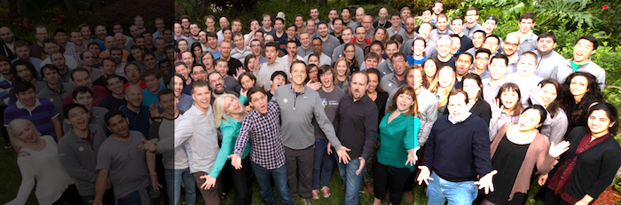
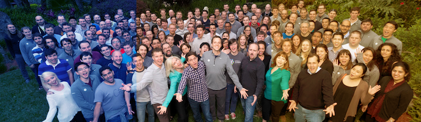

[TOC]

<h1>
 相机工作原理
</h1>
# 一、曝光：进光量调整

> 曝光：单位面积光的数量
> 欠曝：没有捕获足够的光，图像被湮没在图像传感器或者胶卷的固有噪声信号中
> 过曝：捕获过多的光，图片传感器/胶卷所接受的光过于饱和，无法区分不同的光的数量，这意味着几乎所有区域看上去曝光程度都是一样的
>
> 有三个要素可以影响曝光的进光量：快门速度，光圈和感光度 (ISO)

**曝光档数**

在摄影中，通过调整快门速度、光圈、感光度 (ISO)，这三者中任意一个来让进光量翻倍或者减半，就叫做改变了 “一档” 曝光。每一档曝光对于这三者来说对应的是不同的数字变化。但如果我们将快门速度调整一档，我们需要通过调整 ISO 或者光圈一档来进行补偿，才能获取同样的进光量。有趣的是所有这三者 (快门速度，光圈和 ISO) 也会在曝光上影响其他要素，使得这三个参数有着无数种组合来达到同样进光量的结果

曝光方式（自动曝光必须选择被良好曝光的主体才会有较好的效果）

- 自动快门速度，ISO ，光圈大小曝光：[EV (exposure value) 值](http://zh.wikipedia.org/wiki/曝光值)
例：-1 的 EV 值将会通过自动曝光逻辑让图片欠曝一档
- 手动快门速度，自动 ISO 和 光圈大小曝光：[S/Tv 快门优先](http://zh.wikipedia.org/wiki/快门优先)
- 手动光圈大小，自动 ISO 和快门速度：[A/Av 光圈优先](http://zh.wikipedia.org/wiki/光圈优先)
- 完全手动曝光：手动快门速度和 ISO 曝光 M
- 曝光公式：[Want an Easier and Faster Way to Calculate the Exposure Formula?](https://nofilmschool.com/2018/03/want-easier-and-faster-way-calculate-exposure-formula)

## 1. 快门速度（曝光时间）

快门速度：图像传感器捕捉光线所需的一段时间，它表示相机快门打开和关闭的快慢
**一挡**：表示将快门速度加倍或者减半，例如，从 1/50 秒到 1/25 秒调整了一档

> 例： 1/50 秒的快门速度会让图像传感器进行 1/50 秒 (= 0.02 秒或者 20ms) 光线捕捉。如果我们将快门速度改变至 1/25s (40ms) 时，图像传感器将捕捉两倍时间长度的光，也就是两倍数量的光子，或者说两倍的进光量

**快门速度既能调整进光量，又能影响图像的清晰度**
当物体移动的足够快的时候，它在整个曝光时间里便不会只停留在某一个点，这会导致图片[模糊](http://zh.wikipedia.org/wiki/動態模糊)

> 如果我们在拍照时相机和场景是完全静止的，我们可以使用任意长的曝光时间 (快门速度)，但是更多情况并非如此。我们身边的东西都一直在移动，特别是对于手机的相机来说，相机本身也一直在移动

- 快门速度变短，拍摄物体相对更加静止，画面清晰
  使用相机的三脚架可确保拍摄的相对静止，提高画面质量

- 快门速度变长，拍摄物体相对更加动态，画面模糊
  有意地选择一个长的快门速度来让物体模糊，以强调其运动感

  

## 2. 感光度

ISO：[胶卷速度](http://zh.wikipedia.org/wiki/感光度)，图像传感器对光的灵敏程度，根据灵敏度的不同会产生不同的曝光噪声

**一档**对应翻倍或者减半 ISO 值。每次我们将 ISO 加倍 (比如从 ISO 100 到 ISO 200)，我们就只需要一半的进光量

**ISO 既能调整进光量，又能影响图像的噪点**

- ISO 加倍，需要的进光量减半，噪点变多
- ISO 减半，需要的进光量加倍，噪点变少

## 3. 光圈

光圈（相机的镜头）是用来衡量到达图像感应器的光所通过的**通孔的大小**，单位 [F 比例 (焦比)](http://zh.wikipedia.org/wiki/焦比) 
例：$f$/5.6，其中 $5.6 = {镜头焦距 \over 光圈的有效直径}$
焦比 F 越大，进光量越少，例：$f$/4 是 $f$/2.8 进光量的一半

**一档**指的是当前值与$ \sqrt 2 $  相乘或者相除，移动设备的光圈值是固定的，一般是$f$/2.2

**光圈既能调整进光量，又能通过 [对焦](https://objccn.io/issue-21-1/#Focus) 影响图像的 [景深](http://zh.wikipedia.org/wiki/景深)**

# 二、对焦

相机只能将离相机一定距离范围内的物体渲染清晰，如果距离太近或太远都会**失焦**

自动对焦 AF，相机会猜测图片的哪个部分需要被聚焦，并依此来调节焦距

## 1. 光学组件

对相机焦距的调整，其实是通过物理移动这些镜头组件来完成的
相机镜头是由一系列光学组件构成的，它们负责引导和聚集光束

**镜头也影响图像的其他部分会将一些你不想要的变形或者颜色[失真](http://zh.wikipedia.org/wiki/畸變)引入到拍摄的图片中**，例：[色差](http://zh.wikipedia.org/wiki/色差)

镜头系统的指标 [焦距](http://zh.wikipedia.org/wiki/焦距)：放大倍率和视野角度

- [广角镜头](http://zh.wikipedia.org/wiki/广角镜)：放大倍率低，视野角度高
- [长焦镜头](http://en.wikipedia.org/wiki/Long-focus_lens)：放大倍率高，视野角度低

## 2. 像素传感器

图像传感器是由海量的独个的像素传感器串起来的巨大矩形区域。我们可以将每个像素传感器想象成一个装电荷的桶。当光子撞击到像素传感器的光二极管时，它们将在这个像素的桶中缓慢地积攒电荷。最后，每个像素都会有它自己的一小桶电子。这些电荷的数量是依赖于光子数量的 - 或者说是决定于打到这个特定的点上的光的强度

**像素传感器越大，图像噪声越小**

# 三、白平衡

**白平衡**：让图片准确的色彩还原的操作，相机的白平衡会根据**光源的色温**来对照片做出调整

色温：定量地以开尔文温度（K）来表示色彩，**色温越高光色越偏蓝，色温越低高光色越偏红**

> 英国著名物理学家开尔文认为，假定某一黑体物质，能够将落在其上的所有热量吸收，而没有损失，同时又能够将热量生成的能量全部以“光”的形式释放出来的话，它便会因受到热力的高低而变成不同的颜色
>
> 光源的颜色成分与该黑体所受的热力温度是相对应的，任何光线的色温是相当于上述黑体散发出同样颜色时所受到的“温度”，这个温度就用来表示某种色光的特性以区别其它，这就是色温
> 打铁过程中，黑色的铁在炉温中逐渐变成红色，这便是黑体理论的最好例子

# 四、应用

## 1. iOS 相机 API 介绍

- [Apple 官网 AVCaptureDevice 介绍](https://developer.apple.com/documentation/avfoundation/avcapturedevice?language=objc)
- [OC 之 AVCaptureDevice](https://www.jianshu.com/p/155efb36e041)
- [OC 之 AVCaptureDevice 续](https://www.jianshu.com/p/a9c500d74a4b)
- [iOS camera: manual exposure duration but auto ISO?](https://stackoverflow.com/questions/29819515/ios-camera-manual-exposure-duration-but-auto-iso)
- [iOS 中 ImageIO 框架详解与应用分析](https://www.jianshu.com/p/ab566a9ec174)
- [iOS 的传感器系统](https://yq.aliyun.com/articles/614882)
- [iOS CoreMotion 的使用](https://www.jianshu.com/p/9944c1f17d35)

## 2. Android 相机 API 介绍

# 引用

1. [How Your Camera Works](http://www.objc.io/issue-21/how-your-camera-works.html)
2. [在 Xamarin 中手动照相机控件](https://docs.microsoft.com/zh-cn/xamarin/ios/user-interface/controls/intro-to-manual-camera-controls)
3. [iOS 上的相机捕捉](https://objccn.io/issue-21-3/)
4. [摄影入门之光圈](https://zhuanlan.zhihu.com/p/24076867)
5. [摄影入门之快门](https://zhuanlan.zhihu.com/p/25375932)
6. [摄影入门之感光度](https://zhuanlan.zhihu.com/p/25588177)
7. [摄影入门之曝光三要素](https://zhuanlan.zhihu.com/p/26309412)
8. [摄影入门之相机的曝光模式和应用](https://zhuanlan.zhihu.com/p/28972811)
9. [摄影入门之白平衡](https://zhuanlan.zhihu.com/p/26899270)
10. [摄影入门之相机镜头的分类](https://zhuanlan.zhihu.com/p/28613397)
11. [摄影入门之相机镜头的应用](https://zhuanlan.zhihu.com/p/28941021)

