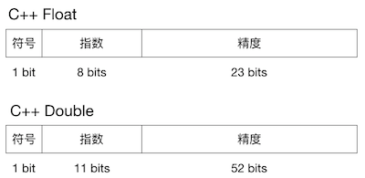

[TOC]

# 一、数字基础

## 1. 进制系统

数字系统【十进制】

- 以 10 为底的，每个位置的数字都代表着 10 的指数

- 十进制数字 412 的计算


数字系统【二进制】

- 以 2 为底的，每个位置的数字都代表着 2 的指数
- 1 比特（存储单位：bit）可以表示的 2 种状态就是指二进制的 1 或 0
- n 比特可以表示  $2^n$ 个状态，可以表示最大值的十进制结果为 $2^{n+1}$
- 十进制数 9 在二进制里表示为 1001


数字系统【十六进制】

- 以 16 为底的，每个位置的数字都代表着 16 的指数
- **十六进制字面量一般成对出现，用来表示字节**
- 十六进制中的 10 ~ 15 用小写字母 a ~ f 或大写字母 A ~ F 来代替


## 2. 数字的字面量表示

字面量：对代码中值（如数字、字符串、数组或字典）的表示法

- 二进制整数以 `0b` 开头，例：**0b**11100001
- 八进制整数以 `0o` 开头，例：**0o**341
- 十进制整数不用写前缀， 例：225
- 十六进制整数以 `0x` 开头，例：**0x**e1


# 二、数字的存储

## 1. 字节序

书写系统有从左到右顺序的也有从右到左顺序的，计算机存储和传递多字节整型也有不一样的顺序

字节数据一般用**十六进制整型**字面量来表示，因为一个字节可以很方便地转换成两个以 16 为底的数字

例，数字 0x083a9c77（十进制是 138,058,871）可以用一个 4 字节无符号整型表示

- 大端格式：数字从最**高**位开始存储，字节序为 0x 08, 3a, 9c, 77
- 小端格式：数字从最**低**位开始存储，字节序为 0x 77, 9c, 3a, 08


## 2. 位运算

按位 **与** &【AND】

- 功能：对应的两个二进位 **均为1** 时，结果 **为1**，否则 为0

- 例子：9 **&** 5 = 1001 **&** 0101 = 0001，即 9 **&** 5 = 1

- **规律：**二进制中与 1 保持原位，与 0 为 0

- 应用

  ```c
  int a = 15; 
  // 方法1 取模判断 
  // 注：这里由于 printf() 是有返回值「输出的字符串长度」 
  // 所以可以用 三位运算符 条件 ? 值 : 值 
  a % 2 ? printf(“奇数\n”):printf(“偶数\n”);
  
  // 方法2 与 1 判断 
  // 奇数，二进制最后一位是 1 
  // 偶数，二进制最后一位是 0 
  // 1 & X = 00001 & X = X 的二进制最后一位
  a & 1 ? printf(“奇数\n”):printf(“偶数\n”);
  ```


按位 **或** |【OR】

- 功能：对应的两个二进位 **只要有一个为1** 时，结果 **为1**，否则 为0

- 例子：9 **|** 5 = 1001 **|** 0101 = 1101，即 9 **|** 5 = 13


按位 **异或** ^【XOR / EOR】

- 功能：对应的两个二进位 **不相同为 1**，否则 为 0

- 例子：9 **^** 5 = 1001 **^** 0101 = 1100，即 9 **^** 5 = 12

- **规律：**
  同一整数 **异或** 为0，                     例：5 ^ 5 = 0
  **不同**整数 异或 **结果和顺序无关**，例：5 ^ 6 ^ 7 = 5 ^ 7 ^ 6
  任何数 和 0 异或 结果**不变**，       例：x ^ 0 = x
  综上，**x ^ y ^ x** = x ^ x ^ y = 0 ^ y = **y**

- 应用
  ```c
  int a = 9;
  int b = 6;
  
  // 1. 借助第三方变量
  int temp;
  temp = a;
     a = b;
     b = temp;
  
  // 2. 不借助额外空间，数学方法
  a = b - a;
  b = b - a;
  a = b + a;
  
  // 3. 不借助额外空间，位运算
  a = a ^ b;
  b = a ^ b;
  a = a ^ b;
  ```


按位 **取反** ~【NOR】

- 功能：对整数的 每一位取反，**符号也会取反「取反：**0 取反为 1，1 取反为 0**」**
- 例子：**~** 9 = -10


按位 **左移** <<

- 格式：整数 **<<** 左移**个数**
- 例子：x **<<** n
- **实质：**x * $2 ^ n$
- **操作：**把 x 的二进制位 向**左**移动 n 个单位，**高位丢弃，低位补 0**（C 语言的规定）


按位 **右移** >>

- 格式：整数 **>>** 右移**个数**
- 例子：x **>>** n
- **实质：**x / $2 ^ n$
- **操作：**把 x 的二进制位 向**右**移动 n 个单位，**低位丢弃，符号位不变**（C 语言的规定）
- 注意：
  **符号位也跟着移动，右移不改变整数的正负，最后符号位会调整为原来的数值**
  正数 符号位为 **0**，最高位补 **0**
  负数 符号位为 **1**，最高位补 **1**


## 3. 有符号的整型表示

> **机器数**：一个数在计算机中的二进制表示形式，叫做这个数的机器数。机器数是带符号的，在计算机用一个数的最高位存放符号，正数为 0，负数为 1
>
> 为了方便说明，这里假设有符号的整型由 3 个比特位表示

原码：最高位表示符号（0 表示正数，1 表示负数）其余位代表数字大小

反码：**正数 == 原码**，负数 == 原码符号位不变，但其他位逐个取反

补码：**正数 == 原码**，负数 == 反码 + 1，**补码把减法转换为加法**

移码：

- **移码只用于表示整数**
- 移码 == 补码符号位取反
- 移码的偏移量：如果用 n 个机器数长度，则移码的偏移量为 $ 2^{n-1} $
- 移码表示法：便于判断正负数的大小
  当符号位为 0 (正) 时，移码 = 偏移量 + 数值
  当符号位为 1 (负) 时，移码 = 偏移量  - 数值 
  例：0b001 (真值 1) 比 0b101 (真值 -1)  大，通过移码表示法转换为 0b101 和 0b011，这两个二进制没有符号位，直接比较这两个二进制大小即可
  0b001 的移码 = 0b100 + 0b01 = 0b101
  0b101 的移码 = 0b100  - 0b01 = 0b011

|  二进制  | 0b000 | 0b001 | 0b010 | 0b011 | 0b100 | 0b101 | 0b110 | 0b111 |
| :---: | :---: | :---: | :---: | :---: | :---: | :---: | :---: | :---: |
|  无符号  |   **0**   |   1   |   2   |   3   |   4   |   5   |   6   |   7   |
| 原码 |   **0**   |   1   |   2   |   3   | **-0** |  -1   |  -2   |  -3   |
| 反码 |   **0**   |   1   |   2   |   3   |  -3  |  -2  |  -1  |  **-0**  |
| 补码 |   **0**   |   1   |   2   |   3   | **0**  |  -3  |  -2  |  -1  |
| 移码 | **-0** | -1 | -2 | -3 | **0** | 3 | 2 | 1 |


# 三、定点数

## 1. 定点整数

- 定点**无**符号整数：全部表示量值，以 16 bit 长度的存储范围 $[0, \space 2^{16} - 1]$
- 定点**有**符号整数：高位第一位存储符号位，其余表示量值，以 16 bit 长度的存储范围 $[-2^{15}, \space 2^{15} - 1]$


## 2. 定点小数

需要提前确定该表示法的小数点位置（定点：又称为定标、Q值表示法，一般表示成纯小数）

- 定点**无**符号小数：全部表示量值
- 定点**有**符号小数：高位第一位存储符号位，其余表示量值

定点小数转换：

当两个定点小数表示的有效值的长度不同时，需要进行对点操作（将 **Q 值即小数点位置对齐**），例：

- 小数转定点整数：$N_i = int(N_f \times 2^Q)$
- 定点整数转小数：$N_f = float(N_i \times 2^{-Q})$


# 四、浮点数

## 1. 浮点数的结构

### 1.1 概念

浮点数的表示很像数学中的科学计数法，所有的浮点数都由四个组件构成：
$$
(-1)^{符号} \times 精度 \times 基数^{指数}
$$

1. 符号：标记正数或负数
2. 基数：表示浮点数的基（底）
3. 指数偏移量：使用指数和偏移量的和计算出一个非负的范围
4. 精度（尾数）：包含有效数字的个数
   **精度的取值范围是 [1, 基数]，该浮点数是标准化的**，例：$12.34 \times 10^4$，精度 12.34 > 基数 10，所以改浮点数的标准化应为 $1.234 \times 10^5$
   标准化的数字**确保浮点数的表示唯一**，便于计算机更快地处理，能最大化地表示有效数字


### 1.2 存储结构

> 不同的语言对 IEEE 754 的实现略有不同

浮点数在存储的二进制以 2 为基底，其他数据以 IEEE 754 规范为例存储如下：
注意：IEEE 754 规定 **指数的移码 - 1** 后的值代替指数存储



IEEE 754 标准中，一个规格化 32 位的浮点数 $x$ 的真值表示为： 
其中，S 表示存储的符号值，E 表示存储移码格式的指数值，M 表示存储的精度值（规格化的浮点数的精度域最左位总是 1，故这一位不予存储）
$$
x = (-1)^S \times (1.M) \times 2^e, \space E = e + 2^{8 -1} - 1 = e + 127
$$
例 0.5 的存储值：$0.5 = (-1)^0 \times 1.0 \times 2^{-1}$，则 S = 0，M = 0，e = -1，则
$$
E = -1 + 127 = 126 = 0b \space 0111 \space 1110
$$
因此，0.5 存储值的为 0b 0 0111 1110 000 0000 0000 0000 0000 0000 = **0x3f00 0000**


## 2. 特殊的浮点数

> [IEEE 754 规范](https://en.wikipedia.org/wiki/IEEE_754) 定义了几个特殊的值，包括正负零、正负无穷，以及 NaN（"Not A Number"，非数字）

**由于浮点数的二进制存储方式，浮点数表示十进制数据时不精确，而是以很小的数来近似表示原数**，例：二进制小数不能用有限数字表示 1/5，就如同十进制小数不能有限的数字表示 1/3 一样，这样 1/5 的倍数累计起来会造成不小的误差

避免比较浮点数：浮点数是离散的误差会导致浮点数计算不太精确，例：0.1 + 0.2 != 0.3 

以 单精度 32 位 float 为例：

- 正负零：存储的指数 E 是 0，精度 M 为 0，则

$$
\pm 0 \approx \pm 1.0 \times 2^{0 - 127} = \pm 2^{-127}
$$

- 正负无穷：存储的指数 E 是 255，精度 M 为 0，则

$$
\pm \infin \approx \pm 1.0 \times 2^{255 - 127} = \pm 2^{128}
$$

- NaN（"Not A Number"，非数字）：存储的指数 E 是 255，精度 M **不为** 0
- 忽略符号的最大数：存储的指数 E 是 **254**，精度 M 为 $2^8 = 256$，则

$$
Float_{max} = 1.11...1 \times 2^{254 - 127} \approx 3.402823e^{38}
$$

- 忽略符号的最小数：存储的指数 E 是 **1**，精度 M 为 0，则

$$
Float_{min} = 1.0 \times 2^{1 - 127} = 2^{-126} \approx 1.175494e^{−38}
$$


## 3. 浮点数的舍入规则

近似值舍入

- 舍入的值倾向偶数（0 也是偶数，方便浮点数表示，二 / 十进制浮点数默认）
- 舍入的值倾向远离 0（十进制浮点数的可选项）
  正数，向上舍入
  负数，向下舍入

有倾向舍入

- 倾向 0 舍入
- 倾向 $+ \infin$ 舍入（向上舍入）
- 倾向 $- \infin$ 舍入（向下舍入）


例：浮点数取整的舍入方式

| 舍入方式                                       | +11.5 | +12.5 | -11.5 | -12.5 |
| ---------------------------------------------- | ----- | ----- | ----- | ----- |
| 近似值舍入，倾向偶数（二/十进制浮点数默认）    | +12.0 | +12.0 | -12.0 | -12.0 |
| 近似值舍入，倾向远离 0（十进制浮点数的可选项） | +12.0 | +13.0 | -12.0 | -13.0 |
| 有倾向舍入，倾向 0 舍入（截断）                | +11.0 | +12.0 | -11.0 | -12.0 |
| 有倾向舍入，倾向 $+\infin$ 舍入（向上舍入）    | +12.0 | +13.0 | -11.0 | -12.0 |
| 有倾向舍入，倾向 $- \infin$ 舍入（向下舍入）   | +11.0 | +12.0 | -12.0 | -13.0 |


## 4. 确保浮点运算精度

### 4.1 使用十进制浮点数

优点：在同一精度下不会发生二进制到十进制浮点数转换带来的误差

缺点：比基本数据类型的浮点数**速度慢**

方法：用以 10 为底的十进制浮点数替代基础类型中以 2 为底的二进制浮点数，常用**二到十进制编码**（称为 BCD 编码，常用的有NBCD 编码，8421 编码）序列来表示以下计数方法：
$$
x = (-1)^{符号} \times 精度 \times 10^{指数}
$$

### 4.2 使用定点整数

> 定点小数（decimal / numeric）：小数点位置确定
>
> DSP 中对数值的存储方式有两种：定点 / 浮点表示法
> 对应 DSP 芯片分为两种
>
> - 定点 DSP 芯片：结构简单，MAC 速度较快，运算精度低，动态范围小
> - 浮点 DSP 芯片：结构较复杂，主频较低，功耗较高，动态范围大


优点：功耗低，比浮点数运算速度快

缺点：精度低，定点数也是二进制表示的小数，在转化为十进制小数时仍有误差

方案：通过乘 10 的指数倍将浮点数小数部分全部**四舍五入**转到正数部分，再进行整数计算，最后转为浮点数用来展示，例：0.1 + 0.2 = (1 + 2) / 10 = 3 / 10 = 0.3 

注意：若不四舍五入，则会因为乘 10 的指数倍后的浮点数精度不足带来误差，例：66.24 * 100 = 6623.999...91

**在整型精度不够的情况下**：直接用字符串表示浮点数，然后逐位用整型计算进位，最后得到字符串格式的浮点数

相关实现：Java 的 BigDecimal，C# 的 decimal 类型


# 五、参考引用

- 原码，补码，反码 http://www.cnblogs.com/zhangziqiu/archive/2011/03/30/ComputerCode.html

- 移码 https://blog.csdn.net/williamgavin/article/details/78709938

- Swift 的运算符 https://docs.swift.org/swift-book/LanguageGuide/AdvancedOperators.html

- IEEE 标准浮点运算 https://en.wikipedia.org/wiki/IEEE_754

- IEEE Standard 754 Floating Point Numbers http://steve.hollasch.net/cgindex/coding/ieeefloat.html


