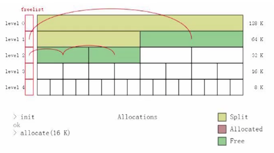

[TOC]

# 一、 内存分配器

如果高效的分配内存
没有最好的内存分配器，只有最切合当前业务类型的内存分配器

## 1. Malloc/Free（new/delete）

优点：

1. 支持任意尺寸的内存分配
2. 由操作系统提供，使用简单

缺点：

1. Free 开销远大于申请开销（DLMalloc）
   处理内存尺寸的合并，处理内存是否要退换给系统内存
2. 绝大多数的实现依赖 Global Mutex（JeMalloc）
3. 容易造成内存碎片

## 2. Linear，Stack Allocator

**Linear Allocator**

简介：

1. 申请内存：线性增长（刚开始申请一块固定大小的内存  ）
2. 释放内存：什么都不做
3. 特定时间重置

应用场景：

1. 每帧生成的渲染状态的数据
2. 每帧给 GPU 骨骼动画的数据

优点：

1. 容易支持 Lockfree
2. 申请内存效率高，只需要一个 index 递增的操作

**Stack Allocator**

简介：实现类似 Linear Allocator

应用场景：关卡的资源加载

优点：

1. 性能高，类似 Linear Allocator
2. 可以按需进行释放
3. 可以作为其他 allocator 的 back allocator

## 3. Freelist Allocator

简介：

1. 用链表方式管理连续的内存（只存储指针的内存，使用的内存不计入链表的内存）
2. 申请/释放复杂度 $O(1)$

应用场景：粒子特效缓冲池

缺点：

1. 连续申请返回的内存不连续
2. 申请的**内存尺寸固定**

## 4. Buddy Allocator

简介：

1. 第一次开辟一个 $2^n$ 大的 内存来用
2. 释放小内存的时候会自动检测周围的内存也是否已经释放，如果释放了，向上通知有可以合并的大内存可以使用，便于下次申请内存的时候使用内存

应用场景：

1. GPU 上的内存管理
2. 申请的内存可以会持续多帧

优点：

1. 支持 $2^n$ 大小的内存
2. 自动合并相邻的内存

## 5. Handle Based Allocation

简介：

1. 是内存分配器的上层抽象，因此内部可以使用任意的内存分配器
2. 申请内存后不直接返回 `void *`
3. 返回一个 `uint64_t` 类型的代表对象的 handle（一部分作为 index，另一部分作为状态标记）

应用场景：

1. Windows Object‘s handle
2. Entity’s GraphicState handle

优点：

1. 可以被随便拷贝（做到不同线程使用不一样的 handle 内存）
2. 杜绝上层的错误访问（降低耦合关系）
   例：主线程访问的内存是渲染线程的拷贝，当渲染完成后切换 handle Buffer 的形式来实现数据同步

# 二、面向数据的的设计方法

如何高效的访问数据（可以根据数据的访问频率来进行问题优先级分层优化性能）

## 1. Entity Component System

简介：

1. 每个 Entity 用 ID 表示，上面对应着这个 Entity 具备的能力的 Component Manager
2. 每次操作 Entity 不同功能的时候，先通过 Entity ID 查找 Component Manager 下属于这个 Entity 的 Component 来操作
3. 更新每个 Entity 就是把所有的 Component Manager 的数据都更新一遍

优点：

1. 同种类型且占用内存不大，经常访问的数据内存布局紧凑，方便 cache line 的命中
2. 层级关系低，方便应对多变的需求方案，各个系统可以更新自己感兴趣的组件
3. 避免虚集成关系导致的性能开销

  

# 引用

1. [如何设计内存池？ - 韦易笑的回答 - 知乎](https://www.zhihu.com/question/25527491/answer/56571062)