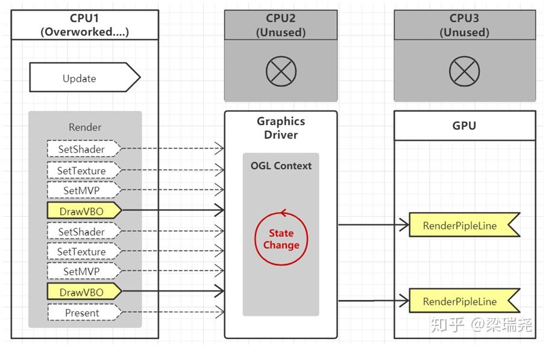
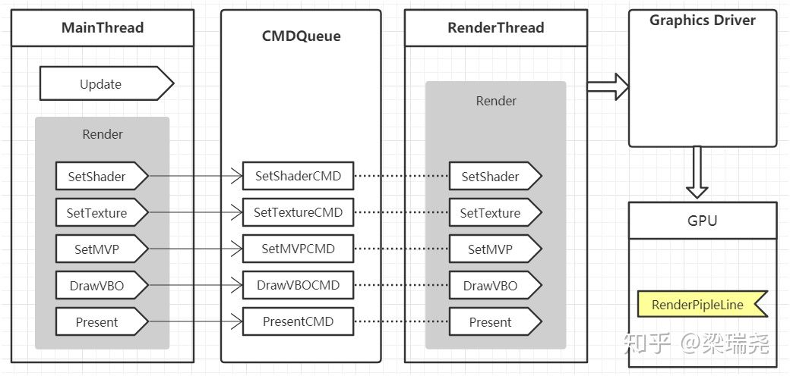
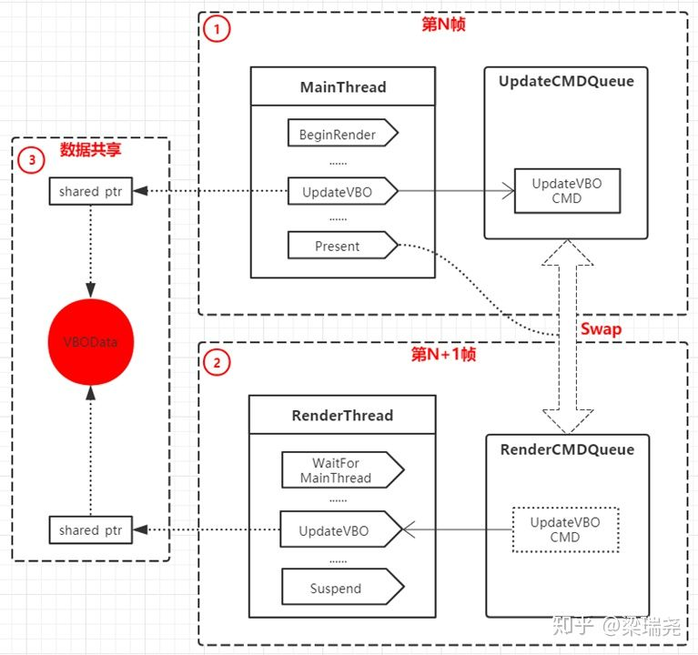
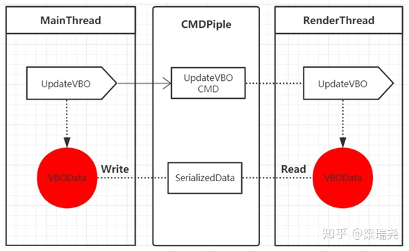
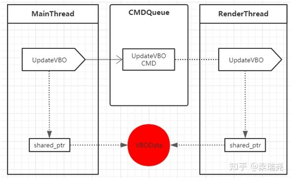
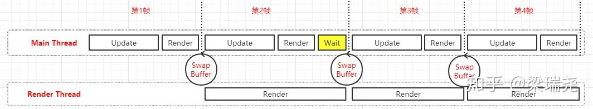
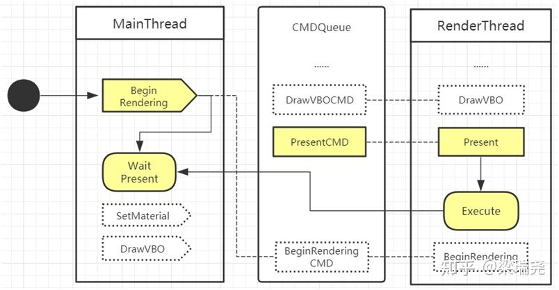

[TOC]

<h1><center>多线程并发编程</center></h1>

> 以下概念主要基于 QNX 系列操作系统（主要面向嵌入式的操作系统，最成功的微内核操作系统之一）提供的文档来描述


# 一、基础概念

> 一般在某些操作会阻塞主线程时，使用多线程，将这些操作放到其他线程中做到并发 —— 多个独立活动同时执行


## 1. 进程 process

> 进程就像工厂的车间


进程是 CPU 所能处理的单个任务 Task，同一时刻，CPU 总是执行一个进程

- 系统中正在运行的**一个程序**
- 每个进程之间相互独立（运行在其专用且受保护的内存空间内）
- 进程之间可以相互通讯


## 2. 线程 thread

> 线程就像车间里的工人
> 一个车间里，可以有很多个工人，他们共享车间的资源，协同合作


一个线程由线程 ID、当前指令指针（PC）、寄存器集合和堆栈组成

- 1 个进程想执行任务，必须得有 1 条线程（每个进程至少有一条线程）
- 1 个进程所有的任务都在线程里执行
- 1 个线程的任务的**执行都是串行**（按顺序多个任务，同一时间内 1 个线程只执行 1 个任务）


### 2.1 线程的访问权限

线程，有时候也被称为轻量级进程（Lightweight Process，LWP）

对于共享的进程资源，线程的访问需要和其他线程保持同步，需要考虑线程安全问题


### 2.2 线程调度与优先级

> 抢占：一个较高优先级的线程突然能被 CPU 使用 Ready，操作系统内核将立即将上下文切换为高优先级的线程，原来优先级较低的线程会被挂起变为 Wait 状态
>
> 恢复：优先级较高的线程执行结束后，原先被挂起的优先级较低线程将会被唤醒，继续执行 Running

**线程的状态切换**：
其中拥有**因时间片用尽，而切换为就绪状态**的功能的线程叫可抢占线程（现在大部分操作系统的线程都是可抢占线程）

- Ready 就绪：此时线程可以立刻执行，但 CPU 已经被其他线程占用
- Wait 等待：此时线程正在等待某一时间发生（通常是 I/O 或同步），无法执行（等待状态内有许多子状态来区别等待的原因）
- Running 运行：此时线程正在执行


**线程的优先级调度**

各个线程，按照线程的优先级顺序轮流执行一小段时间（一般是 4 ms，实际上是 4 个 CPU 时钟）

改变线程优先级的方法有：

1. 用户指定优先级，[*pthread_setschedparam()*](http://www.qnx.com/developers/docs/6.4.1/neutrino/lib_ref/p/pthread_setschedparam.html) 
    线程的优先级可以手动设置，系统会根据线程的实际表现自动调整
    注意：优先级为 0 的线程是为空闲线程保留的
2. 根据进入等待的频繁程度提升或降低优先级
    IO 密集（频繁等待）线程的优先级 >  CPU 密集（很少等待）线程的优先级
3. 长时间得不到执行的线程提升优先级
    防止 Starvation 饿死现象：一个饿死的线程总是有比它优先级高的线程执行，导致这个线程始终无法执行


### 2.3 Linux 系统调用的多线程

>  UNIX 程序的调用过程
>  **程序** $\to$ **C/C++ 标准库**(编译器提供) $\to$ **POSIX 标准库**(操作系统提供的系统调用) $\to$ **系统服务**
>
>  对应的多线程使用的动态库函数
>  程序 $\to$ C/C++ thread 标准库 $\to$ POSIX pthread 标准库 $\to$ 系统服务

在 Linux 平台的 POSIX 库规定的多线程中进程和线程的界限比较模糊

Linux 中只有任务 Task，没有线程和进程的实体

- 一个任务可以看做只含有一个线程的进程
- 多个任务可以共享内存空间构成一个进程，而这些任务便成了这个进程的线程


**Linux 多线程的系统调用函数**（遵循 POSIX 标准库的规则）

1. clone：根据当前调用的 task 产生一个新的 task，并可以设置产生的 task 和原 task 共享的数据
   相当于在进程中产生一个线程

2. fork：根据当前调用的 task 快速产生一个新的 task，并不复制原 task 的内存空间和原 task 共享一个**写时复制**的内存空间
   相当于深拷贝出一个进程

   > 写时复制（Copy on Write，COW）：
   >
   > - 只要一直不写入内存：都读同一份内存
   > - 一旦需要写入内存时：复制原 task 内存供当前 task 读写，当前 task 以后就不在原 task 读内存（以免影响其他 task 使用）

3. exec：将新 fork 出来的 task 设置为当前执行的 task

   

### 2.4 C/C++ 标准库规定的多线程

> 对应的多线程使用的动态库函数
> 程序 $\to$ C/C++ thread 标准库 $\to$ POSIX pthread 标准库 $\to$ 系统服务

#### 2.4.1 pthread.h 函数库

1. 线程创建

   ```c++
   #include <pthread.h>
   int pthread_create(pthread_t *thread,              // 线程 ID 变量存储的地址
                      const pthread_attr_t *attr,     // 线程属性
                      void *(*start_routine) (void *),// 创建线程运行所需的主函数
                      void *arg);                     // 线程运行时需要传入的参数（线程间共享的数据）
   ```

   

2. 线程同步

   2.1. join 函数：加入阻塞的线程执行完成后（不在执行），该函数后面的代码才可以执行

   ```c++
   // 在当前运行的线程中设置要等待的其他线程
   int pthread_join(pthread_t thread, void **value_ptr);
   ```

   2.2 barrier 对象：阻塞的线程在 barrier 处都完成后（等待一段时间），继续执行

   ```c++
   // 1. 在某一个线程中，创建 barrier 对象
   int pthread_barrier_init(pthread_barrier_t *barrier,				// barrier 对象地址指针
   	                      const pthread_barrierattr_t *attr,  // 对象属性
     	                    unsigned int count);                // 等待线程的个数
   
   // 2. 在其他每个需要被等待的线程中
   // - 线程自身执行完后必须调用等待函数（等待其他线程执行完成）
   // - 当所有线程都执行完成后，所有线程同时执行自身 pthread_barrier_wait 后的代码
   int pthread_barrier_wait(pthread_barrier_t *barrier);
   ```


#### 2.4.2 std::thread 函数库

1. 线程对象创建

   ```c++
   #include <thread>
   #include <chrono>
   
   int iPrint(int param){
     using namespace std;
     cout << "Thread id:" << this_thread::get_id() << " param:" << param << endl;
     
     chrono::milliseconds dura(3000); // 定义一个3秒的时间
     this_thread::sleep_for(dura);    // 模拟长时间计算
     
     return param;
   }
   int iPrint(std::future<int>&f){
     using namespace std;
     int param = f.get(); // 等待，直到其他线程的 promise 履行
   
     cout << "Thread id:" << this_thread::get_id() << " param:" << param << endl;
     
     chrono::milliseconds dura(3000); // 定义一个3秒的时间
     this_thread::sleep_for(dura);    // 模拟长时间计算
       
     return param;
   }
   
   // 一、普通创建线程
   // 注意：线程对象在被析构前，需要显式的等待线程完成，或者分离它
   //      进行复制时也需要满足条件（不能通过复制新线程来丢弃一个已有的线程）
   std::thread* iThread = new std::thread(iPrint, 1);
   
   
   #include<future>
   
   int param = 0;
   std::promise<int> p; // 主线程中的 int 变量
   std::future<int> fuPro = p.get_future(); // future 中的变量值约定从将来获得
   
   // 二、异步函数模板创建线程
   // launch::async    立刻创建线程并执行
   // launch::deferred 当调用 get | wait 的时候创建线程执行
   std::future<int> fu1 = std::async(launch::async, iPrint, 4);
   std::future<int> fu2 = std::async(launch::async, iPrint, std::ref(fuPro));
   
   std::cout << "Run in main thread ..." << std::endl;
   std::cout << "Run in main thread ..." << std::endl;
   std::cout << "Run in main thread ..." << std::endl;
   
   p.set_value(13); // 履行 promise 将来传值的约定
   
   // fu1.wait(); // 只等待，不会获取子线程返回结果，类似 iThread.join
   param = fu1.get(); // 等待子线程结果，获得子线程函数返回结果
   
   std::cout << "Future 1 result is:" << param << std::endl;
   std::cout << "Future 2 result is:" << fu2.get() << std::endl;
   ```

   

2. 线程同步

   ```c++
   // 当前线程等待 iThread 结束后在结束
   // 一但设置为 join 或 detach，便不能再次设置 detach 或 join 其他同步类型
if (iThread.joinable()) {
     iThread.join();
   }
   
   // iThread 单独结束，结束后系统自动回收其资源
   iThread.detach();
   ```
   
   


## 3. 多 CPU 多线程并发

假设我们要完成对本地客户端对远端服务器的数据请求，依次需要 C、X、W 三个步骤
其中 C 表示程序运算时长，X 表示电脑外部硬件设备处理数据时长，W 表示等待服务器响应的时长

1. **单 CPU，单线程，顺序执行**
   耗时：(C + X + W) * num_x_lines
   
2. **单 CPU，多线程，并发**
   耗时：(C + X) * num_x_lines + W
   
3. **多 CPU，单线程，并发**
   耗时：（C + X + T）* num_x_lines / num_cpus**（理想情况下，说明了运行效率的上限）**
   下图中，C 都是并行执行的，单由于 X 是计算机的外部资源，需要每个线程单独访问，造成了其他 CPU 的线程等待对 X 资源访问的情况
   
4. **多 CPU，多线程，并发**
   耗时：C + X * num_x_lines**（理想情况下，说明了运行效率的上限）**
   


## 4. 延伸：时钟和计时器

操作系统外层有个**时钟中断硬件**，系统内核每隔一段时间从获取到这个中断服务(Interrupt Service Routine, ISR)

- 这个外层的时钟中断硬件由一个高速(MHz)时钟数除以一个固定的整数得到的数(kHz or Hz)为间隔的时间(一般说是 1 ms)
不过这个除后得到的数并不完全等于实际的 1ms 可能是 0.9999296004 ms 这样的近似值，这被操作系统内核矫正为 1ms 后发出 ISR
- 由于硬件上的小误差，在操作系统上用 sleep 这样的 C 标准库函数时
  实际的唤醒时间要比所设置的唤醒时间早
- 如果是多线程的情况，由于线程调度的耗时会使实际的等待的数比 sleep 设置的数要大


系统调用使用的计时器类型

- 脉冲计时器：周期性的执行计时器的任务（脉冲信号发送时不会被阻塞，可以像其他消息被接收）
- 信号计时器：等待触发后发送信号立刻执行计时器里的任务
- 线程计时器：每隔一段时间创建线程来执行特定的任务，不受其他线程影响，但如果计时器间隔时间过短会有创建很多线程，消耗大量内存


# 二、线程安全

原子操作：对某个变量进行一元操作符运算的时候，能够不被打断，不会被系统的线程调度打断的操作，例 C 或 C++ 代码的原子操作编译成汇编的机器代码后**是一条汇编指令**

内核只与线程交互，并不关心交互的线程是否在同一进程

**系统调用和硬件中断会导致线程优先级的重新调度**

```c++
// C++11 原子操作，限制并发程序对共享数据的使用，避免数据竞争
#include <atomic>
std::atomic<int> iCount(10);
```


## 1. 二元信号量 Binary Semaphore

> 有些车间只能容纳一个工人工作，**需要一把钥匙开锁进车间**
> 车间外的其他工人根据是否上有钥匙来判断是否需要在车间外排队等候

**作用域：不同的线程和进程**
同一个信号量，可以被系统中的一个**线程/进程**获取，被另一个**线程/进程**释放

二元信号量，只有两种状态：占用、非占用


## 2. 信号量 Semaphore

> 有些车间只能容纳多个工人工作，**需要多把钥匙开锁进车间**
> 车间外的其他工人根据自己是否有钥匙来判断是否需要在车间外排队等候

**作用域：不同的线程和进程**
同一个信号量，可以被系统中的一个**线程/进程**获取，被另一个**线程/进程**释放

信号量，全程多元信号量
允许多个线程并发访问资源，一个初始值为 N 的信号量允许 N 个线程并发访问


## 3. 互斥锁 Mutex

互斥锁 Mutual exclusion，缩写 Mutex，防止多个线程同时读写某一块内存区域
互斥锁比二元信号量更为严格特殊，是一种与二元信号量类似确不同的锁，互斥锁有优先级继承等其他属性

一个线程使用一个 互斥锁 Mutex 对象，一旦 A 线程将 Mutex  B 对象 lock，其他线程将无法获得 Mutex B 对象，直到 A 线程将 B 对象设置为 unlock 状态

**作用域：同一进程内**（POSIX 标准，但其他 UNIX 系统可扩展这个标准，让 Mutex 作用域在不同的进程里，例：Neutrino 系统）
同一个互斥锁：谁获取，谁释放

相比二元信号量，互斥锁解决了[线程执行过程中优先级颠倒的问题](https://www.cnblogs.com/codescrew/p/8970514.html)

注意：切勿将一个受互斥锁保护的数据，通过其他接口传到互斥锁保护范围之外

死锁：如果一个进程在等待只能由该进程停止才能引发的事件，那么该进程就是死锁的

- 避免嵌套锁
  已经锁定了一个 mutex 的时候，你最好不要再次锁定
  如果要锁定多个，你就用 `std::lock`
- 按固定顺序锁定
  如果你要锁定两个以上的 mutex 而你又不能用 `std::lock`。那么最好的建议就按固定顺序去锁定
  1. 使用<u>层锁</u>确保顺序
     hierarchical_mutex 规则思想是：将 mutex 分层，规定加锁顺序是由高层到底层才能进行，底层到高层报出运行时错误，这样就可以利用编程的方法检测死锁

```c++
#include<mutex>
std::mutex mu; // 互斥对象
std::once_flag onceFlag;

// 1. 通过函数调用 cout，并为 cout 加锁，防止同时访问 cout
void share_print1(std::string msg, int id) {
	mu.lock();
	std::cout << msg << id << std::endl;
	mu.unlock();
}

// 2. lock_guard 可以对 mutex 进行管理，自动实现其构造调用 lock，析构调用 unlock
void share_print2(std::string msg, int id) {
	std::lock_guard<std::mutex> guard(mu);
  
  // adopt_lock 即抛弃 lock 操作，因为上句已加锁，防止多层嵌套的死锁
  std::lock_guard<std::mutex> guard2(mu, std::adopt_lock);
  
  // unique_lock 和 lock_guard 作用差不多，但 unique_lock 可以随时加锁，可以交换锁的管理权限
  // std::defer_lock 不填，默认加锁
  std::unique_lock<std::mutex> locker(mu, std::defer_lock); // 先不加锁
  std::unique_lock<std::mutex> locker2 = std::move(locker);
  locker2.lock();
  
  // 保证即使是多线程情况下，也只被执行一次
  std::call_once(onceFlag,[&]{ std::cout << "多线程情况下，也只被执行一次" << std::endl; });
  
  locker2.unlock();
  
	std::cout << msg << id << std::endl;
}

//子线程函数
void function_1() {
  for(int i = 0; i < 50; i++) {
		share_print1("From == t1 1:" ,i);
    share_print2("From == t1 2:" ,i);
  }
}

int main() {
	std::thread t1(function_1);
	for (int i = 0; i < 100; i++) {
  	share_print1("From ++ main 1:", i);
		share_print2("From ++ main 2:", i);
  }

	t1.join();// 等待子线程结束
  
	return 0;
}
```


## 4. 临界区 Critical Section

比互斥锁更为严格：作用范围仅限于本进程，其他进程无法获取

- 获取锁：进入临界区

- 释放锁：离开临界区


## 5. 读写锁 Read/Write Lock

读写锁：避免了读取频繁，偶尔写入时，其它锁的低效率

- 多人可读，共享状态
- 单人写入，独占状态

| 读写锁状态 | 以共享的方式获取读写锁 | 以独占的方式获取读写锁 |
| :--------- | ---------------------- | ---------------------- |
| 自由       | 成功                   | 成功                   |
| 共享       | 成功                   | 等待 其它线程释放锁    |
| 独占       | 等待 其它线程释放锁    | 等待其它线程释放锁     |


C++ 标准库中规定的读写锁

```c++
// 1. 创建和销毁读写锁对象
int pthread_rwlock_init(pthread_rwlock_t *lock, const pthread_rwlockattr_t *attr);
int pthread_rwlock_destroy(pthread_rwlock_t *lock);

// 2. 询问是否可以锁定 读/写 锁
int pthread_rwlock_tryrdlock(pthread_rwlock_t *lock);
int pthread_rwlock_trywrlock(pthread_rwlock_t *lock);

// 3. 锁定 读/写 锁，阻塞当前线程
int pthread_rwlock_rdlock(pthread_rwlock_t *lock);
int pthread_rwlock_wrlock(pthread_rwlock_t *lock);

// 4. 解锁 读/写 锁
int pthread_rwlock_unlock(pthread_rwlock_t *lock);
```


## 6. 可重入 Re-entrant

一个函数被重入：这个函数没有执行完成，又一次进入该函数执行（由于外部因素或内部调用）

一个函数被称为可重入的，表示该函数被重入后不会产生任何不良的后果
可重入函数有以下特点

1. 没有任何 局部的静态 或 全局的非 const 变量
2. 仅依赖调用方的参数
3. 不依赖任何单个资源的锁（mutex 等）


## 7. 睡眠锁 Sleepon Lock

睡眠锁

- 当多个线程中都等待同一事件触发时使用的锁
- 内部动态创建条件变量来对应想要同步的多个共享对象


C++ 标准库中规定的睡眠锁

```c++
int pthread_sleepon_lock(void);
int pthread_sleepon_unlock(void);

int pthread_sleepon_wait(void *addr);

int pthread_sleepon_signal(void *addr);
int pthread_sleepon_broadcast(void *addr);
```


睡眠锁是基于条件变量的封装，例：

```c++
#include <stdio.h>
#include <pthread.h>

volatile int data_ready = 0;

void consumer() {
  printf("In consumer thread...\n");
  while(1) {
    pthread_sleepon_lock();
  	while(!data_ready) {
    	pthread_sleepon_wait(&data_ready);
    }
    // process data
    printf("consumer: got data from producer\n");
    data_ready = 0;
		pthread_sleepon_unlock();
  }
}

void producer() {
    printf("In producer thread...\n");
    while(1) {
        // wait for interrupt from hardware here...
        printf ("producer: got data from h/w\n");
        pthread_sleepon_lock();
        data_ready = 1;
        pthread_sleepon_signal(&data_ready); // 唤醒优先级最高的一个线程来处理获得的数据
      																			 // pthread_sleepon_broadcast 唤醒所有线程
        pthread_sleepon_unlock();
    }
}

int main() {
    printf ("Starting consumer/producer example...\n");

    // create the producer and consumer threads
    pthread_create(NULL, NULL, producer, NULL);
    pthread_create(NULL, NULL, consumer, NULL);

    // let the threads run for a bit
    sleep (20);
}
```


## 8. 条件变量 Condition variables

条件变量（缩写：condvars）

- 一个条件变量同步一个共享对象，想同步多个共享对象，需要一个个创建对应的条件变量
- **多用于线程通信**


模拟睡眠锁功能的条件变量实现：

1. **POSIX 库 pthread**

```c++
#include <stdio.h>
#include <pthread.h>

volatile int data_ready = 0;

pthread_mutex_t mutex = PTHREAD_MUTEX_INITIALIZER;
pthread_cond_t condvar = PTHREAD_COND_INITIALIZER; // 与 data_ready 对应

void producer() {
    printf ("In producer thread...\n");
    int count = 10;
    while(count > 0) {
        // wait for interrupt from hardware here...          
        printf("producer:  got data from h/w\n");
        pthread_mutex_lock(&mutex);
      
        while (data_ready) {
            pthread_cond_wait(&condvar, &mutex);
        }
        data_ready = 1;
        pthread_cond_signal(&condvar); // 唤醒优先级最高的一个线程来处理获得的数据
      																 // pthread_cond_broadcast 唤醒所有线程
        pthread_mutex_unlock(&mutex);
      
      	--count;
    }
}

void consumer() {
    printf ("In consumer thread...\n");
  	int count = 10;
    while(count > 0) {
        pthread_mutex_lock(&mutex);
      
        while(!data_ready) {
            pthread_cond_wait(&condvar, &mutex);
        }
        // process data
        printf("consumer:  got data from producer\n");
        data_ready = 0;
        pthread_cond_signal(&condvar);
      
        pthread_mutex_unlock(&mutex);
      
      	--count;
    }
}

int main() {
    printf("Starting consumer/producer example...\n");

    // create the producer and consumer threads
    pthread_create(NULL, NULL, producer, NULL);
    pthread_create(NULL, NULL, consumer, NULL);

    // let the threads run for a bit
    sleep (20);
}
```


2. **std::thread 库**

```c++
#include<mutex>
#include <condition_variable>

volatile int data_ready = 0;
std::mutex mu;								   // 互斥对象
std::condition_variable condvar; // 条件变量：避免线程无谓的循环

void producer() {
		printf ("In producer thread...\n");
  	int count = 10;
    while(count > 0) {
        // wait for interrupt from hardware here...          
        printf("producer:  got data from h/w\n");
        unique_lock<mutex> locker(mu);
      
      	while (data_ready) {
            condvar.wait(locker);
        }
        data_ready = 1;
        condvar.notify_one(); // 激活一个等待这个条件的线程
      										    // notify_all 激活所有
        locker.unlock();
      
	      --count;
    }
}

void consumer() {
		printf ("In consumer thread...\n");
  	int count = 10;
  	while(count > 0) {
        unique_lock<mutex> locker(mu);
      
        while(!data_ready) {
            condvar.wait(locker);
        }
        // process data
        printf("consumer:  got data from producer\n");
        data_ready = 0;
        condvar.notify_one();
      
        locker.unlock();
      
	      --count;
    }
}

int main() {
	  printf("Starting consumer/producer example...\n");
		thread t1(producer);
    thread t2(consumer);
    t1.join();
    t2.join();
  
    return 0;
}
```


## 9. 线程池 thread Pool

在服务器中，经常会遇到 1.创建线程 2.等待请求 3.销毁线程 4.再创建线程防止遗漏的请求未处理
为了节省内存和不断创建销毁线程所占用的时间，需要使用线程池来解决这个问题


## 10. 中断 interrupts

中断：操作系统内核停止正在发生的一切，并转移到中断所服务的程序（内核切换当前任务到中断服务的时间叫中断等待，不同的处理器有不同的中断等待时间长度）

注意：

- 中断服务程序所需要执行的时间应尽可能的短
- java 线程的中断只是一个中断标识位的改变，中断后依旧会执行


## 11. 防止编译器过度优化 volatile

CPU 的动态调度：在执行程序的时候，为了提高效率有可能**交换指令的执行顺序**
编译器在进行优化的时候，可能为了效率而交换毫不相干的两条相邻指令的执行顺序

关键字 **volatile**，防止编译器过度优化（无法阻止 CPU 动态调度换序）

- 阻止编译器为了提高速度将一个变量缓存到寄存器内而不写回
- 阻止编译器调整操作 volatile 变量的指令顺序（volatile 确保所有的 write 操作都将发生在 read 操作之前）


应用：单例设计模式的线程安全

```c++
#include <mutex> // C++ 标准库头文件

volatile T* pInst = 0;
T* GetInstance()
{
  if (!pInst)	  // double-check 双重校验，确保只有在未初始化时同步数据，减少同步数据频率，提高效率
  {
    lock();
    if (!pInst) // 判断上一个释放锁的线程（如果有的话）是否已经成功初始化单例
    {
      // 错误的方式
      // pInst = new T; // 此行代码包涵三步骤：
      									// 1.分配内存空间 2.执行构造函数 3.将分配的空间指针赋值给 pInst
      									// 其中，2，3 步骤可以被编译器优化而颠倒顺序
      									// 出现 pInst 有值但没有被初始化的情况，导致线程锁失效
      
      // 正确的方式
      T* temp = new T;
      __asm__ volatile ("lwsync") // 插入汇编指令，阻止 CPU 动态交换该指令前后的位置
      pInst = temp;
    }
    unlock();
  }
  
  return pInst;
}
```


# 三、系统内核线程和应用程序线程模型

## 1. 一对一模型

一个用户态的线程对应一个内核态的线程，反过来不一定（有些内核态线程在用户态可能没有与之对应的线程）

来源：直接使用 POSIX 协议的 API 或 系统调用的方法创建的线程（在内核态有对应的一个线程）

优点：

- 线程之间是真正的并发
- 多线程程序在多任务处理器上有更好的表现

缺点：

- 操作系统会限制内核线程的数量，导致了用户线程的数量被限制
- 操作系统内核线程切换上下文开销大，导致了用户线程执行效率低


## 2. 多对一模型

多个用户态的线程对应一个内核态的线程

优点：

- 用户线程切换较快
- 用户线程数量几乎不限制

缺点：

- 一个用户线程阻塞，对应其他用户态的线程（对应同一个内核态线程）也会阻塞
- 多任务处理器的提升，对多对一模型线程不会有明显的帮助


## 3. 多对多模型

多个用户态的线程对应少数但不止一个内核态的线程

- 用户线程切换较快
- 用户线程数量几乎不限制
- 多任务处理器的提升，对多对多模型会有提升，不过提升幅度不如一对一模型大


# 四、并发编程模型

其他线程在等待该线程释放锁，但该线程却被挂起了，便会发生死锁

## 1. 并行工作者

方法：由一个委派者将多分流程相同，数据不同的任务分配到不同的工作者上并行执行

优点：

- 容易理解，便于快速上手使用

- 从代码上能清楚的反映出整个任务的流程顺序


缺点：

- 多线程直接的共享数据控制复杂
- 共享数据的工作者每次都要从共享内存获取共享数据来读/写，将会导致效率降低
- 多个并行的任务执行顺序是不确定的，不便于维护和调试


## 2. 流水线并发


方法：每个工作者只处理总流程的其中一个工序，多个工作者做到无共享数据的并发
		   实际可能所有工作拆分为多条流水线并发处理，然后在每条流水线内，多个工作者并发处理数据

优点：

- 任务执行顺序固定，会使任务整体上得到简化

- 无需共享数据

- 每个工作都有自己的私有数据，不用从共享内存读/写数据
  可以的根据硬件设备做优化，执行效率会相对较高

缺点：

- 从代码上不能清楚的反映出整个任务的流程顺序
- 加大了代码编写的难度
  若在代码中嵌入过多的回调处理，往往会出现所谓的回调地狱（callback hell）现象


## 3. 函数式并行

方法：任务的并行操作交给单个函数来执行而不是一个类

优点：

- 每个函数调用都可以独立执行
- 无需共享数据

缺点：

- 协调函数调用需要一定的开销


# 五、应用（渲染引擎方向）

## 1. 应用背景

### 1.1 单线程渲染流程

1. 主线程：大量逻辑更新（例 AI、碰撞检测和动画更新）
2. 主线程：调用图形 API 更新渲染状态（例 shader、纹理、矩阵 和 alpha 融合后执行 DrawCall）
   触发驱动层状态改变，可能造成卡顿
3. GPU：驱动层调用 GPU 渲染管线绘制图像




### 1.2 多线程渲染流程

受限与 OpenGL、DX9、DX10 并不支持多个线程操作同一个 Context，渲染线程只能使用一个线程来管理

1. 主线程：大量逻辑更新（例 AI、碰撞检测和动画更新）
2. 主线程：将图形 API 指令提交到渲染队列（减少直接调用图形 API 的开销）
3. 渲染线程：执行渲染队列，更新渲染状态，触发驱动层状改变
4. GPU：驱动层调用 GPU 渲染管线绘制图像




### 1.3 真正的多线程渲染

需要开启多个线程来执行渲染，而非单一个线程来执行渲染线程

微软最新的 Directx12、苹果的 Metal 及 Khronos 的 Vulkan 对多线程渲染已经有了很好的支持
它们都有一个Command List的概念，Command List可以并行执行而并不会太多的依赖图形驱动层的优化，将不同的渲染指令提交到不同的Command List，能更充分的利用多核CPU，提高渲染效率


## 2. 多线程渲染通信模型

最简单的方式：主线程提交命令到队列，渲染线程执行队列中的命令，在出入队列的时候会加锁来保证线程安全
缺点：频繁的加锁会导致两个线程相互阻塞，降低运行效率


### 2.1 双队列 + 帧同步

在同一帧里

1. 渲染线程首先执行上一帧的渲染指令

2. 主线程执行更新逻辑，然后提交本帧的渲染指令

3. 主线程 **同步等待** 渲染线程执行完上一帧的渲染指令
   如果渲染线程先执行完，也需要 **同步等待** 主线程更新完当前逻辑处理

4. **交换**更新队列（主线程） 和渲染队列（渲染线程）

   

优点：

1. 限定并减少了同步次数
2. 减少了资源竞争问题

缺点：

1. 额外使用了一个队列大小的内存空间

2. 渲染相对于逻辑延迟一帧

3. 主线程和渲染线程共享一份资源，数据传递使用的指针必须是线程安全的
   导致存在不确定的线程安全问题：在渲染线程调用析构函数，在析构函数调用了主线程方法（将某个资源从主线程队列中移除）

   可以通过以下方法解决：

   1. 禁止在资源析构函数中调用主线程的函数
   2. 使用资源 GC，即资源的分配和释放完全在主线程中完成，分配资源时，将资源放到主线程的资源管理器中，引用计数为 1，在每一帧结束时，将资源管理器中引用计数为 1 的资源删除




### 2.2 管道方案

Unity 的多线程渲染采用的方案

在同一帧里

1. 主线程将渲染指令序列化为二进制数据

2. 主线程不断的往循环的 buffer 里写入（如果 buffer 被填满，主线程被阻塞）

3. 渲染线程不断的从 buffer 中读取数据，反系列化为渲染指令（如果 buffer 中无数据，渲染线程被阻塞）

   

优点：
1. 运行稳定，读写 buffer 只需要移动读写点的位置
2. 只有一个生产者和消费者前提下，环形 buffer 的读写可以做到无锁
   采用 [内存屏障](https://zhuanlan.zhihu.com/p/208788426) 保证读写点变更时，相应的内存读写可用
3. 不用考虑资源分配与释放的线程安全
   同一份资源在主线程和渲染线程**分别有自己不同的实例**，两个线程分别维护自己资源的生命周期

缺点：

1. 效率较低（单仍高于单线程的速度）
2. 面向数据，所有渲染指令必须能被序列化，因此不能采用抽象度过高的实现方式
3. 需要预先分配一块比较大的内存（为了能读写大容量的资源）
   而且相对于直接传递资源的指针来说，读取耗时会相对高一些




### 2.3 环形队列方案

在同一帧里

1. 主线程不断的将渲染指令加入到**环形队列**（不用序列化，如果队列满，主线程被阻塞）
2. 渲染线程不断的从队列中取出数据执行（如果队列为空，渲染线程被阻塞）


优点：

1. 执行效率最高
2. 不需要每一帧同步主线程和渲染线程
3. 渲染虽然会有延迟，但是延迟时长比双队列要短

缺点：

1. 主线程和渲染线程共享一份资源，数据传递使用的指针必须是线程安全的
   和双队列 + 帧同步的缺点一致
2. 当瓶颈在消费者（渲染线程，GPU）时，缓冲区会长时间处于填满的状态
   生产者（主线程）可能频繁被休眠和唤醒从而影响帧率
   缓冲区被填满时，渲染线程的帧可能会落后主线程多帧，导致画面出现比较高的延迟




## 3. 同步策略 主线程和渲染线程

### 3.1 同步在主线程提交渲染命令后

在 **双队列 + 帧同步** 的多线程渲染模型中




### 3.2 同步在主线程逻辑更新后

在 **环形队列** 和 **管道** 的多线程渲染模型中（Unity 多线程渲染采用的同步策略）


具体同步流程，在同一帧里

1. 主线程更新逻辑
2. 主线程提交本帧 BeginRendering 指令，**进行同步操作**
   如果检测到渲染线程上一帧的数据没有处理完成，则等待渲染线程
3. 主线程提交渲染指令后，提交 Present 指令




每帧都同步的问题：

游戏的瓶颈如果不在 GPU 端，但是偶尔因为图形驱动层的状态变更导致某一帧的渲染耗时较高
这会造成帧率抖动，引起卡顿


延时一帧同步：可以不用每隔一帧同步一次，而是采用每隔两帧同步一次的方式

这样会让画面更加平滑过度，方便当前两帧的渲染命令及时提交到渲染线程
容错率高，降低偶尔的驱动状态变化的抖动概率


### 3.3 同步在主线程获取渲染线程返回值

#### 3.3.1 同步阻塞

方法

1. 调用有返回值的渲染 API 时，先阻塞主线程
2. 等待渲染线程将队列中指令全部指令完毕返回时，再唤醒主线程
   

优点：实现简单
缺点：阻塞了主线程，会降低帧率

大多数有返回值的图形 API 都是与资源加载相关的，我们可以预先加载好这些资源，避免在 Update 中频繁的调用


#### 3.3.2 封装返回值

方法

1. 主线程调用有返回值的图形API时，在主线程创建一个被封装的对象直接返回
2. 将这个对象作为渲染指令的参数传递到队列
3. 等到渲染线程执行到该指令后创建好正真的对象，再将真正的对象赋值给封装的对象
4. **销毁这个对象时，不直接删除对象，而是将删除对象调用封装成一条指令，提交到队列，让渲染线程来执行删除**


优点：非阻塞，对主线程的帧率影响比阻塞方案低
缺点：实现相对复杂（对象在主线程与渲染线程之间传递，生命周期维护起来也比较麻烦）


# 引用

- [cplusplus](http://www.cplusplus.com/reference/mutex/)
- [cppreference](https://en.cppreference.com/w/cpp/thread)
- [Clocks, Timers, and Getting a Kick Every So Often](http://www.qnx.com/developers/docs/6.4.1/neutrino/getting_started/s1_timer.html)
- [Processes and Threads](http://www.qnx.com/developers/docs/6.4.1/neutrino/getting_started/s1_procs.html)
- [Message Passing](http://www.qnx.com/developers/docs/6.4.1/neutrino/getting_started/s1_msg.html)
- [Interrupts](http://www.qnx.com/developers/docs/6.4.1/neutrino/getting_started/s1_inter.html)
- [POSIX Threads Programming](https://computing.llnl.gov/tutorials/pthreads/)
- [Using the Clone() System Call](https://www.linuxjournal.com/article/5211)
- [non-blocking-algorithms](http://tutorials.jenkov.com/java-concurrency/non-blocking-algorithms.html)
- [Java 并发编程](https://wiki.jikexueyuan.com/project/java-concurrency/thread-interrupt.html)
- [并发编程模型](https://wiki.jikexueyuan.com/project/java-concurrent/concurrency-models.html)
- [正确使用 Volatile 变量](https://www.ibm.com/developerworks/cn/java/j-jtp06197.html)
- [Java 中的双重检查锁（double checked locking）](https://www.cnblogs.com/xz816111/p/8470048.html)
- [多线程渲染](https://zhuanlan.zhihu.com/p/44116722)

