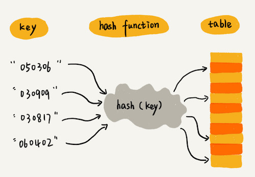
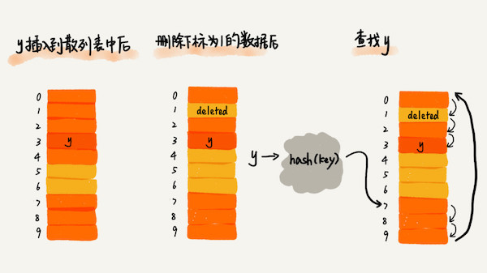

[TOC]

# 一、STL 容器

## 1. 序列式容器

> 不会重新排序，内部排列次序 == 插入次序

### 1.1 数组 Array

- 数组长度在编译期间定义，不可改变
- 连续存储数据，支持随机访问，插入或删除且效率低

```c++
// 普通数组
float vector4f[4];

// C++11 新增数组模版类
// 在普通数组的基础上，添加了一些成员函数和全局函数
std::array<int, 4> vector4i;
```


### 1.2 动态数组 Dynamic array

- 可在运行期动态改变长度
- 连续存储数据，支持随机访问，插入或删除且效率低

```c++
// 当容量不够时，内部会重新生成一个新的数组，将原来的数据都 copy 到新数组后，销毁原来的数据
// 不同的编译器实现的扩容方式不一样，VS2015中以1.5倍扩容，GCC以2倍扩容
std::vector<float> vector4f(4);
```


### 1.3 链表 Linked

- 内存不连续，不支持随机访问，插入或删除且效率高

```c++
// 内部数据结构为：双向循环链表
std::list<float> vector4f(4);
```


### 1.4 双端队列 Double-ended queue

- 由一段一段的定量连续空间构成
- 支持随机访问，是 list 和 vector 的折中方案

```c++
// 内部数据结构为：双向循环队列
std::deque<float> vector4f(4);
```


## 2. 关联式容器

> 元素位置取决于容器内特定的排序准则以及元素值
> 元素位置和插入次序无关

### 2.1 集合 Set

- 内部由红黑树实现
- 其内部元素依据其值自动排序
- Set 集合每个元素值只能出现一次，不允许重复
  **Multiset 集合允许重复元素**
- 当 Set 集合中的元素为结构体时，该结构体必须实现运算符 `<` 的重载

```c++
#include <iostream>
#include <set>
#include <string>

struct People
{
	string name;
	int age;

	bool operator <(const People p) const {
		return age < p.age;
	}
};

int main(int argc, char* argv[]) {
	std::set<People> setTemp;
	setTemp.insert({"张三",14});
	setTemp.insert({"李四",16});
	setTemp.insert({"老王",10});

	std::set<People>::iterator it;
	for (it = setTemp.begin(); it != setTemp.end(); it++) {
		printf("姓名：%s 年龄：%d\n", (*it).name.c_str(), (*it).age);
	}

	return 0;
}

// 输出结果
// 姓名：老王 年龄：10
// 姓名：张三 年龄：14
// 姓名：李四 年龄：16 
```


### 2.2 映射 Map

- 内部由红黑树实现
- 其元素都是 key/value 所形成的一个 pairs，依据 key 值自动排序
- Map 每一个 key 只能出现一次，不允许重复
  **Multimap 允许重复多个 key**
- 对于迭代器来说，可以修改实值，而不能修改 key

```c++
std::map<string, int> mapTemp;
```


## 3. 容器适配器

> 重新组合容器中包含的成员函数，使其满足某些特定场景的需要
> 容器适配器内部可以使用任意容器，但会有一个默认容器

### 3.1 堆栈 Stack

- 默认容器 `std::deque`
- 新增和移除数据时，采用后进先出（Last-In-First-Out, LIFO）的模式

```c++
std::list<int> values {1, 2, 3};
// 替换容器为 list
// stack<T,Container=deque<T>>
std::stack<int,std::list<int>> my_stack(values);
```


### 3.2 队列 Queue

- 默认容器 `std::deque`
- 新增和移除数据时，采用先进先出（First-In-First-Out, FIFO）的模式

```c++
std::list<int> values {1, 2, 3};
// 替换容器为 list
// queue<T,Container=deque<T>>
std::queue<int,std::list<int>> my_queue(values);
```


### 3.3 优先队列 Priority queue

- 默认容器 `std::vector`
- 先进队列的元素并不一定先出队列，而是优先级最大的元素最先出队列

```c++
// 每个 priority_queue 容器适配器在创建时，都制定了一种排序规则
// 根据此规则，该容器适配器中存储的元素就有了优先级高低之分
// priority_queue 容器适配器的定义如下
template <
					typename T, 
					typename Container=std::vector<T>,
					typename Compare=std::less<T>      // Option: std::greater<T>
         >
class priority_queue{
    //......
}

std::priority_queue<int> my_priority_queue;
```


# 二、散列 Hashing

## 1. 散列表 Hash Table

数据结构

- 内部为固定大小的表
- 表中的每个元素表示一个或者多个 key


内部实现

- 通过散列函数 `int hash(key)` 根据存储的 key 值得到表的存储索引 index
- 通过 index % 散列表的固定长度，得到存储的索引
  如果这个索引没有被使用，则为最终的索引值
  如果这个索引被使用了，则会产生散列冲突，通过一些方法解决散列冲突的问题后，也会得到最终的索引值




## 2. 哈希算法


## 3. 防止散列冲突

在有限大小的散列表里通过**散列函数**使 key 和 index 一一对应十分困难，即便像业界著名的 MD5、SHA、CRC 等哈希算法也无法避免散列冲突

### 3.1 开放寻址法

不会开辟新的内存，在原散列表里重新探测一个空闲位置，将其插入

当散列表中空闲位置不多的时候，散列冲突的概率就会大大提高
一般通过装载因子来衡量散列表中空位的多少 `散列表的装载因子 = 填入表中的元素个数 / 散列表的长度`


探测方法

1. **线性探测（Linear Probing）**常用方法
   $hash(key)+i$ 从冲突的索引开始，依次往后查找下一个，看是否有空闲位置，直到找到为止
2. 二次探测（Quadratic probing）
   $hash(key)+i^2$ 从冲突的索引开始，依次往后查找，步长为线性探测原步长的平方
3. 双重散列（Double hashing）
   先用第一个散列函数，如果计算得到的存储位置已经被占用，再用第二个散列函数，依次类推，直到找到空闲的存储位置


下图为使用线性探测的散列表的查找操作

- 插入时，如果发生散列冲突，就探测下一个位置，直到找到空位为止
- 删除时，为了让有冲突的散列数据**保持连续**，需要**通过打上删除的标记，而不是设为空**
- 查找时，如果找到先比较找到的 key 是否与当前 key 相同
  如果不相同，则此 key 发生了散列冲突，就探测下一个位置，直到找到与当前 key 相同的值 或 空位为止




### 3.2 链表法

需要开辟新的内存，所有散列值相同的元素我们都放到相同槽位对应的链表中


# 三、二叉树 Binary Tree

## 1. 树

## 2. 二叉树

## 3. 红黑树

## 4. 递归树

## 5. 堆


# 四、图 Graph


# 引用

- [代码在线运行网页工具](https://tool.lu/coderunner/)
- [What You Should Know about vector](http://www.informit.com/guides/content.aspx?g=cplusplus&seqNum=98)
- [The Fate of vector in C++09](http://www.informit.com/guides/content.aspx?g=cplusplus&seqNum=350)
- [vector: More Problems, Better Solutions](http://www.gotw.ca/publications/N1211.pdf)

