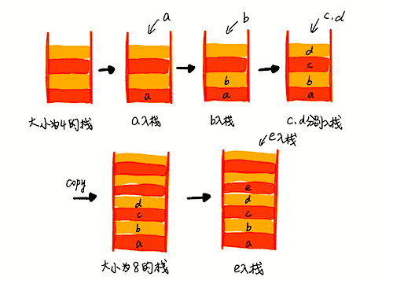

[TOC]

# 一、序列式存储结构

| 时间复杂度 | 数组 | 链表 |
| ---------- | ---- | ---- |
| 插入、删除 | O(n) | O(1) |
| 随机访问   | O(1) | O(n) |

## 1. 链表

链表结构

其中，带头链表利用了添加哨兵来简化操作的思想


链表实现

```c++
// 双向链表节点
typedef struct DNode {
    int data;           //数据，当作为表头时存储整个链表的长度
    struct DNode *prev; //节点前项指针
    struct DNode *next; //节点后项指针
} DNode, *DLinkList;

// 双向循环带头链表 Double Circular Link List
void DCLinkListCreate(DLinkList& plist)
{
    plist = (DLinkList)malloc(sizeof(DNode));
    if (plist)
        plist->next = plist->prev = plist;
    else
        exit(OVERFLOW);
}

// 彻底删除链表，包括头节点
void DCLinkListDestroy(DLinkList& plist)
{
    DCLinkListClear(plist);
    free(plist);

    plist = nullptr;
}

// 从前往后删除节点，只保留头节点
void DCLinkListClear(DLinkList& plist)
{
    DLinkList pFirst = plist->next;
    DLinkList pSecond;
    while (pFirst != plist) {
        pSecond = pFirst->next;
        free(pFirst);
        pFirst = pSecond;
    }

    // 回到初始状态
    plist->next = plist->prev = plist;
}

DNode* DCLinkListSearch(DLinkList& plist, size_t index)
{
    if (index >= (size_t)plist->data) return nullptr;

    DNode *pNode = plist->next;
    for (size_t i = 0; i < index; ++i) {
        pNode = pNode->next;
    }

    return pNode;
}

void DCLinkListInsertTail(DLinkList& plist, int data)
{
     DNode* pNode = (DNode *)malloc(sizeof(DNode));
     pNode->data = data;

     pNode->prev = plist->prev;
     pNode->next = plist;

     plist->prev->next = pNode;
     plist->prev = pNode;

     ++(plist->data);
}

void DCLinkListRemove(DLinkList& plist, int index)
{
    if(plist->data == 0) return;

    DNode* pNode = DCLinkListSearch(plist, index);
    if (nullptr == pNode) return;

    pNode->prev->next = pNode->next;
    pNode->next->prev = pNode->prev;
    free(pNode);

    --(plist->data);
}

void TestCode()
{
    DLinkList list;
    DCLinkListCreate(list);

    DCLinkListInsertTail(list, 3);
    DCLinkListInsertTail(list, 2);
    DCLinkListInsertTail(list, 5);
    DCLinkListInsertTail(list, 0);
    DCLinkListInsertTail(list, 9);

    DCLinkListRemove(list, 3);

    for (int i = 0; i < list->data; ++i) {
        DNode* node = DCLinkListSearch(list, i);
        printf("%d", node->data);
    }
    printf("\n");

    DCLinkListDestroy(list);
}
```


## 2. 栈

栈结构



栈实现

```c++
// 基于数组实现的顺序栈
template <typename T>
class StackArray {
private:
  T* m_items;  		// 数组
	int m_count;    // 栈中元素个数
	int m_capacity; // 栈的大小

public:
  StackArray(int n) {
		m_items = new T[n];
    m_count = 0;
		m_capacity = n;
  }

  // 入栈操作
  bool push(T item) {
    if (m_count == m_capacity) return false;
    
    // 将 item 放到下标为 count 的位置，并且 count 加一
    m_items[m_count++] = item;
    
    return true;
  }
  
  // 出栈操作
  T pop() {
    if (m_count == 0) return NULL;
    
		T tmp = m_items[m_count - 1];
    --m_count;
    
    return tmp;
  }
  
  int count() {
      return m_count;
  }

  T search(size_t index) {
    if (index >= (size_t)m_count) return NULL;

    return m_items[index];
  }
};

void TestCode() {
  StackArray<int> stack(10);
  
  stack.push(3);
  stack.push(0);
  stack.push(5);
  stack.push(2);
  stack.push(9);
  stack.pop();

  for (int i = 0; i < stack.count(); ++i) {
  	printf("%d ", stack.search(i));
  }
  printf("\n");
}
```


## 3. 队列

队列结构


队列实现

```c++

```


# 二、二叉树 Binary Tree

## 1. 树

## 2. 二叉树

## 3. 红黑树

## 4. 递归树

## 5. 堆


# 三、图 Graph


# 四、STL 容器

## 1. 序列式容器

> 不会重新排序，内部排列次序 == 插入次序

### 1.1 数组 Array

- 数组长度在编译期间定义，不可改变
- 连续存储数据，支持随机访问，插入或删除且效率低

```c++
// 普通数组
float vector4f[4];

// C++11 新增数组模版类
// 在普通数组的基础上，添加了一些成员函数和全局函数
std::array<int, 4> vector4i;
```


### 1.2 动态数组 Dynamic array

- 可在运行期动态改变长度
- 连续存储数据，支持随机访问，插入或删除且效率低

```c++
// 当容量不够时，内部会重新生成一个新的数组，将原来的数据都 copy 到新数组后，销毁原来的数据
// 不同的编译器实现的扩容方式不一样，VS2015中以1.5倍扩容，GCC以2倍扩容
std::vector<float> vector4f(4);
```


### 1.3 链表 Linked

- 内存不连续，不支持随机访问，插入或删除且效率高

```c++
// 内部数据结构为：双向循环链表
std::list<float> vector4f(4);
```


### 1.4 双端队列 Double-ended queue

- 由一段一段的定量连续空间构成
- 支持随机访问，是 list 和 vector 的折中方案

```c++
// 内部数据结构为：双向循环队列
std::deque<float> vector4f(4);
```


## 2. 关联式容器

> 元素位置取决于容器内特定的排序准则以及元素值
> 元素位置和插入次序无关

### 2.1 集合 Set

- 内部由红黑树实现
- 其内部元素依据其值**自动排序**
- Set 集合每个元素值只能出现一次，不允许重复
  **Multiset 集合允许重复元素**
- 当 Set 集合中的元素为结构体时，该结构体必须实现运算符 `<` 的重载

```c++
#include <iostream>
#include <set>
#include <string>

struct People
{
	string name;
	int age;

	bool operator <(const People p) const {
		return age < p.age;
	}
};

int main(int argc, char* argv[]) {
	std::set<People> setTemp;
	setTemp.insert({"张三",14});
	setTemp.insert({"李四",16});
	setTemp.insert({"老王",10});

	std::set<People>::iterator it;
	for (it = setTemp.begin(); it != setTemp.end(); it++) {
		printf("姓名：%s 年龄：%d\n", (*it).name.c_str(), (*it).age);
	}

	return 0;
}

// 输出结果
// 姓名：老王 年龄：10
// 姓名：张三 年龄：14
// 姓名：李四 年龄：16 
```


### 2.2 映射 Map

- 内部由红黑树实现
- 其元素都是 key/value 所形成的一个 pairs，依据 key 值**自动排序**
- Map 每一个 key 只能出现一次，不允许重复
  **Multimap 允许重复多个 key**
- 对于迭代器来说，可以修改实值，而不能修改 key

```c++
std::map<string, int> mapTemp;

// 由散列表实现的 hash_map, 在其他语言里多为字典类型的容器由散列表实现
std::hash_map<string, int> hashMapTemp;
```


## 3. 容器适配器

> 重新组合容器中包含的成员函数，使其满足某些特定场景的需要
> 容器适配器内部可以使用任意容器，但会有一个默认容器

### 3.1 堆栈 Stack

- 默认容器 `std::deque`
- 新增和移除数据时，采用后进先出（Last-In-First-Out, LIFO）的模式

```c++
std::list<int> values {1, 2, 3};
// 替换容器为 list
// stack<T,Container=deque<T>>
std::stack<int,std::list<int>> my_stack(values);
```


### 3.2 队列 Queue

- 默认容器 `std::deque`
- 新增和移除数据时，采用先进先出（First-In-First-Out, FIFO）的模式

```c++
std::list<int> values {1, 2, 3};
// 替换容器为 list
// queue<T,Container=deque<T>>
std::queue<int,std::list<int>> my_queue(values);
```


### 3.3 优先队列 Priority queue

- 默认容器 `std::vector`
- 先进队列的元素并不一定先出队列，而是优先级最大的元素最先出队列

```c++
// 每个 priority_queue 容器适配器在创建时，都制定了一种排序规则
// 根据此规则，该容器适配器中存储的元素就有了优先级高低之分
// priority_queue 容器适配器的定义如下
template <
					typename T, 
					typename Container=std::vector<T>,
					typename Compare=std::less<T>      // Option: std::greater<T>
         >
class priority_queue{
    //......
}

std::priority_queue<int> my_priority_queue;
```


# 引用

- [代码在线运行网页工具](https://tool.lu/coderunner/)
- [What You Should Know about vector](http://www.informit.com/guides/content.aspx?g=cplusplus&seqNum=98)
- [The Fate of vector in C++09](http://www.informit.com/guides/content.aspx?g=cplusplus&seqNum=350)
- [vector: More Problems, Better Solutions](http://www.gotw.ca/publications/N1211.pdf)

