[TOC]

# 一、基础

## 1. 时间复杂度分析

程序复杂度测试的外部因素

1. 测试结果非常依赖测试环境
2. 测试结果受数据规模的影响很大


时间复杂度的分析

1. 复杂度的分析不一定要精确，有时候为了快速分析可以很粗略
   一般，只关注循环执行次数最多的一段代码
2. 时间复杂度反应的是数据规模 n 很大的时候的一个增长趋势
   一般**系数、常数、低阶**会被忽略，但在实际开发中由于使用的数据规模一般都不大
   反而需要考虑**系数、常数、低阶**
3. 加法法则：总复杂度等于量级最大的那段代码的复杂度
4. 乘法法则：嵌套代码的复杂度等于嵌套内外代码复杂度的乘积


多个计算的总时间复杂度分析

1. 平均复杂度分析：平均计算每个复杂度值
2. 均摊复杂度分析：根据每个复杂的计算出现概率 * 复杂度，累加后得到的最终复杂度


常用时间复杂度大小的比较

- 由于对数可以互相转换 $log_{10}n = log_{10}2 \cdot log_2n = C_{常数}log_2n$

  不管是以 2 为底、以 3 为底，还是以 10 为底复杂度都计做 logn
  
- 时间复杂度 logn，不管问题 n 有多大，最后 logn 总会维持在一个较小的范围下，如下图

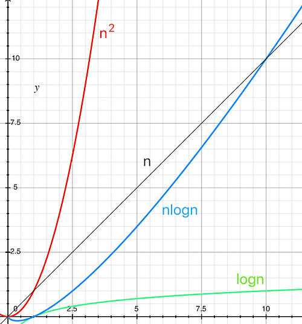


## 2. 使用哨兵

例：
在数组 a 中，查找 key，返回 key 所在的位置
其中，n 表示数组 a 的长度

- 一般做法

  ```c
  int find(char* a, int n, char key) {  
    // 边界条件处理，如果 a 为空，或者 n<=0，说明数组中没有数据，就不用 while 循环比较了  
    if(a == null || n <= 0) {    
      return -1;  
    }
    
    int i = 0;  
    // 这里有两个比较操作：i<n 和 a[i]==key
    while (i < n) {    
      if (a[i] == key) {      
        return i;
      }
      ++i;
    }
    return -1;
  }
  ```


- 使用哨兵
  可以省去循环体中的判断操作，从而达到简化问题的目的

  ```c
  // 通过减小循环体中的比较次数(耗时最多的地方)，来提升效率
  // 例：char *a = {'4','2','3','5','9','6'} n=6 key='7'
  int find(char* a, int n, char key) {  
    if(a == null || n <= 0) {    
      return -1;
    }
    
    // 这里因为要将 a[n-1] 的值替换成 key，所以要特殊处理这个值  
    if (a[n-1] == key) {
      return n-1;
    }
    
    // 把 a[n-1] 的值临时保存在变量 tmp 中，以便之后恢复 tmp='6'   
    // 之所以这样做的目的是：希望find()代码不要改变a数组中的内容
    char tmp = a[n-1];
    
    // 把 key 的值放到 a[n-1] 中，此时 a = {'4','2','3','5','9','7'}
    a[n-1] = key;
    
    int i = 0;
    // while 循环比起代码一，少了 i<n 这个比较操作
    while (a[i] != key) {
      ++i;
    }
    
    // 恢复 a[n-1] 原来的值,此时 a= {'4','2','3','5','9','6'}
    a[n-1] = tmp;
    
    if (i == n-1) {
      // 如果 i == n-1 说明，在 0...n-2 之间都没有 key，所以返回 -1
      return -1;
    } else {
      // 否则，返回 i，就是等于 key 值的元素的下标
      return i;  
    }
  }
  ```


## 3. 递归

结构

1. **递推公式**，例：$F(n) = F(n-1) * F(n-2)$
   一个问题的解可以分解为几个子问题的解
   这个问题与分解之后的子问题，除了数据规模不同，求解思路完全一样
2. **递归终止条件**，例：$F(1) = 1,\space F(2) = 2$


缺点

1. **空间复杂度高**

   递归函数内的局部变量过多，在栈内递归调用的成本会过高

2. **堆栈溢出**
   通过堆栈剩余内存大小，来限制递归深度

   ```c
   // 全局变量，表示递归的深度
   int depth = 0;
   int F(int n) { 
     ++depth； 
     if (depth > 1000) throw exception;
     
     if (n == 1) return 1;		// 终止条件
     if (n == 2) return 2;
     
     return F(n-1) * F(n-2);	// 递推公式
   }
   ```

3. **重复计算**

   可以通过一个数据结构（比如散列表）来保存已经求解过的值

   ```c
   // 以下 F(2) 被重复计算了
   // F(3) = F(2) + F(1)
   // F(4) = F(3) + F(2)
   int F(int n) {
     if (n == 1) return 1;
     if (n == 2) return 2;
     
     // hasSolvedList 可以理解成一个 Map，key 是 n，value 是 F(n)
     if (hasSolvedList.containsKey(n)) {
       return hasSolvedList.get(n);
     }
     
     int ret = f(n-1) + f(n-2);
     hasSolvedList.put(n, ret);
     
     return ret;
   }
   ```

   

<u>根据开发所面临的具体问题</u>，可以将递归转换为**迭代循环**的方式

1. 链表、二叉树相关的问题可以用递归来实现

2. 用迭代循环来替代递归并不能避免递归原有的缺陷

3. 迭代循环本质上与递归的方法没有任何区别
   但具体细节为手动实现，使**迭代循环比递归更具有可控性**

   ```c
   int F(int n) {
     // 终止条件
     if (n == 1) return 1;
     if (n == 2) return 2;
     
     // 原递归栈所需要存储的数据
     int ret = 0;					
     int pre = 2;
     int prepre = 1;
     
     // 递归体
     for (int i = 3; i <= n; ++i) {
       ret = pre + prepre;
       prepre = pre;
       pre = ret;
     }
     
     return ret;
   }
   ```


# 二、排序

**稳定排序**：相同的数字排序后顺序不变

**有序度**：有序关系的元素对的个数
				例 序列 3，1，5，6 中，有序度为 5，有序关系元素对为 (3, 5) (3,6) (1,5) (1,6) (5,6)
**逆序度**： 满有序度 - 有序度
**满有序度**：序列全部顺序排列时的有序度，计算公式 ${n(n-1) \over 2}$


## 1. 比较排序
### 1.1 冒泡排序

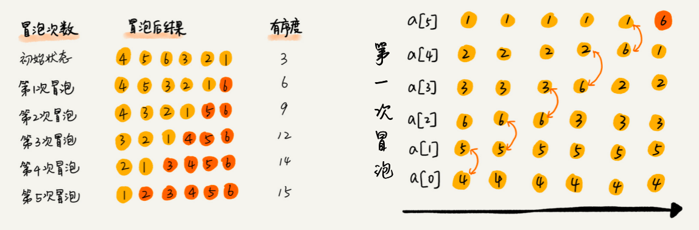

每次确保固定后段区间（冒泡上去的）顺序是正确的，不断缩小排序范围

- 稳定排序
- 空间复杂度 $O(1)$
- 时间复杂度，**取决于逆序度的数量**
  最好 $O(n)$
  最坏 $O(n^2)$

```c
// 冒泡排序，a表示数组，n表示数组大小
void bubble_sort(int* arr, int n)
{
	if (n <= 1) return;
  
  for (int i = 0; i < n; ++i) {
  	bool flag = false;	// 提前退出冒泡循环的标志位
    for (int j = 0; j < n - 1 - i; ++j) {
      if (arr[j] > arr[j+1]) {
        int tmp = arr[j];	// 交换
        arr[j] = arr[j+1];
        arr[j+1] = tmp;
        flag = true;    // 表示有数据交换
      }
    } // for j
    
    if (!flag) break;		// 没有数据交换，提前退出
    
  } // for i
  
}
```


### 1.2 插入排序

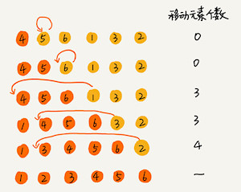

区分已排序区间和未排序区间，每次将未排序区间的第一元素插入到已排序区间

- 稳定排序
- 空间复杂度 $O(1)$
- 时间复杂度，**取决于逆序度的数量**
  最好 $O(n)$
  最坏 $O(n^2)$

```c
// 插入排序，a表示数组，n表示数组大小
void insertion_sort(int* arr, int n)
{
  if (n <= 1) return;
  
  for (int i = 1; i < n; ++i) {
    int tmp = arr[i];
    int j = i - 1; 		// 查找插入的位置
    for (; j >= 0; --j) {
      if (arr[j] > tmp) {
        arr[j+1] = arr[j];// 这里相比于冒泡排序只进行了一次赋值，所以插入排序比冒泡排序更高效
      } else {
        break;
      }
    }
    arr[j+1] = tmp; 		// 插入数据
  }
  
}
```


### 1.3 选择排序

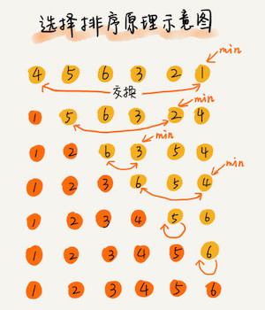

区分已排序区间和未排序区间，每次将未排序区间中找到最小的元素，将其放到已排序区间的末尾

- 不是稳定排序
- 空间复杂度 $O(1)$
- 时间复杂度较稳定，最好最坏都是 $O(n^2)$

```c
// 选择排序，a表示数组，n表示数组大小
void selection_sort(int* arr, int n)
{
  if (n <= 1) return;
  
  for (int i = 0; i < n - 1; ++i) {
    int min = i;
    for (int j = i + 1; j < n; ++j) {
      if (arr[min] > arr[j]) {
        min = j;
      }
    } // for j
    
    if (min != i) {
    	std::swap(arr[i], arr[min]);    
		}
  } // for i
  
}
```


### 1.4 归并排序


采用分而治之的思想，先将序列二分，直到不能二分为止，后通过合并序列的方法来排序

- 稳定排序

- 空间复杂度 $O(n)$

- 时间复杂度较稳定，最好最坏都是 $O(nlogn)$
  由下面的推论可知，归并排序经过 ${n \over 2^k}$ 次分解才变为 1，因此 $k = log_2n$ 则 $T(n) = nlog_2n$
  $$
  \begin{align}
  T(1) &= C \\
  T(n) &= 2*T({n \over 2}) \\
  		 &= 2*(2*T({n \over 4}))  &= 4*T({n \over 4}) \\
       &= 4*(2*T({n \over 8}))  &= 8*T({n \over 8}) \\
       &= 2^k * T({n \over 2^k}) \\
  \end{align}
  $$

```c
void merge_sort(int* arr, int arrLength)
{
  __merge_sort(arr, 0, arrLength-1);
}

// 递归调用函数
void __merge_sort(int* arr, int start, int end)
{
  // 递归终止条件
  if (start >= end) return;  
  
  int middle = (start + end) / 2;
    
  // 分治递归
  __merge_sort(arr, middle, 		start);
  __merge_sort(arr, middle + 1, end);
  
  // 解决问题，合并结果
  __merge(arr, start, middle, end);
}

void __merge(int* arr, int start, int middle, int end)
{
  const int size = end - start + 1;
  int tmp[size];
	int i = start;
  int j = middle + 1;
  int k = 0;
  // 比较前后两部分元素，从小到大排列在 tmp 数组里
	while (i <= middle && j <= end) {
		if (arr[i] <= arr[j])
			tmp[++k] = arr[++i];
		else
			tmp[++k] = arr[++j];
	}
  
  // 如果前半部分剩下，copy 到缓存数组
  while (i <= middle) {
    tmp[++k] = arr[++i];
  }
  // 如果后半部分剩下，copy 到缓存数组
  while (j <= end) {
    tmp[++k] = arr[++j];
  }

  // 将排好序的数组 copy 回原数组
	memcpy(&(arr[start]), &(tmp[0]), size * sizeof(int));
}
```


### 1.5 快速排序

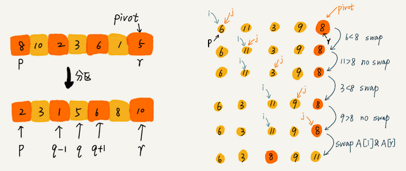

采用分而治之的思想，在序列中选择任意一个数为分区点（Pivot），遍历当前序列，将小于分区点的数据放在其前面，大于分区点的数据放在其后面，之后前后分区重新选择新的分区点，不断细分，最后到不能划分后，排序完成

- 不是稳定排序

- 空间复杂度 $O(1)$

- 时间复杂度
  最好 $O(nlogn)$
  最坏 $O(n^2)$ （区分点选择不当）


优化，主要是优化区分点的选择

1. 三数取中
   从区间的首、尾、中间，分别取出一个数，然后对比大小，取这 3 个数的中间值作为分区点
2. 随机法
   每次从要排序的区间中，随机选择一个元素作为分区点

```c
void quick_sort(int *arr, int size)
{
	__quick_sort(arr, 0, size - 1);
}

void __quick_sort(int *arr, int p, int r)
{
	if (p >= r) return;

	int q = partition(arr, p, r);
	__quick_sort(arr, p, q-1);
	__quick_sort(arr, q+1, r);
}

int partition(int *arr, int p, int r)
{
	int i; // 将数组分为 < i 的已处理区，和 >= i 的未处理区
  int j; // 指向未处理区第一个元素
	for (i = j = p; j < r; ++j) {
		if (arr[j] < arr[r]) { 									// 设 pivot = arr[r]
			if(i != j) std::swap(arr[i], arr[j]); // 为避免插入数据后的移动，这里使用交换
      
			++i;																	// 遇到 > pivot 的数就停住，等待交换
		}
	}
	
	std::swap(arr[i], arr[r]);
  
	return i;
}
```


### 1.6 堆排序

利用堆这么一个逻辑上的完全二叉树结构，而存储上用数组这个数据结构来进行排序

- 不是稳定排序
- 空间复杂度 $O(1)$
- 时间复杂度，最好，最坏都是 $O(nlogn)$
- **堆擅长取数据的前几个值，而不是将整个数据排序**
- 堆擅长取**动态变化数据**的前几个值


对比于快速排序，堆排序性能较差

1. 堆排序访问数据是跳着访问的，快速排序是顺序访问的，跳着访问如果幅度过大可能会导致 CPU 缓存的不断更换，从而降低性能
2. 同样的数据堆排序进行的交换次数比快速排序多


步骤

1. **建堆**：时间复杂度 $O(n)$
   将数组原地建成一个堆（不借助其他数组）
   <u>方法一：从前到后</u>
   尽管堆数组中包含 n 个数据，但可以假设，起初堆中只包含一个数据，就是下标为 1 的数据。然后将剩下的数据逐个插入堆中
   <u>方法二：从后到前</u>
   从后到前将堆节点全部遍历堆化，减少方法一中**堆化不断从前到后**的**重复遍历**

2. **堆化**
   从上到下（或从下到上）将最大值（或最小值）放到堆的根目录，构建有序的堆

3. **排序**：从后向前

   1. 交换堆顶和堆最后一个数

   2. 堆<u>逻辑上删除</u>堆最后一个数（堆的范围减小）

   3. 堆化

   4. 重复 1 ～ 3 步骤，直到堆的范围缩小为 1，堆排序结束

      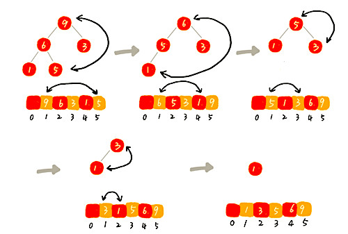

```c++
// 建堆：从后到前
// 这里的 a 默认结构是从 1 开始存储的数组，不同于数组 a 的长度，n 表示数据的个数
void buildHeap(int* a, int n) {
  // 对于堆这样的完全二叉树结构第 n/2+1 ～ n 都是叶子节点
  // 堆化时会访问下一层的节点，因此这里不需要对最底层的节点做堆化
  for (int i = n/2; i >= 1; --i) {
    heapify(a, n, i);
  }
}

// 堆化：自上往下
void heapify(int* a, int n, int i) { 
  while (true) {
    int maxPos = i;
    if (i*2 <= n && a[i] < a[i*2]) 					maxPos = i*2;
    if (i*2+1 <= n && a[maxPos] < a[i*2+1]) maxPos = i*2+1;
    if (maxPos == i) 												break;
    std::swap(a[i], a[maxPos]);
    i = maxPos;
  }
}

// 这里的 a 默认结构是从 1 开始存储的数组，不同于数组 a 的长度，n 表示数据的个数
void heap_sort(int* a, int n) {
  buildHeap(a, n);
  int k = n;
  while (k > 1) {
    std::swap(a[1], a[k]);
    --k;
    heapify(a, k, 1);
  }
}
```


## 2. 线性排序

排序算法的时间复杂度是线性的，对排序的数据要求苛刻
<u>线性排序比较强调数据的范围，范围不等同于大小，一组很大的数，他们的范围可以很小</u>

### 2.1 桶排序

把含有的 n 个数据的数组，均匀地划分到 m 个数组（桶）内，每个数组内部使用快速排序，最后重新合并为一个数组（如果划分后，某个数组的数据仍过多，可单独将这个数组继续划分）

- 不是稳定排序
- 空间复杂度 $O(n)$
- 时间复杂度
  平均 $O(nlog{n \over m}) = O(m * {n \over m} * log{n \over m})$
  最好 $O(n)$，当 m 和 n 接近时


**使用桶排序的前置条件**

1. 数组的数据可以被均匀的划分为几个数组（极端情况，都被划分为一个桶里，桶排序会退化为一个快速排序）

2. 数组划分为几个数组后，数组间的顺序要求已经排好了，不需要数组间在重新排序

   

**适用场景**

桶排序比较适合用在外部排序中
外部排序就是数据存储在外部磁盘中，数据量比较大，内存有限，无法将数据全部加载到内存中

```c++
#include <algorithm>
#include <iterator>

template <size_t BucketSize,
          typename IterT,
          typename T = typename std::iterator_traits<IterT>::value_type,
          typename Compare = std::less<T>>
void bucket_sort(IterT first, IterT last, Compare comp = Compare()) {
    const T min = *std::min_element(first, last);
    const T max = *std::max_element(first, last);
    const T range = max + 1 - min;
    const size_t bucket_num = (range - 1) / BucketSize + 1;

    std::vector<std::vector<T>> buckets(bucket_num);
    for (auto b : buckets) {
        b.reserve(2 * BucketSize);
    }

    for (IterT i = first; i != last; ++i) {
        size_t idx = (*i - min) / BucketSize;
        buckets[idx].emplace_back(*i);
    }

    IterT dest = first;
    for (auto b : buckets) {
        std::sort(b.begin(), b.end(), comp);
        std::copy(b.begin(), b.end(), dest);
        dest += b.size();
    }

    return;
}
```


### 2.2 计数排序

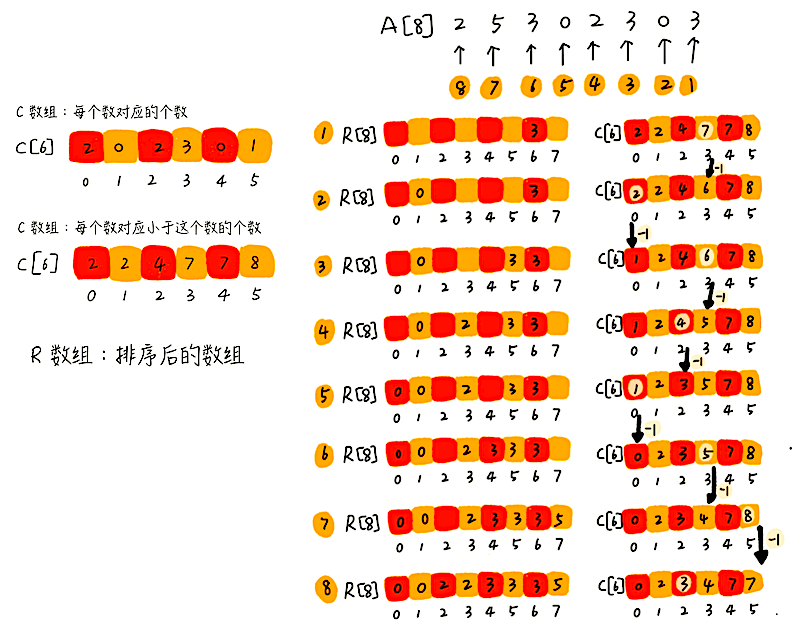

计数排序是桶排序的特殊情况，把含有的 n 个数据的数组，均匀地划分到 m 个数组（桶）内，**每个数组内部的数据都相同**

- 稳定排序（必须从后向前遍历）
- 空间复杂度 $O(n)$
- 时间复杂度 $O(n)$


**使用计数排序的前置条件**

1. 只能用在数据范围不大的场景中，如果数据范围 k 比要排序的数据个数 n 大很多，不适合用计数排序
2. 只能给非负整数排序，如果要排序的数据是其他类型的，要将其在不改变相对大小的情况下，转化为非负整数


**适用场景**

排序的数据范围小

```c++
#include <algorithm>
#include <iterator>

template <typename IterT,
          typename T = typename std::iterator_traits<IterT>::value_type>
void counting_sort(IterT first, IterT last) {
    const auto len = std::distance(first, last);
    if (len < 2) return;

    const T max = *std::max_element(first, last);
    if (max == 0) return;

    std::vector<size_t> counter(max + 1);
    // 记录每个数对应的个数
    for (IterT i = first; i != last; ++i) {
        ++counter[*i];
    }
    // 记录小于当前数的个数
    for (size_t i = 1; i < counter.size(); ++i) {
        counter[i] += counter[i - 1];
    }

    std::vector<T> temp(len);
    // 根据计数表，从后向前遍历原数组（确保稳定排序），生成一个新的排序后的数组
    for (IterT i = last - 1; i >= first; --i) {
        temp[counter[*i] - 1] = *i;
        --counter[*i];
    }
    std::copy(temp.begin(), temp.end(), first);
}

// 测试函数
template <typename Container,
          typename T = typename Container::value_type>
void test_counting_sort(Container cont) {
    counting_sort(cont.begin(), cont.end());
    std::transform(cont.begin(), 
                   cont.end(), 
                   std::ostream_iterator<T>(std::cout, " "),
                   [](T i){ return i; });
    std::cout << std::endl;
}
```


### 2.3 基数排序

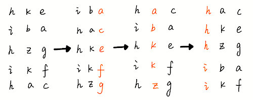

在一些较大的数组成的数组里，通过**逐个比较**不同数同一位数字（基数）的大小来进行排序

- 稳定排序（必须从后向前遍历）
- 空间复杂度 $O(1)$
- 时间复杂度 $O(n) = O(C_{位数} * n)$


**使用基数排序的前置条件**

1. 数组里的数据可以按位划分
2. 位之间有递进的关系
   如果 a 数据的高位比 b 数据大，那剩下的低位就不用比较了
3. 每一位的数据**范围**不能太大，要可以用线性排序算法来排序


**适用场景**

- 单词在字典中的排序
  所有的单词补齐到相同长度，位数不够的可以在后面补 0
  ASCII 值所有字母大于 0，补 0 不会影响原有的顺序
- 手机号排序
  手机号要是看作一个数的话，即便位数要相同，数据的范围会很大
  使用基数排序，会细分手机号的分布范围，从而提高排序效率

```c++
#include <math.h>

void radix_sort(int a[], int len, int digit_max)
{
	int *tmp = (int *)std::malloc(sizeof(int)*len);
	assert(nullptr != tmp);

  int digit = 1;
	int counter[10];
	for (int i = 0, j = 0, k = 0; i < digit_max; ++i) {
    memset(counter, 0, sizeof(int)*10);
    
    // 从后向前遍历原数的位数（确保稳定排序）
    digit = pow(10, i);
    
    for (j = 0; j < len; ++j) {
			k = (a[j] / digit) % 10;
			++counter[k];
		}
		for(j = 1; j < 10; ++j) {
			counter[j] += counter[j-1];
		}

    // 从后向前遍历原数组（确保稳定排序）
		for(j = len - 1; j >= 0; --j) {
			k = (a[j] / digit) % 10;
      tmp[counter[k] - 1] = a[j];
			--counter[k];
		}
    
    memcpy(a, tmp, sizeof(int)*len);
	}

}
```


# 三、搜索数据

不同的数据结构，适合不同的数据查找方式


## 1. 二分查找（依赖数组）

空间复杂度 $O(1)$

时间复杂度 $O(logn)$
其中 ${n \over 2^k}=1$ 时，k 的值就是总共缩小的次数，即时间复杂度


### 1.1 使用二分查找的前置条件

- 查找数据已经**有序**
- 二分查找**依赖于数组**这种连续内存的数据结构
- 由于连续内存的存储结构，二分查找的数量不宜太大或者太小

```c++
// 1. 简单的二分查找实现（数据已经排好序，且数据不重复）
// 1.1 循环实现
int binary_search(int* a, int n, int value) {
  int low = 0; 
  int high = n - 1;
  while (low <= high) {
    // 为防止相加带来的过大数据移除，可优化为：low + (high - low) / 2
    int mid = (low + high) / 2;
    if (a[mid] == value) {
      return mid;
    } else if (a[mid] < value) {
      low = mid + 1;
    } else {
      high = mid - 1;
    }
  }
  
  return -1;
}

// 1.2 递归实现
int __binary_search(int* a, int low, int high, int value) {
  if (low > high) return -1;
  
  int mid = low + ((high - low) >> 1);
  if (a[mid] == value) {
    return mid;
  } else if (a[mid] < value) {
    return __binary_search(a, mid+1, high, value);
  } else {
    return __binary_search(a, low,  mid-1, value);
  }
}

int bsearch(int* a, int n, int val) {
  return __binary_search(a, 0, n - 1, val);
}

// 2. 考虑重复情况的二分查找（数据已经排好序，且数据含有多个重复的数）
// 2.1 查找第一个值等于给定值的元素
int bsearch(int* a, int n, int val) {
  int low = 0;  
  int high = n - 1;  
  while (low <= high) {
    int mid = low + ((high - low) >> 1);
    if (a[mid] > val) {
      high = mid - 1;
    } else if (a[mid] < val) {
      low = mid + 1;
    } else {
      if ((mid == 0) || (a[mid - 1] != val)) return mid;
      else high = mid - 1;   // 由于是找可能重复数的第一个，这里不断取前半段数据
    }
  }
  
  return -1;
}

// 2.2 查找最后一个值等于给定值的元素
int bsearch(int* a, int n, int val) {
  int low = 0;  
  int high = n - 1;  
  while (low <= high) {
    int mid = low + ((high - low) >> 1);
    if (a[mid] > val) {
      high = mid - 1;
    } else if (a[mid] < val) {
      low = mid + 1;
    } else {
      if ((mid == 0) || (a[mid - 1] != val)) return mid;
      else low = mid + 1;   // 由于是找可能重复数的最后一个，这里不断取后半段数据
    }
  }
  
  return -1;
}

// 2.3 查找第一个大于等于给定值的元素
int bsearch(int* a, int n, int val) {
  int low = 0;  
  int high = n - 1;  
  while (low <= high) {
    int mid = low + ((high - low) >> 1);
    if (a[mid] >= val) {
      if ((mid == 0) || (a[mid - 1] < val)) return mid;
      else high = mid - 1;   // 由于是找可能重复数的第一个，这里不断取前半段数据
    } else {
      low = mid + 1;
    }
  }
  
  return -1;
}

// 2.4 查找最后一个小于等于给定值的元素
int bsearch(int* a, int n, int val) {
  int low = 0;  
  int high = n - 1;  
  while (low <= high) {
    int mid = low + ((high - low) >> 1);
    if (a[mid] > val) {
      high = mid - 1;
    } else {
      if ((mid == n - 1) || (a[mid + 1] > val)) return mid;
      else low = mid + 1;   // 由于是找可能重复数的最后一个，这里不断取后半段数据
    }
  }
  
  return -1;
}
```


### 1.2 二分查找适用场景

- 二分查找更适合用在查找近似值的问题
- 对于给定值的查找，用散列表或者二叉树比二分查找更好

```c++
// 应用举例：
// 1. 查找 IP 在某一个 IP 范围内，确定归属地（二分查找最后一个小于等于给定值的元素）
// 2. 求数的平方根（停止二分查找的依据是一个精度范围）
double sqrt(double x, double precision) {
	if (x < 0) return NAN;
	
	double low = 0;
	double high = x;
	if (x < 1 && x > 0) {
		low = x;
		high = 1;
	}
  
  double mid = low + ((up - high) >> 1);
	while((high - low) > precision) {
    // mid * mid 这里可能会溢出
		if (mid * mid > x ) {
			high = mid;
		} else if (mid * mid < x) {
			low = mid;
		} else {
			return mid;
		}
    mid = low + ((up - high) >> 1);
	}
  
	return mid;
}
```


## 2. 拓扑排序 Topological


## 3. Dijkstra 单源最短路径算法


## 4. A* 单源最短路径算法


# 四、字符串匹配

## 1. 单模式串匹配

一个字符串（主串）查找一个字符串（模式串）

### 1.1 BF（Brute Force）暴力/朴素匹配算法

方法：在主串中，从起始位置开始检查后续的位置是否和模式串一一对应，如果不是，从起始位置的后一位重新开始是检查，直到第 n - m + 1 位为止

- 时间复杂度：最坏 $O(n_{主串长度}*m_{模式串长度})$
- 统计意义上，在主串和模式串**不算太长**的情况下效率高
- 算法实现简单，在工程中，在满足性能要求的前提下，简单是首选
  满足 KISS（Keep It Simple and Stupid）设计原则

```c++
/** BF 方法示例：
	i = 0
	b a d d e f 主串
	a b c				模式串
	
		i = 1
	b a d d e f 主串
		a b c			模式串
		
	    i = 2
	b a d d e f 主串
			a b c	  模式串
			
	      i = 3
	b a d d e f 主串
				a b c	模式串
 */
bool isMatch(const char* strMain, int start, const char* strPattern, int lenPattern) {
  int j = 0;
  while (j < lenPattern) {
    if (strMain[j + start] != strPattern[j]) break;
    ++j;
  }
  
  return (j == lenPattern);
}

int findBF(const char* strMain, const char* strPattern) {
  const int lenMain = std::strlen(strMain);
  const int lenPattern = std::strlen(strPattern);
  
  if (lenMain < lenPattern) return -1;
  
  for (int i = 0; i < lenMain - lenPattern + 1; ++i) {
     if (isMatch(strMain, i, strPattern, lenPattern)) return i;
  }
  
  return -1;
}
```


### 1.2 RK 算法

> RK（Rabin-Karp）是发明它的两个作者名字的缩写

方法：通过哈希算法对主串中的 n-m+1 个子串分别求哈希值，然后逐个与模式串的哈希值比较大小，相等则找到

```c++
bool isMatch(const char* strMain, int start, const char* strPattern, int lenPattern) {
  int j = 0;
  while (j < lenPattern) {
    if (strMain[j + start] != strPattern[j]) break;
    ++j;
  }
  return (j == lenPattern);
}

// 仅适合纯小写字母的 hash
int rkHash(const char* str, const int start, const int len) {
	const int digit = 26;
  int result = 0;
 	for (int i = 0; i < len; ++i) {
    result = result * digit + (str[start + i] - 'a');
  }
  
  return result;
}

int findRK(const char* strMain, const char* strPattern) {
  const int lenMain = std::strlen(strMain);
  const int lenPattern = std::strlen(strPattern);
  
  if (lenMain < lenPattern) return -1;
  
  int hashPattern = rkHash(strPattern, 0, lenPattern);
  for (int i = 0; i < lenMain - lenPattern + 1; ++i) {
    // 这里还可以优化 https://www.jianshu.com/p/7fefc40767ae
    int hashChild = rkHash(strMain, i, lenPattern);
    if (hashChild == hashPattern) {
      // 为了避免 hash 冲突带来的问题，再次检测两个字符串是否匹配
      if (isMatch(strMain, i, strPattern, lenPattern))  return i;
    }
  }
  
  return -1;
}
```


### 1.3 BM（Boyer-Moore）算法

方法：寻找一种规律可以在模式串匹配主串失败时**一次向后移动多位**，而不是一位

```c++

```


### 1.4 KMP 算法

> KMP（Knuth Morris Pratt）是发明它的三个作者名字的缩写

```c++

```


### 1.5 Trie 树（字典树）

```c++

```


## 2. 多模式串匹配

一个字符串（主串）查找多个字符串（模式串）

### 2.1 AC（Aho-Corasick）自动机

```c++

```


# 五、算法思想

<p style="color:red">以下算法均为指导性算法，许多算法基于以下算法的思想，但用的不仅仅只有以下算法</p>


## 1. 贪心算法 Greedy

方法：局部最优

1. 问题划分
2. 求得局部最优
3. 累计局部最优以求得总体最优


适用场景：

- 针对一组数据，我们定义了限制值和期望值，希望从中选出几个数据，**在满足限制值的情况下，期望值最大**
- **每次选择当前情况下**，在对限制值同等贡献量的情况下（前面的选择**不会影响**后面的选择），对期望值**贡献最大的数据**
- 举几个例子看下贪心算法产生的结果是否是最优的
  严格地证明贪心算法的正确性，非常复杂
  大部分能用贪心算法解决的问题，其的正确性都是显而易见的


**贪心算法解决问题的思路，并不总能给出最优解**
例，求下图最短路径（前面的选择影响了后面的选择，便不适合局部采用贪心算法的方式）

- 采用贪心算法：S, A, E, T = 1 + 4 + 4 = 9
- 实际最短路径：S, B, D, T = 2 + 2 + 2 = 6

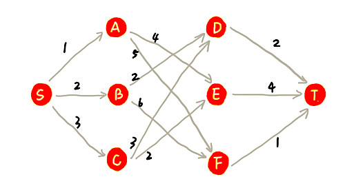


### 1.1 应用：钱币找零

问题：

有 1 元、2 元、5 元、10 元、20 元、50 元、100 元这些面额的纸币，它们的张数分别是 c1、c2、c5、c10、c20、c50、c100。我们现在要用这些钱来支付 K 元，最少要用多少张纸币


问题建模：

- 操作：从 n 个面额的纸币中，抽取几张纸币
- 限制值：纸币的金额一共 K 元
- 期望值：纸币的数量最少


贪心解法：

先用面值最大的来支付，如果不够，就继续用更小一点面值的，以此类推，最后剩下的用 1 元来补齐


### 1.2 应用：区间覆盖

问题：
类似问题：任务调度、教师排课

区间的起始端点和结束端点分别是 [6,8], [2,4], [3,5], [1,5], [5,9], [8,10]。从中选出一部分区间，这部分区间满足两两不相交（端点相交的情况不算相交），最多能选出多少个区间


问题建模：

- 操作：从已知区间选出一部分区间
- 限制值：区间内部满足两两不相交
- 期望值：区间的数量最多


贪心解法：

优先选择左边端点与前面已经选择的不重合的，并且右端点尽量小的区间，则可以如下图得出最多选择 3 个区间
[2,4], [6,8], [8,10]

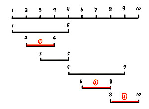


### 1.3 应用：压缩存储与霍夫曼编码

问题：

有一个包含 1000 个字符的文件，每个字符占 1 个 byte（1byte=8bits），存储这 1000 个字符就一共需要 8000bits，那有没有更加节省空间的存储方式


问题建模：

- 操作：将 1000 个字符文件存储
- 限制：存储大小不能高于 1000 byte
- 期望：用最小的内存存储数据


贪心解法：霍夫曼编码

使用步骤

1. 统计存储字符文件包含的字符种类
2. 根据字符种类出现的频率给字符种类进行霍夫曼编码，频率越高，编码长度越短


**霍夫曼编码：**

特点

1. 不等长编码
2. 某个编码不能是另一个编码的前缀（为了避免解压缩过程中的歧义）
3. 特殊的二叉树存储方式，节点是需要存储的数据，左节点编码为 0 ，右节点编码为 1


构建方式：

1. 每个字符看作一个节点，筛选出出现频率最低的两个节点
2. 将筛选出的两个节点频率和作为一个新的节点，这个节点是这两个节点的父节点
3. 将新生成的父亲节点放入剩余的节点中，重复 1，2 步骤，直到所有节点都被筛选出来
4. 左节点编码为 0 ，右节点编码为 1，从构建的霍夫曼树根节点开始查找节点索经过的编码为霍夫曼编码

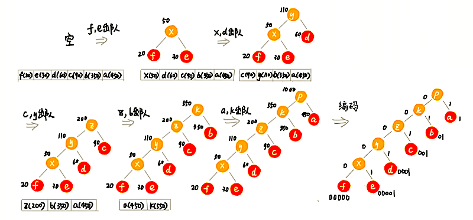


## 2. 分治算法 Divide and Conquer

> 分治算法是一种处理问题的思想，递归是一种编程技巧


方法：分而治之 

1. 将原问题划分成几个规模较小，并且<u>结构与原问题相似</u>的子问题
2. 递归地解决这些子问题
3. 合并所有子问题的结果，就得到原问题的解


适用场景（和递归类似）

1. 原问题与分解成的小问题具有相同的模式
2. 原问题分解成的子问题可以独立求解，子问题之间没有相关性，
3. 具有分解终止条件，当问题足够小时，可以直接求解
4. 可以将子问题合并成原问题
   这个合并操作的复杂度不能太高，否则就起不到减小算法总体复杂度的效果


应用：Google 的 MapRedue 编程模型


### 2.1 应用：求一组数据的逆序对个数

通过修改归并排序来解决问题

```c++
int num = 0; // 全局变量或者成员变量

// 逆序对个数
int count(int* arr, int arrLength) {
  num = 0;
  mergeSortCounting(arr, 0, arrLength-1);
  return num;
}

void mergeSortCounting(int* arr, int start, int end) {
  if (start >= end) return;
  int middle = (start + end) / 2;
  
  // 1. 划分问题
  mergeSortCounting(arr, middle,  	 start);
  mergeSortCounting(arr, middle + 1, end);
  
  // 2. 解决，合并问题
  merge(arr, start, middle, end);
}

void merge(int* arr, int start, int middle, int end) {
  const int size = end - start + 1;
  int tmp[size];
	int i = start;
  int j = middle + 1;
  int k = 0;
  // 比较前后两部分元素，从小到大排列在 tmp 数组里
  while (i <= middle && j <= end) {
    if (arr[i] <= arr[j]) {
      tmp[++k] = arr[++i];
    } else {
      // 记录原数组中 start 到 middle 之前比 a[j] 大的元素个数（逆序对数）
      // 因为是原数组，所以，这要 middle - i，因为是由索引计算得到的个数，所以 +1
      num += (middle - i + 1);
      tmp[++k] = arr[++j];
    }
  }
  // 如果前半部分剩下，copy 到缓存数组
  while (i <= middle) {
    tmp[++k] = arr[++i];
  }
  // 如果后半部分剩下，copy 到缓存数组
  while (j <= end) {
    tmp[++k] = arr[++j];
  }
  // 排好序的 tmp 数组 copy 回原数组
  memcpy(&(arr[start]), &(tmp[0]), size * sizeof(int));
}
```


### 2.2  应用：求出二维平面中相距最近的两个点

利用归并排序的流程

1. 针对平面上的所有点把平面不断划分为两部分
2. 直到一个平面内只有两个点
3. 根据每个平面内两个点的距离，将点成对排序


### 2.3  应用：计算多维度矩阵乘积

利用归并排序的流程，详细的计算见[斯特拉森矩阵运算](https://www.csdn.net/gather_29/MtTaIgxsNDI5ODYtYmxvZwO0O0OO0O0O.html)

1. 将多维度的矩阵乘积不断划分为 2 X 2 的四部分
2. 直到每部分矩阵只包含 1 个元素为止
3. 根据每个子矩阵的乘积计算值
4. 将子矩阵的结果合并


## 3. 回溯算法 Backtracking

方法：失败后回溯

1. 枚举：穷举所有的解，找到满足期望的解
2. 划分：把问题求解的过程分为多个阶段
   为了有规律地枚举所有可能的解，避免遗漏和重复
3. 选择：每个阶段，我们都会面对一个岔路口，我们先随意选一条路走
4. 回溯：当发现这条路走不通的时候（不符合期望的解），就回退到上一个岔路口，另选一种走法继续走


适合场景：缺乏规律或目前不了解其规律的搜索场景


### 3.1 应用：八皇后问题

问题：

- 有一个 8 X 8 的棋盘，希望往里放 8 个棋子（皇后）
- 每个棋子所在的行、列、对角线都不能有另一个棋子

```c++
int gEightQueenCols[8];

void eight_queens_print() {
    using namespace std;
    for (int row = 0; row < 8; ++row) {
        int col;
        for (col = 0; col < gEightQueenCols[row]; ++col)
            cout << "* ";
        cout <<"Q ";
        for (col = gEightQueenCols[row] + 1; col < 8; ++col)
            cout << "* ";
        cout << endl;
    }
    cout << "\n";
}

//   0 1 2
// 0 0 # 2
// 1 # 0 #
// 2 2 # 0
bool check_pos_valid(int rowOrigin, int colOrigin) {
    for (int row = 0, col = 0; row < rowOrigin; ++row) {
        col = gEightQueenCols[row];
        if (colOrigin == col)                       // 同列
            return false;
        if ((row + col) == (rowOrigin + colOrigin)) // 同右上对角线
            return false;
        if ((row - col) == (rowOrigin - colOrigin)) // 同左上对角线
            return false;
    }

    return true;
}

void eight_queens(int row) {
    if (row > 7) {
        eight_queens_print();     // 发现一种后，也会回溯到上一状态，继续查找下一种新的摆法
        gEightQueenCols[row] = 0; // 重置为默认数据
        return;
    }

    for (int col = 0; col < 8; ++col) {
        if (check_pos_valid(row, col)) {
            gEightQueenCols[row] = col;
            eight_queens(row + 1);
          	// 重置为默认数据，防止回溯时上一次的数据让 check_pos_valid 判断失误
            gEightQueenCols[row] = 0;
        }
    }
    // 当前行没有适合的列，通过递归调用返回，回溯到上一行的选择，选择其他可能情况
}

void TestCode() {
  eight_queens(0);
}
```


### 3.2 应用：0-1 背包

问题：

有一个背包，背包总的承载重量是 w kg。现在我们有 n 个物品，每个物品的重量不等，并且不可分割。我们现在期望选择几件物品，装载到背包中。在不超过背包所能装载重量的前提下，如何让背包中物品的总重量最大？

```c++
int weightMax = 0;
void package(int* itemsW, int itemsIdx, int itemsWCount, int weight, int capacity) {
  if (weight == capacity || itemsIdx == itemsWCount) {
    if (weight > weightMax) weightMax = weight; // 满足条件后也会回溯，但会记录下当前的最大值
    return;
  }
  // 遍历到最深处，如果不符合情况会向后回溯
  package(itemsW, itemsIdx + 1, itemsWCount, weight, capacity);
  
  // 根据条件判断当前方法是否可行，不行就通过递归的回调回溯到上一状态
  if (weight + itemsW[itemsIdx] <= capacity) {
    package(itemsW, itemsIdx + 1, itemsWCount, weight + itemsW[itemsIdx], capacity);
  }
}

void TestCode() {
  int items[7] = { 30, 2, 3, 4, 40, 20, 9 };
  package(items, 0, 7, 0, 100);
  std::cout << "背包最大承重" << weightMax << " kg" << std::endl;
}
```


### 3.2 应用：正则表达式

问题：

假设正则表达式中只包含 `*` 和 `?` 这两种通配符，对于给定的文本，能否跟给定的正则表达式匹配，其中：

- `*` 匹配任意多个（大于等于 0 个）任意字符
- `?` 匹配零个或者一个任意字符

```c++
class Pattern {
private:
  bool matched = false;
  char* pattern; // 正则表达式
  int pLen;      // 正则表达式长度

public:
   Pattern(char* pattern, int pLen) {
    this->pattern = pattern;
    this->pLen = pLen;
  }

  bool match(char* text, int tLen) { // 文本串及长度
    matched = false;
    rmatch(0, 0, text, tLen);
    return matched;
  }

  void rmatch(int tIdx, int pIdx, char* text, int tLen) {
    if (matched) return;

    if (pIdx == pLen) {                   // 正则表达式到结尾了
      if (tIdx == tLen) matched = true;   // 文本串也到结尾了
      return;
    }
    if (pattern[pIdx] == '*') {           // * 匹配任意个字符
      for (int k = 0; k <= tLen-tIdx; ++k) {
        rmatch(tIdx+k, pIdx+1, text, tLen);
      }
    } else if (pattern[pIdx] == '?') {    // ? 匹配 0 个或者 1 个字符
      rmatch(tIdx,   pIdx+1, text, tLen);
      rmatch(tIdx+1, pIdx+1, text, tLen);
    } else if (tIdx < tLen && pattern[pIdx] == text[tIdx]) { // 纯字符匹配才行
      rmatch(tIdx+1, pIdx+1, text, tLen);
    }
  }
};
```


## 4. 动态规划 Dynamic Programming


# 引用

- [十大经典排序算法总结](https://www.cnblogs.com/guoyaohua/p/8600214.html)
- [谈谈 STL 中的 std::sort](https://liam.page/2018/09/18/std-sort-in-STL/)
- [谈谈内省式排序算法](https://liam.page/2018/08/29/introspective-sort/)
- [谈谈基于比较的排序算法的复杂度下界](https://liam.page/2018/08/28/lower-bound-of-comparation-based-sort-algorithm/)
- [Boyer-Moore](http://www.cs.jhu.edu/~langmea/resources/lecture_notes/boyer_moore.pdf)

