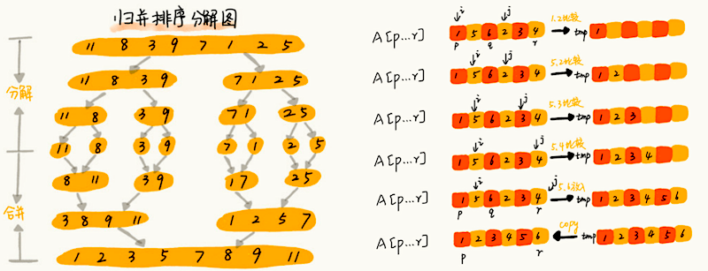

[TOC]

# 一、基础

## 1. 时间复杂度分析

程序复杂度测试的外部因素

1. 测试结果非常依赖测试环境
2. 测试结果受数据规模的影响很大


时间复杂度的分析

1. 复杂度的分析不一定要精确，有时候为了快速分析可以很粗略
   一般，只关注循环执行次数最多的一段代码
2. 时间复杂度反应的是数据规模 n 很大的时候的一个增长趋势
   一般**系数、常数、低阶**会被忽略，但在实际开发中由于使用的数据规模一般都不大
   反而需要考虑**系数、常数、低阶**
3. 加法法则：总复杂度等于量级最大的那段代码的复杂度
4. 乘法法则：嵌套代码的复杂度等于嵌套内外代码复杂度的乘积


多个计算的总时间复杂度分析

1. 平均复杂度分析：平均计算每个复杂度值
2. 均摊复杂度分析：根据每个复杂的计算出现概率 * 复杂度，累加后得到的最终复杂度


常用时间复杂度大小的比较

- 由于对数可以互相转换 $log_{10}n = log_{10}2 \cdot log_2n = C_{常数}log_2n$

  不管是以 2 为底、以 3 为底，还是以 10 为底复杂度都计做 logn


## 2. 使用哨兵

例：
在数组 a 中，查找 key，返回 key 所在的位置
其中，n 表示数组 a 的长度

- 一般做法

  ```c
  int find(char* a, int n, char key) {  
    // 边界条件处理，如果 a 为空，或者 n<=0，说明数组中没有数据，就不用 while 循环比较了  
    if(a == null || n <= 0) {    
      return -1;  
    }
    
    int i = 0;  
    // 这里有两个比较操作：i<n 和 a[i]==key
    while (i < n) {    
      if (a[i] == key) {      
        return i;
      }
      ++i;
    }
    return -1;
  }
  ```


- 使用哨兵
  可以省去循环体中的判断操作，从而达到简化问题的目的

  ```c
  // 通过减小循环体中的比较次数(耗时最多的地方)，来提升效率
  // 例：char *a = {'4','2','3','5','9','6'} n=6 key='7'
  int find(char* a, int n, char key) {  
    if(a == null || n <= 0) {    
      return -1;
    }
    
    // 这里因为要将 a[n-1] 的值替换成 key，所以要特殊处理这个值  
    if (a[n-1] == key) {
      return n-1;
    }
    
    // 把 a[n-1] 的值临时保存在变量 tmp 中，以便之后恢复 tmp='6'   
    // 之所以这样做的目的是：希望find()代码不要改变a数组中的内容
    char tmp = a[n-1];
    
    // 把 key 的值放到 a[n-1] 中，此时 a = {'4','2','3','5','9','7'}
    a[n-1] = key;
    
    int i = 0;
    // while 循环比起代码一，少了 i<n 这个比较操作
    while (a[i] != key) {
      ++i;
    }
    
    // 恢复 a[n-1] 原来的值,此时 a= {'4','2','3','5','9','6'}
    a[n-1] = tmp;
    
    if (i == n-1) {
      // 如果 i == n-1 说明，在 0...n-2 之间都没有 key，所以返回 -1
      return -1;
    } else {
      // 否则，返回 i，就是等于 key 值的元素的下标
      return i;  
    }
  }
  ```


## 3. 递归

结构

1. **递推公式**，例：$F(n) = F(n-1) * F(n-2)$
   一个问题的解可以分解为几个子问题的解
   这个问题与分解之后的子问题，除了数据规模不同，求解思路完全一样
2. **递归终止条件**，例：$F(1) = 1,\space F(2) = 2$


缺点

1. **空间复杂度高**

   递归函数内的局部变量过多，在栈内递归调用的成本会过高

2. **堆栈溢出**
   通过堆栈剩余内存大小，来限制递归深度

   ```c
   // 全局变量，表示递归的深度
   int depth = 0;
   int F(int n) { 
     ++depth； 
     if (depth > 1000) throw exception;
     
     if (n == 1) return 1;		// 终止条件
     if (n == 2) return 2;
     
     return F(n-1) * F(n-2);	// 递推公式
   }
   ```

3. **重复计算**

   可以通过一个数据结构（比如散列表）来保存已经求解过的值

   ```c
   // 以下 F(2) 被重复计算了
   // F(3) = F(2) + F(1)
   // F(4) = F(3) + F(2)
   int F(int n) {
     if (n == 1) return 1;
     if (n == 2) return 2;
     
     // hasSolvedList 可以理解成一个 Map，key 是 n，value 是 F(n)
     if (hasSolvedList.containsKey(n)) {
       return hasSolvedList.get(n);
     }
     
     int ret = f(n-1) + f(n-2);
     hasSolvedList.put(n, ret);
     
     return ret;
   }
   ```

   

<u>根据开发所面临的具体问题</u>，可以将递归转换为**迭代循环**的方式

1. 用迭代循环来替代递归并不能避免递归原有的缺陷

2. 迭代循环本质上与递归的方法没有任何区别
   但具体细节为手动实现，使**迭代循环比递归更具有可控性**

   ```c
   int F(int n) {
     // 终止条件
     if (n == 1) return 1;
     if (n == 2) return 2;
     
     // 原递归栈所需要存储的数据
     int ret = 0;					
     int pre = 2;
     int prepre = 1;
     
     // 递归体
     for (int i = 3; i <= n; ++i) {
       ret = pre + prepre;
       prepre = pre;
       pre = ret;
     }
     
     return ret;
   }
   ```


# 二、排序

**稳定排序**：相同的数字排序后顺序不变

**有序度**：有序关系的元素对的个数
				例 序列 3，1，5，6 中，有序度为 5，有序关系元素对为 (3, 5) (3,6) (1,5) (1,6) (5,6)
**逆序度**： 满有序度 - 有序度
**满有序度**：序列全部顺序排列时的有序度，计算公式 ${n(n-1) \over 2}$


## 1. 比较排序
### 1.1 冒泡排序


每次确保固定后段区间（冒泡上去的）顺序是正确的，不断缩小排序范围

- 稳定排序
- 空间复杂度 $O(1)$
- 时间复杂度，**取决于逆序度的数量**
  最好 $O(n)$
  最坏 $O(n^2)$

```c
// 冒泡排序，a表示数组，n表示数组大小
void bubble_sort(int* arr, int n)
{
	if (n <= 1) return;
  
  for (int i = 0; i < n; ++i) {
  	bool flag = false;	// 提前退出冒泡循环的标志位
    for (int j = 0; j < n - 1 - i; ++j) {
      if (arr[j] > arr[j+1]) {
        int tmp = arr[j];	// 交换
        arr[j] = arr[j+1];
        arr[j+1] = tmp;
        flag = true;    // 表示有数据交换
      }
    } // for j
    
    if (!flag) break;		// 没有数据交换，提前退出
    
  } // for i
  
}
```


### 1.2 插入排序


区分已排序区间和未排序区间，每次将未排序区间的第一元素插入到已排序区间

- 稳定排序
- 空间复杂度 $O(1)$
- 时间复杂度，**取决于逆序度的数量**
  最好 $O(n)$
  最坏 $O(n^2)$

```c
// 插入排序，a表示数组，n表示数组大小
void insertion_sort(int* arr, int n)
{
  if (n <= 1) return;
  
  for (int i = 1; i < n; ++i) {
    int tmp = arr[i];
    int j = i - 1; 		// 查找插入的位置
    for (; j >= 0; --j) {
      if (arr[j] > tmp) {
        arr[j+1] = arr[j];// 这里相比于冒泡排序只进行了一次赋值，所以插入排序比冒泡排序更高效
      } else {
        break;
      }
    }
    arr[j+1] = tmp; 		// 插入数据
  }
  
}
```


### 1.3 选择排序


区分已排序区间和未排序区间，每次将未排序区间中找到最小的元素，将其放到已排序区间的末尾

- 不是稳定排序
- 空间复杂度 $O(1)$
- 时间复杂度较稳定，最好最坏都是 $O(n^2)$

```c
// 选择排序，a表示数组，n表示数组大小
void selection_sort(int* arr, int n)
{
  if (n <= 1) return;
  
  for (int i = 0; i < n - 1; ++i) {
    int min = i;
    for (int j = i + 1; j < n; ++j) {
      if (arr[min] > arr[j]) {
        min = j;
      }
    } // for j
    
    if (min != i) {
    	std::swap(arr[i], arr[min]);    
		}
  } // for i
  
}
```


### 1.4 归并排序



采用分而治之的思想，先将序列二分，直到不能二分为止，后通过合并序列的方法来排序

- 稳定排序

- 空间复杂度 $O(n)$

- 时间复杂度较稳定，最好最坏都是 $O(nlogn)$
  由下面的推论可知，归并排序经过 ${n \over 2^k}$ 次分解才变为 1，因此 $k = log_2n$ 则 $T(n) = nlog_2n$
  $$
  \begin{align}
  T(1) &= C \\
  T(n) &= 2*T({n \over 2}) \\
  		 &= 2*(2*T({n \over 4}))  &= 4*T({n \over 4}) \\
       &= 4*(2*T({n \over 8}))  &= 8*T({n \over 8}) \\
       &= 2^k * T({n \over 2^k}) \\
  \end{align}
  $$

```c
// 归并排序算法, A是数组，n表示数组大小
void merge_sort(int* arr, int n)
{
  __merge_sort(arr, 0, n-1);
}

// 递归调用函数
void __merge_sort(int* arr, int p, int r)
{
  // 递归终止条件
  if (p >= r) return;  
  
  // 取 p 到 r 之间的中间位置 q
  int q = (p + r) / 2;
    
  // 分治递归
  __merge_sort(arr, p, q);
  __merge_sort(arr, q + 1, r);
    
  // 将 arr[p...q] 和 arr[q+1...r] 合并为 arr[p...r]
  __merge(arr, p, q, r)
}

void __merge(int* arr, int p, int q, int r)
{
  int *tmp;
	int i, j, k;

	tmp = (int*)malloc((r - p + 1) * sizeof(int));

	if (!tmp) abort();

	for (i = p, j = q + 1, k = 0; i <= q && j <= r;) {
		if (arr[i] <= arr[j])
			tmp[k++] = arr[i++];
		else
			tmp[k++] = arr[j++];
	}

	if (i == q + 1) {
		for (; j <= r;)
			tmp[k++] = arr[j++];
	} else {
		for (; i <= q;)
			tmp[k++] = arr[i++];
	}

	memcpy(arr + p, tmp, (r - p + 1) * sizeof(int));
	free(tmp);
}
```


### 1.5 快速排序


采用分而治之的思想，在序列中选择任意一个数为分区点（Pivot），遍历当前序列，将小于分区点的数据放在其前面，大于分区点的数据放在其后面，然后前后分区重新选择新的分区点，不断细分，最后不能分了之后排序就完成了

- 不是稳定排序
- 空间复杂度 $O(1)$
- 时间复杂度
  最好 $O(nlogn)$
  最坏 $O(n^2)$ （区分点选择不当）

```c
void quick_sort(int *arr, int size)
{
	__quick_sort(arr, 0, size - 1);
}

void __quick_sort(int *arr, int p, int r)
{
	if (p >= r) return;

	int q = partition(arr, p, r);
	__quick_sort(arr, p, q-1);
	__quick_sort(arr, q+1, r);
}

int partition(int *arr, int p, int r)
{
	int i; // 将数组分为 < i 的已处理区，和 >= i 的未处理区
  int j; // 指向未处理区第一个元素
	for (i = j = p; j < r; ++j) {
		if (arr[j] < arr[r]) { 									// 设 pivot = arr[r]
			if(i != j) std::swap(arr[i], arr[j]); // 为避免插入数据后的移动，这里使用交换
      
			++i;																	// 遇到 > pivot 的数就停住，等待交换
		}
	}
	
	std::swap(arr[i], arr[r]);
  
	return i;
}
```


## 2. 线性排序

排序算法的时间复杂度是线性的，对排序的数据要求苛刻

### 2.1 桶排序

桶排序比较适合用在外部排序中
外部排序就是数据存储在外部磁盘中，数据量比较大，内存有限，无法将数据全部加载到内存中


### 2.2 计数排序


### 2.3 基数排序


# 引用

- [十大经典排序算法总结](https://www.cnblogs.com/guoyaohua/p/8600214.html)