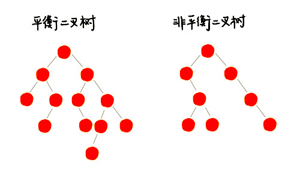

[TOC]

# 一、序列式存储结构

| 时间复杂度 | 数组 | 链表 |
| ---------- | ---- | ---- |
| 插入、删除 | O(n) | O(1) |
| 随机访问   | O(1) | O(n) |

## 1. 链表

链表结构

其中，带头链表利用了添加哨兵来简化操作的思想


链表实现

```c++
// 双向链表节点
typedef struct DNode {
    int data;           //数据，当作为表头时存储整个链表的长度
    struct DNode *prev; //节点前项指针
    struct DNode *next; //节点后项指针
} DNode, *DLinkList;

// 双向循环带头链表 Double Circular Link List
void DCLinkListCreate(DLinkList& plist)
{
    plist = (DLinkList)malloc(sizeof(DNode));
    if (plist)
        plist->next = plist->prev = plist;
    else
        exit(OVERFLOW);
}

// 彻底删除链表，包括头节点
void DCLinkListDestroy(DLinkList& plist)
{
    DCLinkListClear(plist);
    free(plist);

    plist = nullptr;
}

// 从前往后删除节点，只保留头节点
void DCLinkListClear(DLinkList& plist)
{
    DLinkList pFirst = plist->next;
    DLinkList pSecond;
    while (pFirst != plist) {
        pSecond = pFirst->next;
        free(pFirst);
        pFirst = pSecond;
    }

    // 回到初始状态
    plist->next = plist->prev = plist;
}

DNode* DCLinkListSearch(DLinkList& plist, size_t index)
{
    if (index >= (size_t)plist->data) return nullptr;

    DNode *pNode = plist->next;
    for (size_t i = 0; i < index; ++i) {
        pNode = pNode->next;
    }

    return pNode;
}

void DCLinkListInsertTail(DLinkList& plist, int data)
{
     DNode* pNode = (DNode *)malloc(sizeof(DNode));
     pNode->data = data;

     pNode->prev = plist->prev;
     pNode->next = plist;

     plist->prev->next = pNode;
     plist->prev = pNode;

     ++(plist->data);
}

void DCLinkListRemove(DLinkList& plist, int index)
{
    if(plist->data == 0) return;

    DNode* pNode = DCLinkListSearch(plist, index);
    if (nullptr == pNode) return;

    pNode->prev->next = pNode->next;
    pNode->next->prev = pNode->prev;
    free(pNode);

    --(plist->data);
}

void TestCode()
{
    DLinkList list;
    DCLinkListCreate(list);

    DCLinkListInsertTail(list, 3);
    DCLinkListInsertTail(list, 2);
    DCLinkListInsertTail(list, 5);
    DCLinkListInsertTail(list, 0);
    DCLinkListInsertTail(list, 9);

    DCLinkListRemove(list, 3);

    for (int i = 0; i < list->data; ++i) {
        DNode* node = DCLinkListSearch(list, i);
        printf("%d", node->data);
    }
    printf("\n");

    DCLinkListDestroy(list);
}
```


## 2. 栈

栈结构


栈实现

```c++
// 基于数组实现的顺序栈
template <typename T>
class StackArray {
private:
  T* m_items;  		// 数组
	int m_count;    // 栈中元素个数
	int m_capacity; // 栈的大小

public:
  StackArray() = delete;
  StackArray(int n) {
		m_items = new T[n];
    m_count = 0;
		m_capacity = n;
  }

  // 入栈操作
  bool push(T item) {
    if (m_count == m_capacity) return false;
    
    // 将 item 放到下标为 count 的位置，并且 count 加一
    m_items[m_count++] = item;
    
    return true;
  }
  
  // 出栈操作
  T pop() {
    if (m_count == 0) return NULL;
    
		T tmp = m_items[m_count - 1];
    --m_count;
    
    return tmp;
  }
  
  int count() {
      return m_count;
  }

  T search(size_t index) {
    if (index >= (size_t)m_count) return NULL;

    return m_items[index];
  }
};

void TestCode() {
  StackArray<int> stack(10);
  
  stack.push(3);
  stack.push(0);
  stack.push(5);
  stack.push(2);
  stack.push(9);
  stack.pop();

  for (int i = 0; i < stack.count(); ++i) {
  	printf("%d ", stack.search(i));
  }
  printf("\n");
}
```


## 3. 队列

队列结构


队列实现

```c++
// 1. 队列链表实现
template <typename T>
class QueueLinked {

private:
    typedef struct Node {
        T data;
        Node* next;

        Node(T item):data(item),next(nullptr){}
    } Node;

    Node* m_pHead = nullptr;
    Node* m_pTail = nullptr;

public:
    void enqueue(T item) {
        Node* pNode = new Node(item);
        if (nullptr == m_pHead) {
            m_pHead = pNode;
            m_pTail = m_pHead;
        } else {
            m_pTail->next = pNode;
            m_pTail = m_pTail->next;
        }
    }

    void dequeue() {
        if (nullptr != m_pHead) {
            Node* pNode = m_pHead;
            m_pHead = pNode->next;
            free(pNode);
            if (nullptr == m_pHead) {
                m_pTail = nullptr;
            }

        } else {
            throw "dequeue: empty!";
        }
    }

    template <typename FUNC>
    void traverse(FUNC callback) {
       for (Node* pNode = m_pHead; nullptr != pNode; pNode = pNode->next) {
           callback(pNode->data);
       }
    }
};

// 2. 循环队列
template <typename T>
class QueueCircular {

private:
    T*     m_items    = nullptr;
    size_t m_capacity = 0;
    size_t m_head     = 0;
    size_t m_tail     = 0;

public:
    QueueCircular() = delete;
    QueueCircular(const size_t capacity) {
        m_items = new T[capacity];
        m_capacity = capacity;
    }
    ~QueueCircular() {
        if (nullptr != m_items) {
            delete[] m_items;
            m_items = nullptr;
        }
    }

  public:
    void enqueue(T item) {
        if ((m_tail + 1) % m_capacity == m_head) {
            throw "QueueCircular::enqueue queue is Full!";
        }
        m_items[m_tail] = item;
        m_tail = (m_tail + 1) % m_capacity;
    }

    void dequeue() {
        // 随着队列的使用，队列为空时 m_head 和 m_tail 一定会相等，但他们不一定都为 0
        if (m_head != m_tail) {
            m_head = (m_head + 1) % m_capacity;
        } else {
            throw "QueueCircular::dequeue queue is Empty!";
        }
    }

  public:
    template <typename FUNC>
    void traverse(FUNC callback) {
        for (size_t i = m_head; i % m_capacity != m_tail; ++i) {
            callback(m_items[i % m_capacity]);
        }
    }
};

void TestCode() {
//    QueueCircular<int> queue(20);
  	QueueLinked<int> queue;
  
    queue.enqueue(1);
    queue.enqueue(2);
    queue.enqueue(3);
    queue.dequeue();

    queue.traverse([&](int item) {
        std::cout << item << " ";
    });
    std::cout <<  std::endl;

    queue.enqueue(4);
    queue.enqueue(5);

    queue.traverse([&](int item) {
        std::cout << item << " ";
    });
    std::cout <<  std::endl;

    queue.dequeue();
    queue.dequeue();
    queue.dequeue();
    queue.dequeue();
    queue.enqueue(9);
    queue.enqueue(6);

    queue.traverse([&](int item) {
        std::cout << item << " ";
    });
    std::cout <<  std::endl;
}
```


队列的应用

- 阻塞队列
  队列为空，取数据的操作会阻塞，直到队列中有数据新加入后，取数据操作才放开阻塞并返回数据
  队列为满，添加队列的操作会阻塞，直到队列中有空闲位置，添加队列操作才会放开阻塞并返回
  
- 并发队列

  ```c++
  #include <queue>
  #include <mutex>
  #include <condition_variable>
  #include <memory>
  
  template <typename T>
  class ConcurrencyQueue {
    private:
      std::queue<T> m_queue;
      mutable std::mutex m_mutex;
      std::condition_variable m_condition_var;
  
    public:
      bool empty() const {
          std::lock_guard<std::mutex> lg(m_mutex);
          return m_queue.empty();
      }
      void push(T item) {
          std::lock_guard<std::mutex> lg(m_mutex);
          m_queue.push(item);
          m_condition_var.notify_one();
      }
      std::shared_ptr<T> wait_and_pop() {
          std::unique_lock<std::mutex> lk(m_mutex);
          while (m_queue.empty()) {
              m_condition_var.wait(lk);
          }
          auto res = m_queue.front();
          m_queue.pop();
  
          return res;
      }
      std::shared_ptr<T> try_pop() {
          std::lock_guard<std::mutex> lg(m_mutex);
          if (m_queue.empty()) return nullptr;
  
          auto res = m_queue.front();
          m_queue.pop();
  
          return res;
      }
  };
  ```

  

## 4. 跳表（依赖链表）

将原来的单链表添加了额外几层**索引链表**用于更大跨度的查询数据，以提升查询速度

- 空间复杂度 $O(n)$
  索引只是整数，而查询的数据大多是浮点数比索引要多很多，这样索引占用的额外内存，反而会不那么多了
- 时间复杂度 $O(logn) = O(C_{经过的跳表索引层数}logn)$
- 支持快速插入、删除、查找
  插入、删除时动态更改多层索引链表（通过随机方式在一个范围内增加新的索引节点）
- 相比于红黑树的优势在于
  跳表可按照区间查找数据（比如查找值在[100, 356]之间的数据）
  跳表的代码实现比红黑树更简单，更容易维护


## 5. 散列表（依赖数组）

### 5.1 结构

数据结构

- 内部为固定大小的表
- 表中的每个元素表示一个或者多个 key


内部实现

- 通过散列函数 `int hash(key)` 根据存储的 key 值得到表的存储索引 index
- 通过 index % 散列表的固定长度，得到存储的索引
  如果这个索引没有被使用，则为最终的索引值
  如果这个索引被使用了，则会产生散列冲突，通过一些方法解决散列冲突的问题后，也会得到最终的索引值


### 5.2 散列函数

```c++
// 散列函数的设计并不复杂，追求的是简单高效、分布均匀
int hash(Object key) {    
  int h = key.hashCode()；
  // 除留余数法 A % B = A & (B - 1)
  return (h ^ (h >>> 16)) & (capicity -1); //capicity表示散列表的大小
}
```

#### 5.2.1 哈希算法

哈希算法：将任意长度的二进制值串映射为固定长度的二进制值串，通过原始数据映射之后得到的二进制值串就是**哈希值**

特点：

- 最后得到的哈希值长度一固定
- 从哈希值不能反向推导出原始数据
- 对输入数据非常敏感，哪怕原始数据只修改了一个 Bit，最后得到的哈希值也大不相同
- 散列冲突的概率很小
- 执行效率高，针对较长的文本，也能快速地计算出哈希值


应用：

1. 安全加密
   需要权衡破解难度和计算时间，来决定究竟使用哪种加密算法，常用的加密算法有
   MD5（MD5 Message-Digest Algorithm，MD5 消息摘要算法）
   SHA（Secure Hash Algorithm，安全散列算法）
   DES（Data Encryption Standard，数据加密标准）
   AES（Advanced Encryption Standard，高级加密标准）
2. 唯一标识
   例：比较图片是否相同时，需要每一个图片取一个唯一标识，或者说信息摘要，通过这个唯一标识来判定图片是否在图库中，这样就可以减少很多工作量
   比如，我们可以从图片的二进制码串开头取 100 个字节，从中间取 100 个字节，从最后再取 100 个字节，然后将这 300 个字节放到一块，通过哈希算法（比如 MD5），得到一个哈希字符串，用它作为图片的唯一标识
3. 数据校验
   BT 下载时会对下载好的文件块逐一求哈希值，然后跟种子文件中保存的哈希值比对。如果不同，说明这个文件块不完整或者被篡改了，需要再重新从其他宿主机器上下载这个文件块
4. 散列函数
   散列函数用的散列算法一般都<u>比较简单，比较追求效率</u>


### 5.3 防止散列冲突

在有限大小的散列表里通过**散列函数**使 key 和 index 一一对应十分困难，即便像业界著名的 MD5、SHA、CRC 等哈希算法也无法避免散列冲突

**面对散列冲突，优先给原来的散列数组做动态扩容，其次在使用防止散列冲突的方法**


#### 5.3.1 开放寻址法

不会开辟新的内存，在原散列表里重新探测一个空闲位置，将其插入

当散列表中空闲位置不多的时候，散列冲突的概率就会大大提高
一般通过装载因子来衡量散列表中空位的多少 `散列表的装载因子 = 填入表中的元素个数 / 散列表的长度`


探测方法

1. **线性探测（Linear Probing）**常用方法
   $hash(key)+i$ 从冲突的索引开始，依次往后查找下一个，看是否有空闲位置，直到找到为止
2. 二次探测（Quadratic probing）
   $hash(key)+i^2$ 从冲突的索引开始，依次往后查找，步长为线性探测原步长的平方
3. 双重散列（Double hashing）
   先用第一个散列函数，如果计算得到的存储位置已经被占用，再用第二个散列函数，依次类推，直到找到空闲的存储位置


下图为使用线性探测的散列表的查找操作

- 插入时，如果发生散列冲突，就探测下一个位置，直到找到空位为止
- 删除时，为了让有冲突的散列数据**保持连续**，需要**通过打上删除的标记，而不是设为空**
- 查找时，如果找到先比较找到的 key 是否与当前 key 相同
  如果不相同，则此 key 发生了散列冲突，就探测下一个位置，直到找到与当前 key 相同的值 或 空位为止


#### 5.3.2 链表法

需要开辟新的内存，所有散列值相同的元素我们都放到相同槽位对应的链表中
有时候为了效率，散列数组内的链表可能会被红黑树等树形结构代替（例：Java HashMap）


### 5.4 散列表 + 链表 / 跳表

用散列表和双向链表来指向同一个数据，这样的数据结构（例：Java LinkHashMap 按访问时间排序）

- 即有散列表的快速查找效果
- 又有双向链表的快速插入和删除效果


下图中，hnext 服务于散列表，为了将节点串在散列表的拉链中


**应用场景：缓存淘汰策略 LRU**

缓存的大小有限，当缓存被用满时，哪些数据应该被清理出去，哪些数据应该被保留？这就需要缓存淘汰策略来决定，常见的策略有三种：

- 先进先出策略 FIFO（First In，First Out）
- 最少使用策略 LFU（Least Frequently Used）
- 最近最少使用策略 LRU（Least Recently Used）
  同样也是先进先出的操作，不过会在访问数据时，将被访问的数据重新排在后面，做到最近最少使用的最先出


### 5.6 位图 Bitmap

位图可以作为一种特殊的（只存储 bool 类型的）散列表

- 一般语言里 bool 类型占用一个字节，在大量存储 bool 类型的情况下，比较浪费内存
- 一般用作表示查找的大量数据是否存在用


**布隆过滤器 Bloom Filter**

- 通过 k 个 hash 函数来同时存储一个数字是否存在（hash 值都为 true 才存在）
  相当于 k 个二进制位，来表示一个数字的存在
  防止大范围的数据散列映射到较小规模数据时的 hash 冲突问题
- 仍然会有 hash 冲突的问题，但概率较小，使用时需要参考项目对 hash 冲突的容忍度

```c++
// 注意：Java 中 char 类型占 16 bit，即 2 个字节
#define CHAR_SIZE 8
class BitMap {
private:
  char* bytes;
	int nbits;
  
public:
  BitMap(int nbits) {
    this.nbits = nbits;
    this.bytes = new char[nbits/CHAR_SIZE + 1];
  }

	void set(int k) {
    if (k > nbits) return;
    int byteIndex = k / CHAR_SIZE;
    int bitIndex = k % CHAR_SIZE;
    bytes[byteIndex] |= (1 << bitIndex);
  }

  // 数组下标定位数据，访问快速
	bool get(int k) {
    if (k > nbits) return false;
    int byteIndex = k / CHAR_SIZE;
    int bitIndex = k % CHAR_SIZE;
    return (bytes[byteIndex] & (1 << bitIndex)) != 0;
  }
};
```


# 二、树形存储结构


**节点的高度（Height）**从下往上度量
节点到叶子节点的最长路径（边数），树的高度就是根节点的高度

**深度（Depth）**从上往下度量
根节点到这个节点所经历的边的个数

**层（Level）**从上往下度量
节点的深度 + 1


## 1. 二叉树 Binary Tree

二叉树：每个节点最多有两个子节点

满二叉树：除了叶子节点之外，每个节点都有左右两个子节点

完全二叉树：叶子节点都在<u>最底下两层</u>，最后一层的<u>叶子节点都靠左排列</u>，并且<u>除了最后一层，其他层的节点个数都要达到最大</u>


### 1.1 存储二叉树

**链式存储**

- 常用的存储方式简单、直观


**顺序存储**

- 最节省内存的存储方式
  数组的存储方式并不需要像链式存储法那样，要存储额外的左右子节点的指针
- 根节点存储在下标 i = 1 的位置
- 左子节点存储在下标 2 * i 的位置
- 右子节点存储在下标 2 * i + 1 的位置
- 父亲节点存储在下表 i / 2 的位置（整数相除，会丢弃小数位）


完全二叉树，用数组存储最节省内存，如下图


### 1.2 遍历二叉树


遍历的时间复杂度 $O(n)$

```c++
typedef struct BTNode
{
	int data;
	struct BTNode* left;
	struct BTNode* right;
} BTNode, Tree;

// 先序遍历
// 1. 先遍历这个节点
// 2. 再遍历它的左子树
// 3. 最后遍历它的右子树
void preOrder(BTNode* root) {
  if (root == nullptr) return;
  
  printf("%d ", root->data);
  preOrder(root->left);
  preOrder(root->right);
}

// 中序遍历
// 1. 先遍历它的左子树
// 2. 再遍历这个节点
// 3. 最后遍历它的右子树
void inOrder(BTNode* root) {
  if (root == nullptr) return;
  
  inOrder(root->left);
  printf("%d ", root->data);
  inOrder(root->right);
}

// 后序遍历
// 1. 先遍历它的左子树
// 2. 再遍历它的右子树
// 3. 最后遍历这个节点
void postOrder(BTNode* root) {
  if (root == nullptr) return;
  
  postOrder(root->left);
  postOrder(root->right);
  printf("%d ", root->data);
}
void postOrder2(BTNode* root) {
  std::stack<BTNode*> stackNode;
  std::stack<BTNode*> stackTmp;
  stackTmp.push(root);
  
  while (!stackTmp.empty()) {
    BTNode* node = stackTmp.top();
    stackTmp.pop();
    stackNode.push(node);
    
    if (nullptr != node->left) {
        stackTmp.push(node->left);
    }
    if (nullptr != node->right) {
        stackTmp.push(node->right);
    }
  }
  while (!stackNode.empty()) {
    BTNode* node = stackNode.top();
    stackNode.pop();
    printf("%d ", node->data);
  }
}

// 层级遍历（广度优先遍历）
void levelOrder(BTNode* root) {
  if (root == nullptr) return;
  
  std::queue<BTNode*> queue;
  queue.push(root);
  
	while(!queue.empty()) {
    BTNode* pNode = queue.front();
		printf("%d ", pNode->data);
    queue.pop();

		if(pNode->left != nullptr) {
      queue.push(pNode->left);
		}
		if(pNode->right != nullptr) {
      queue.push(pNode->right);
		}
	} // while
}

// 获取树的高度
int treeHeight(BTNode *root) {
	int lheight = 0;
	int rheight = 0;
	
	if (nullptr == root) return 0;

	lheight = treeHeight(root->left);
	rheight = treeHeight(root->right);

	return std::max(lheight, rheight) + 1;
}

// TestCode 
void addNodeByArray(BTNode* root, int* array, int idx) {
  BTNode *left = new BTNode();
	left->data = array[idx * 2];
	BTNode *right = new BTNode();
	right->data = array[idx * 2 + 1];

	root->data = array[idx];
	root->left = left;
	root->right = right;
}

//    1
//  2   3
// 4 5 6 7
BTNode* createBTree(){
	int numbers[] = { 0, 1, 2, 3, 4, 5, 6, 7 };

	BTNode *root = new BTNode();
	addNodeByArray(root, numbers, 1);
	addNodeByArray(root->left, numbers, 2);
	addNodeByArray(root->right, numbers, 3);

	return root;
}

void destroyBTree(BTNode *root) {
	if (root == nullptr) return;

	destroyBTree(root->left);
	destroyBTree(root->right);
	free(root);
}

void TestCode(){
  BTNode* root = createBTree();
  printf("树高：%d\n", treeHeight(root));
  preOrder(root);
	printf("\n");
  inOrder(root);
  printf("\n");
  postOrder(root);
  printf("\n");
  postOrder2(root);
  printf("\n");
  levelOrder(root);
  printf("\n");
  
  destroyBTree(root);
}
```


### 1.3 堆 Heap

堆

- **是完全二叉树**
  完全二叉树适合用数组来存储，因此堆也适合用数组来存储
- 堆中每一个节点的值都必须
  大于等于（大顶堆）或小于等于（小顶堆）其子树中**每个节点**的值


同一组数据，我们可以构建多种不同形态的堆


**查找**

堆的查找是二分查找，查找速度取决于堆的高度 $O(logh)$，因此堆的查找速度相对较快


**插入**

得益于堆的数组存储结构，我们可以很快的将插入节点放到堆最后面


```c++
template <typename T>
class Heap {
private:
  T* a; 		 // 数组，从下标 1 开始存储数据
	int n;  	 // 堆可以存储的最大数据个数
	int count; // 堆中已经存储的数据个数

public:
  Heap(int capacity) {
    a = new int[capacity + 1];
    n = capacity;
    count = 0;
  }

  void insert(int data) {
    if (count >= n) return;
    ++count;
    a[count] = data;
    int i = count;
    while (i/2 > 0 && a[i] > a[i/2]) { // 自下往上堆化
      std::swap(a[i], a[i/2]); 				 // 交换 i 和 i 的父节点
      i = i/2;
    }
  }
 };
```


**删除**

单纯删除要删除的节点会造成删除后的堆很可能不符合完全二叉树的标准，同样得益于堆数组的存储形式，可以将要删除的节点**换到最后一个节点**，然后删除最后一个节点，最后做和添加一样的**堆化**操作


```c++
public:
  ...
    
  void removeMax() {
    if (count == 0) return;
    a[1] = a[count];
    --count;
    heapify(a, count, 1);
  }

  // 堆化：自上往下
  void heapify(T* a, int n, int i) { 
    while (true) {
      int maxPos = i;
      if (i*2 <= n && a[i] < a[i*2]) 					maxPos = i*2;
      if (i*2+1 <= n && a[maxPos] < a[i*2+1]) maxPos = i*2+1;
      if (maxPos == i) 												break;
      std::swap(a[i], a[maxPos]);
      i = maxPos;
    }
  }
};
```


## 2. 二叉查找树 Binary Search Tree

二叉查找树，树中任意一个节点

- 其左子树每个节点的值，都小于这个节点的值
- 其右子树每个节点的值，都大于这个节点的值
- 中序遍历二叉查找树，可以输出有序的数据序列（无需额外的排序操作，这一点比散列表有优势）
- 不管操作是插入、删除还是查找，时间复杂度其实都跟树的高度成正比  $O(height)$
极端情况下会退化为链表
  


重复数据在二叉查找树中的存储

1. 相同的数据都存储在同一个节点
   把每个节点的结构变为链表或者数组

2. 添加时，重复的数据当作大于这个节点的值来处理
   删除时，继续向右子树查找是否还有重复的树，有就继续删除
   查找时，找到后仍会继续在右子树中查找，直到遇到叶子节点，以便查找出所有的节点

   


### 2.1 BSTree 的查找和添加

```c++
typedef struct BTNode
{
	int data;
	struct BTNode* left;
	struct BTNode* right;
  BTNode(int _data):data(_data),left(nullptr),right(nullptr){}
} BTNode, Tree;

BTNode* BSTreeFind(BTNode* root, int data) {
  BTNode* node = root;
  while (nullptr != node) { 
    if (data < node->data)
      node = node->left; 
    else if (data > node->data)
      node = node->right;
    else
      return node;
  }
  
  return nullptr;
}

void BSTreeInsert(BTNode* root, int data) {
  if (nullptr == root) {
    root = new BTNode(data);
    return;
  }

  BTNode* node = root;
  while (nullptr != node) {
    if (data > node->data) {
      if (nullptr == node->right) {
        node->right = new BTNode(data);
        return;
      }
      node = node->right;
    } else { // data < node->data
      if (nullptr == node->left) {
        node->left = new BTNode(data);
        return;
      }
      node = node->left;
    }
  } // while
}
```


### 2.2 BSTree 的删除

还可以将要删除的节点标记为 "已删除"，但是并不真正从树中将这个节点去掉，这样不会增加插入和查找的复杂度，但比较浪费空间

```c++
void BSTreeDelete(BTNode* root, int data) {
  BTNode* node = root; 
  BTNode* nodeSuper = nullptr; 
  while (nullptr != node && node->data != data) {
    nodeSuper = node;
    node = data > node->data ? node->right : node->left;
  }
  
  if (nullptr == node) return; // 没有找到要删除的数据

  // 要删除的节点有两个子节点，调整树结构
  if (nullptr != node->left && nullptr != node->right) { // 查找右子树中最小节点
    BTNode* minNode = node->right;
    BTNode* minNodeSuper = node;
    while (nullptr != minNode->left) {
      minNodeSuper = minNode;
      minNode = minNode->left;
    }
    
    node->data = minNode->data;  // 将适合的叶子节点和要删除的节点交换数据
    node = minNode;							 // 最后只删除叶子节点，简化了操作
    nodeSuper = minNodeSuper;
  }

  // 删除节点是叶子节点或者仅有一个子节点
  BTNode* nodeChild;
  if (node->left  != nullptr) 
    nodeChild = node->left;
  else if (node->right != nullptr) 
    nodeChild = node->right;
  else 														 
    nodeChild = nullptr;

  if (nodeSuper == nullptr) 
    root = nodeChild;
  else if (nodeSuper->left == node)
    nodeSuper->left = nodeChild;
  else 
    nodeSuper->right = nodeChild;
  
  delete node;
}
```


### 2.3 平衡二叉树查找树



平衡：解决普通二叉查找树在频繁的插入、删除等动态更新的情况下，出现时间复杂度退化的问题
平衡二叉树：二叉树中**任意一个**节点的左右子树的高度相差不能大于 1
平衡二叉查找树：平衡二叉树的特点 + 二叉查找树的特点

AVL 树：是平衡二叉查找树的一种，每次插入、删除都要做调整，就比较复杂、耗时

由于平衡二叉查找树的实现复杂，应用不如红黑树广泛，这里不过多赘述


### 2.4 红黑树 Red-Black Tree

> 学习数据结构和算法，要学习它的由来、特性、适用的场景以及它能解决的问题
> 红黑树的学习重点应该放在红黑树的应用而不是实现上

红黑树：一种近似平衡的**平衡二叉查找树**，高度稳定地趋近 $log_2n$
从根节点到各个叶子节点的最长路径，有可能会比最短路径大一倍

- 根节点是黑色的
- 每个叶子节点都是黑色的空节点
  叶子节点不存储数据，作为哨兵简化代码实现用
- 任何相邻的节点都不能同时为红色
  红色节点是被黑色节点隔开的
- 每个节点，从该节点到达其可达叶子节点的所有路径，都包含**相同数目的黑色节点**


红黑树去掉红色节点后，是一个类似于完全二叉树（从四叉树中取出某些节点，放到叶节点位置，四叉树就变成了完全二叉树，因此相同节点数目下，四叉树的高度 低于 完全二叉树）

红黑树加上去掉的红色节点后，由于红黑树相邻节点不能同时为红色，树高大约增加为原来的两倍


### 2.5 B+ 树

> B- 树就是 B 树，英文翻译都是 B-Tree
>
> 当 B+ 树存储的数据量非常大时，B+ 树的索引节点（非叶子节点）就会占用较多的内存，可以将索引节点先存储在磁盘中，使用的时候读取部分索引数据，所以树的高度决定了读取磁盘的最少次数
>
> 操作系统都是按页读取的，为了尽量减少 IO 操作，每个节点的大小要和页的大小（一般是 4 k）一致

功能：

1. 解决平衡二叉树**快速查找区间范围数据**的问题
2. 降低同样的元素数量中平衡二叉树的高度，采用了多个子节点方式


B+ 树结构：

- 每个节点中子节点的个数不能超过 m，也不能小于 m/2
  根节点的子节点个数可以不超过 m/2，这是一个例外
- m 叉树只存储索引，并不真正存储数据，这个有点儿类似跳表
- 通过链表将叶子节点串联在一起，这样可以方便按区间查找
  一般情况，根节点会被存储在内存中，其他节点存储在磁盘中


```c++
/**
 * 非 叶子节点的定义。
 *
 * 假设keywords=[3, 5, 8, 10]
 * 4个键值将数据分为5个区间：(-INF,3), [3,5), [5,8), [8,10), [10,INF)
 * 5个区间分别对应：children[0]...children[4]
 *
 * m值是事先计算得到的，计算的依据是让所有信息的大小正好等于页的大小：
 * PAGE_SIZE = (m-1)*4[keywordss大小]+m*8[children大小]
 */
class BPlusTreeNode {
public:
  static int m = 5; 					// m 叉树
  int keywords[m-1]; 					// 键值，用来划分数据区间
  BPlusTreeNode* children[m];	// 保存子节点指针
}

/**
 * 叶子节点的定义。
 *
 * B+树中的叶子节点跟内部节点是不一样的,
 * 叶子节点存储的是值，而非区间。
 * 这个定义里，每个叶子节点存储3个数据行的键值及地址信息。
 *
 * k值是事先计算得到的，计算的依据是让所有信息的大小正好等于页的大小：
 * PAGE_SIZE = k*4[keyw..大小]+k*8[dataAd..大小]+8[prev大小]+8[next大小]
 */
class BPlusTreeLeafNode {
public:
  static int k = 3;
  int keywords[k]; 			// 数据的键值
  long dataAddress[k]; 	// 数据地址

  BPlusTreeLeafNode* prev; // 这个结点在链表中的前驱结点
  BPlusTreeLeafNode* next; // 这个结点在链表中的后继结点
}
```


# 三、图 Graph

无向图

- 顶点 Vertex：图中的节点
- 边 Edge：两个顶点的连线
- 顶点的度 Degree：和顶点连接的边个数


有向图

- 顶点的入度 In-degree：指向这个顶点的边个数
- 顶点的出度 Out-degree：以这个顶点作为起点的边个数


带权图

- 每条边上只有一个权重


稀疏图 Sparse Matrix

- 图中顶点很多，但图中的边很少


## 1. 图的存储

### 1.1 邻接矩阵 Adjacency Matrix

采用二维数组的数据存储方式**存储边信息**，行列索引均为图中所有顶点的索引，不适合存储边少的稀疏图
占用内存空间大，但访问顶点快速，**可以将图的运算转换为矩阵的运算**

- 无向图：如果顶点 i 与顶点 j 之间有边，就将 $A[i][j]$和 $A[j][i]$ 标记为 1
                 无向图只需要存储对角线上的一半数据就够了

- 有向图：如果有从顶点 $i$ 指向顶点 $j$ 的边，就将 $A[i][j]$ 标记为 1
                 如果有从顶点 $j$ 指向顶点 $i$ 的边，就将 $A[j][i]$ 标记为 1

- 带权图：存储边上的权重


### 1.2 邻接表 Adjacency List

采用散列表的数据存储方式**存储边信息**

- 每个数据的索引为顶点的索引，数据每个元素存储当前顶点的出度顶点索引（逆邻接表存储入度顶点索引）
- 占用空间小，但访问顶点较慢
  如果存储的顶点多，可以采用和散列表一样的优化方法，在数组每个元素中存储红黑树来代替单链表的结构


```c++
class Graph { 
private:
  // 邻接表，如果要存储带权图，存储的数据由 int 转为 一个可以存权重和索引的结构体
	std::vector<std::list<int> *> adj;

public:
  Graph(int capacity) {
    adj.resize(capacity);
    for (int i = 0; i < adj.size(); ++i) {
      adj[i] = new std::list<int>();
    }
  }

  // 无向图一条边存两次
  void addEdge(int s, int t) { 
    addVector(s, t);
    addVector(t, s);
  }
  
  // 有向图存储边
  void addVector(int s, int t) {
     adj.at(s)->push_back(t);
  }
  
};
```


## 2. 图的暴力搜索


### 2.1 广度优先搜索 Breadth-First-Search

先查找离起始顶点最近的，然后是次近的，依次往外搜索

- 广度优先搜索得到的路径是**最短路径**

- 空间复杂度 $O(V_{顶点个数})$
- 时间复杂度
  最好 $O(V_{顶点个数})$
  最坏 $O(V_{顶点个数} + E_{边个数})$


```c++
class Graph { 
private:
  std::vector<std::list<int> *> adj;
  ...
  
  // 递归打印 s->t 的路径
  void print(int* prev, int s, int t) {
    if (prev[t] != -1 && t != s) {
      print(prev, s, prev[t]);
    }
    printf("%d ", t);
  }
  
public:
  void BreadthFistSearch(int s, int t) {
    if (s == t) return;

    const int count = adj.size();
    bool isVisited[count];	// 每个顶点是否被访问过
    std::memset(isVisited, false, sizeof(isVisited));

    int prev[count]; 			// 每个顶点的前向顶点索引
    std::memset(prev, -1, sizeof(prev));

    std::queue<int, std::list<int>> visitedVertex;
    visitedVertex.push(s);
    isVisited[s] = true;
    while (visitedVertex.size() != 0) {
    	int w = visitedVertex.front();
      visitedVertex.pop();
      // 遍历与当前顶点邻接的所有顶点
      for (std::list<int>::iterator item = adj[w]->begin(); item != adj[w]->end(); ++item) {
        int i = (*item);
        if (!isVisited[i]) {
          prev[i] = w;
          if (i == t) {
            print(prev, s, t);
            return;
          }
          isVisited[i] = true;
          visitedVertex.push(i);
        } // if
      } // for
    } // while

  }
  
};
```


### 2.2 深度优先搜索 Depth-First-Search 

DSF 就像走迷宫：随意选择一个岔路口来走，走着走着发现走不通的时候，就回退到上一个岔路口，重新选择一条路继续走，直到最终找到出口

- 深度优先搜索得到的路径**不一定是最短路径**

- 空间复杂度 $O(V_{顶点个数})$
- 时间复杂度 $O(E_{边个数})$


```c++
class Graph { 
private:
  std::vector<std::list<int> *> adj;
  ...
  
public:
  void DepthFistSearch(int s, int t) {    
    const int count = adj.size();
    bool isVisited[count]; // 每个顶点是否被访问过
    std::memset(isVisited, false, sizeof(isVisited));

    int prev[count]; 			 // 每个顶点的前向顶点索引
    std::memset(prev, -1, sizeof(prev));
    
    recurDFS(s, t, isVisited, prev);
    print(prev, s, t);
  }

  bool recurDFS(int w, int t, bool* isVisited, int* prev) {    
    isVisited[w] = true;
    
    if (w == t) return true;
    
    for (std::list<int>::iterator item = adj[w]->begin(); item != adj[w]->end(); ++item) {
      int i = (*item);
      if (!isVisited[i]) {
        prev[i] = w;
        if (recurDFS(i, t, isVisited, prev)) return true;
      }
    }
    
    return false;
  }
  
};

void TestCode() {
  // 0 —— 1 —— 2
  // |		|		 |
  // 3 —— 4 —— 5
  //		  |		 |
  //			6 —— 7
  Graph graph(8);
  graph.addEdge(0,1);
  graph.addEdge(0,3);
  graph.addEdge(1,2);
  graph.addEdge(1,4);
  graph.addEdge(2,5);
  graph.addEdge(3,4);
  graph.addEdge(4,5);
  graph.addEdge(4,6);
  graph.addEdge(5,7);
  graph.addEdge(6,7);
  
  graph.DepthFistSearch(0, 6);   // 0 1 2 5 4 6
  graph.BreadthFistSearch(0, 6); // 0 1 4 6
}
```


# 四、STL 容器

## 1. 序列式容器

> 不会重新排序，内部排列次序 == 插入次序

### 1.1 数组 Array

- 数组长度在编译期间定义，不可改变
- 连续存储数据，支持随机访问，插入或删除且效率低

```c++
// 普通数组
float vector4f[4];

// C++11 新增数组模版类
// 在普通数组的基础上，添加了一些成员函数和全局函数
std::array<int, 4> vector4i;
```


### 1.2 动态数组 Dynamic array

- 可在运行期动态改变长度
- 连续存储数据，支持随机访问，插入或删除且效率低

```c++
// 当容量不够时，内部会重新生成一个新的数组，将原来的数据都 copy 到新数组后，销毁原来的数据
// 不同的编译器实现的扩容方式不一样，VS2015中以1.5倍扩容，GCC以2倍扩容
std::vector<float> vector4f(4);
```


### 1.3 链表 Linked

- 内存不连续，不支持随机访问，插入或删除且效率高

```c++
// 内部数据结构为：双向循环链表
std::list<float> vector4f(4);
```


### 1.4 双端队列 Double-ended queue

- 由一段一段的定量连续空间构成
- 支持随机访问，是 list 和 vector 的折中方案

```c++
// 内部数据结构为：双向循环队列
std::deque<float> vector4f(4);
```


## 2. 关联式容器

> 元素位置取决于容器内特定的排序准则以及元素值
> 元素位置和插入次序无关

### 2.1 集合 Set

- 内部由红黑树实现
- 其内部元素依据其值**自动排序**
- Set 集合每个元素值只能出现一次，不允许重复
  **Multiset 集合允许重复元素**
- 当 Set 集合中的元素为结构体时，该结构体必须实现运算符 `<` 的重载

```c++
#include <iostream>
#include <set>
#include <string>

struct People
{
	string name;
	int age;

	bool operator <(const People p) const {
		return age < p.age;
	}
};

int main(int argc, char* argv[]) {
	std::set<People> setTemp;
	setTemp.insert({"张三",14});
	setTemp.insert({"李四",16});
	setTemp.insert({"老王",10});

	std::set<People>::iterator it;
	for (it = setTemp.begin(); it != setTemp.end(); it++) {
		printf("姓名：%s 年龄：%d\n", (*it).name.c_str(), (*it).age);
	}

	return 0;
}

// 输出结果
// 姓名：老王 年龄：10
// 姓名：张三 年龄：14
// 姓名：李四 年龄：16 
```


### 2.2 映射 Map

- 内部由红黑树实现
- 其元素都是 key/value 所形成的一个 pairs，依据 key 值**自动排序**
- Map 每一个 key 只能出现一次，不允许重复
  **Multimap 允许重复多个 key**
- 对于迭代器来说，可以修改实值，而不能修改 key

```c++
// 内存占用最低
std::map<string, int> mapTemp;

// 由散列表实现的 hash table, 占用内存较多, 使用一个下标范围比较大的数组来存储元素, 形成很多的桶
std::hash_map<string, int> hashMapTemp;

// C++11 由散列表实现的 hash table, 内存占用较 hash_map 低, 查找、插入速度比 hash_map 高
std::unordered_map<string, int> hashMapUnorder;
```


## 3. 容器适配器

> 重新组合容器中包含的成员函数，使其满足某些特定场景的需要
> 容器适配器内部可以使用任意容器，但会有一个默认容器

### 3.1 堆栈 Stack

- 默认容器 `std::deque`
- 新增和移除数据时，采用后进先出（Last-In-First-Out, LIFO）的模式

```c++
std::list<int> values {1, 2, 3};
// 替换容器为 list
// stack<T,Container=deque<T>>
std::stack<int,std::list<int>> my_stack(values);
```


### 3.2 队列 Queue

- 默认容器 `std::deque`
- 新增和移除数据时，采用先进先出（First-In-First-Out, FIFO）的模式

```c++
std::list<int> values {1, 2, 3};
// 替换容器为 list
// queue<T,Container=deque<T>>
std::queue<int,std::list<int>> my_queue(values);
```


### 3.3 优先队列 Priority queue

- 默认容器 `std::vector`
- 先进队列的元素并不一定先出队列，而是优先级最大的元素最先出队列

```c++
// 每个 priority_queue 容器适配器在创建时，都制定了一种排序规则
// 根据此规则，该容器适配器中存储的元素就有了优先级高低之分
// priority_queue 容器适配器的定义如下
template <
					typename T, 
					typename Container=std::vector<T>,
					typename Compare=std::less<T>      // Option: std::greater<T>
         >
class priority_queue{
    //......
}

std::priority_queue<int> my_priority_queue;
```


## 4. 迭代器

### 4.1 数组的迭代器

内存分配连续，insert 和 erase 操作，都会使得删除点和插入点之后的元素挪位置
插入点和删除掉之后的迭代器全部失效，也就是说 `insert(*iter)`、`erase(*iter)`，然后在 `iter++`，没有意义

**解决方法**：
`erase(*iter)`  的返回值是下一个有效迭代器的值，`iter = cont.erase(iter);`


### 4.2 链表的迭代器

内存分配不连续，删除运算使指向删除位置的迭代器失效，但是不会失效其他迭代器

**解决办法**：

1. `erase(*iter)` 会返回下一个有效迭代器的值
2. `erase(iter++)`


### 4.3 树形结构的迭代器

使用红黑树来存储数据

- <u>插入不会使得任何迭代器失效</u>

- 删除运算使指向删除位置的迭代器失效，但是不会失效其他迭代器


**解决办法**：
erase 迭代器只是被删元素的迭代器失效，但是返回值为 void，所以要采用  `erase(iter++)` 的方式删除迭代器


# 引用

- [代码在线运行网页工具](https://tool.lu/coderunner/)

- [What You Should Know about vector](http://www.informit.com/guides/content.aspx?g=cplusplus&seqNum=98)

- [The Fate of vector in C++09](http://www.informit.com/guides/content.aspx?g=cplusplus&seqNum=350)

- [vector: More Problems, Better Solutions](http://www.gotw.ca/publications/N1211.pdf)

- [一篇总结二叉树的4种遍历方式（含模板）](https://mp.weixin.qq.com/s/0b5OsnFLLg18Td4CuR51_Q)

- [详解 AVL 树（基础篇）](https://zhuanlan.zhihu.com/p/34899732)

- [红黑树的演变](https://www.cnblogs.com/tiancai/p/9072813.html)

- [C++迭代器失效的几种情况总结](https://www.cnblogs.com/fnlingnzb-learner/p/9300073.html)

